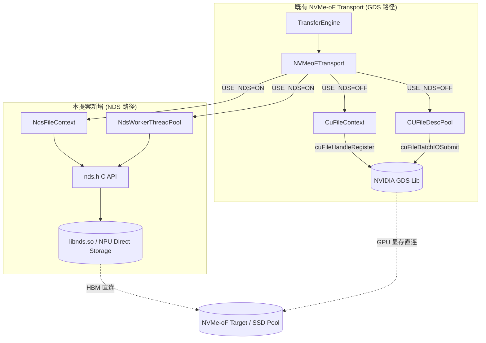
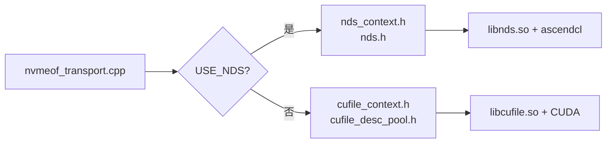
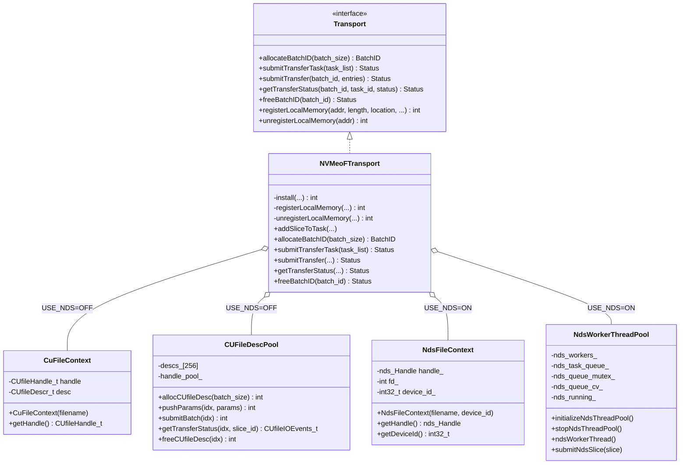
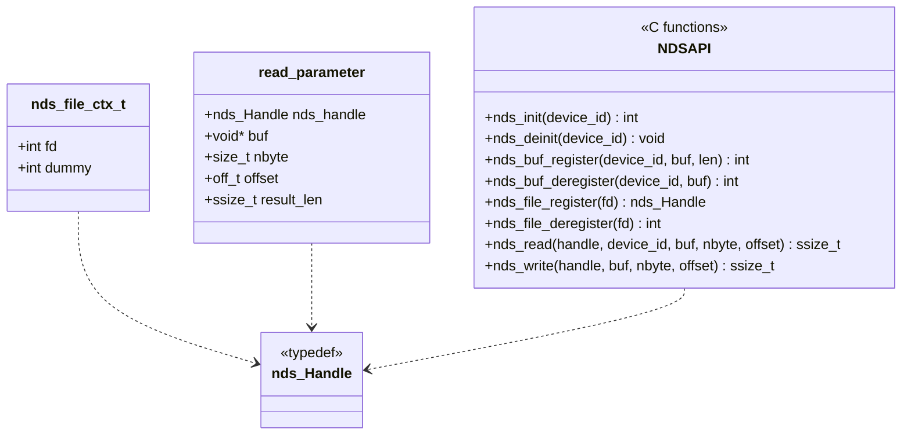
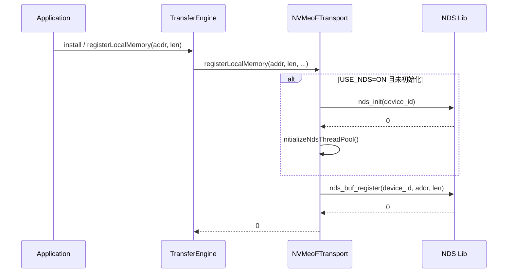
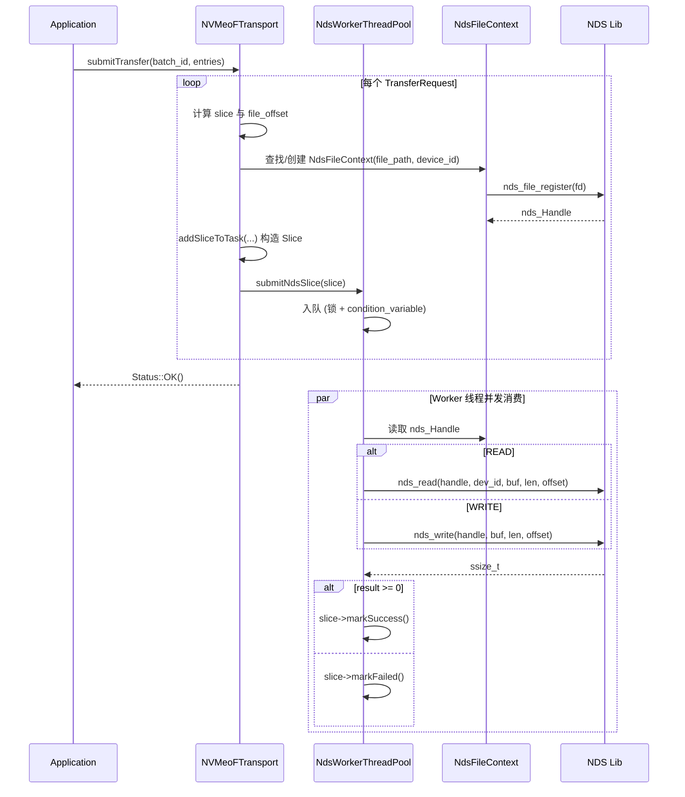
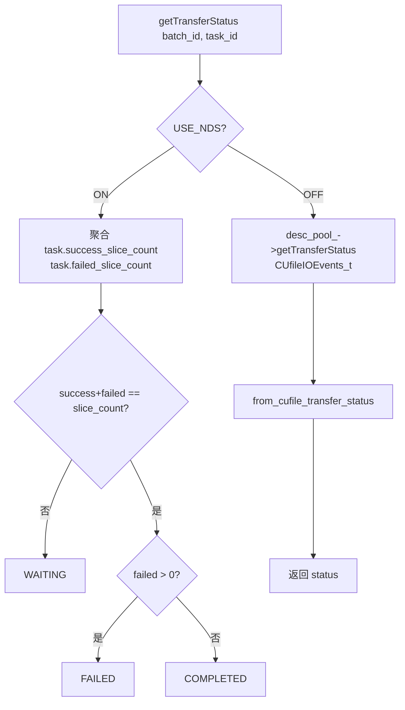
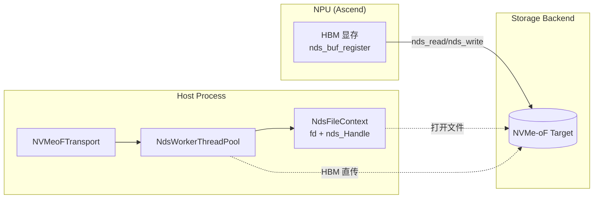
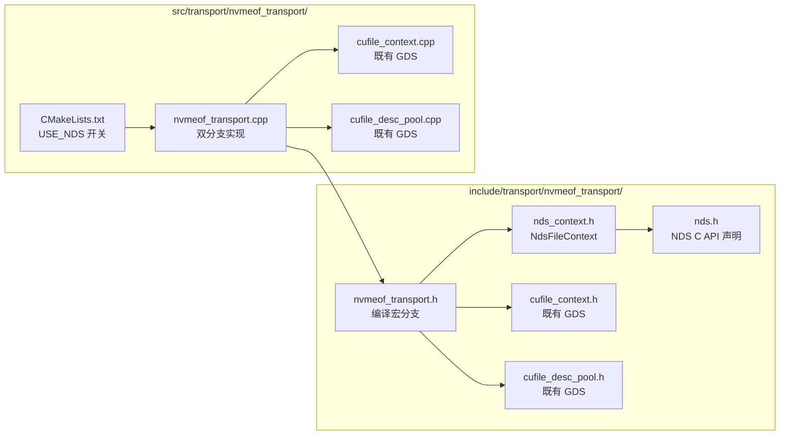

# RFC: 在 NVMe-oF Transport 中引入 NDS (NPU Direct Storage) 分支以支持昇腾 NPU 直连存储

## 1. 引言

本 RFC 提议在现有的 `nvmeof_transport` 中增加一条与 GDS（GPU Direct Storage）平行的 **NDS（NPU Direct Storage）分支**，使得基于昇腾 NPU（HBM）的推理/训练场景也能像 NVIDIA GPU + GDS 一样，直接通过 NVMe-oF 访问远端 SSD Pool，从而扩展 KV Cache 的容量上限。

本提案与社区已有的两条相关工作互补但不重叠：

- [#1940 SSD pool over NVMe-oF (SPDK 路线)](https://github.com/kvcache-ai/Mooncake/issues/1940)：在 host 侧通过 SPDK wrapper 走存储后端，并改造 LMCache 内存为 huge page + `cudaHostRegister` 以实现 zero-copy。
- [#2084 SPDK 集成补充](https://github.com/kvcache-ai/Mooncake/pull/2084)：在 1940 基础上补齐了 SSD 注册脚本、NoF 心跳、多副本清理与监控指标等。

我们的方案与上述两条路线的区别在于：**保留 transport 层的 GDS 抽象，平行引入 NDS 后端**，无需引入 SPDK、无需替换既有 CUDA pinned memory 分配逻辑，对存量 GDS 路径零侵入。

## 2. 背景与动机

### 2.1 现状

当前 `mooncake-transfer-engine/src/transport/nvmeof_transport/` 中存在一份 NVMe-oF transport 参考实现，但它强依赖于 NVIDIA GDS（`cufile.h`），只能在 NVIDIA GPU + CUDA 环境下使用：

- `CuFileContext` 通过 `cuFileHandleRegister` 注册文件句柄；
- `CUFileDescPool` 通过 `cuFileBatchIOSetUp / cuFileBatchIOSubmit` 进行批量提交；
- `NVMeoFTransport::registerLocalMemory` 调用 `cuFileBufRegister` 注册 GPU 显存。

这导致以下问题：

1. **NPU（昇腾）用户无法使用该 transport**：`cufile.h` 不存在于昇腾环境，编译直接失败；
2. **现有社区方案改造面较大**：#1940 / #2084 引入了 SPDK wrapper、NoF segment manager、心跳与脚本化注册，并且需要把 LMCache 的 pinned memory 由 `cudaHostAlloc` 改为 SPDK huge page + `cudaHostRegister`，对宿主内存管理改动较大；
3. **缺少一条与 GDS 对称、最小侵入的 NPU 直连路径**：在已有 NDS（NPU Direct Storage，昇腾提供的用户态库，等价于 GDS 的角色）能力下，理论上可以复用 transport 层的绝大多数逻辑，仅替换底层 API。

### 2.2 目标

- **零侵入 GDS 路径**：通过编译宏 `USE_NDS` 切换，不破坏现有 NVIDIA + GDS 用户的使用。
- **NPU HBM 与 NVMe-oF 直连**：通过 NDS 库（`nds_init / nds_buf_register / nds_read / nds_write`）实现 HBM ↔ NVMe-oF 的直接搬运，无需经过 host 内存中转。
- **不引入 SPDK 依赖**：避免对 LMCache pinned memory 做替换，避免新增 SPDK wrapper、NoF segment manager 等模块。
- **与现有 batch 提交模型解耦**：NDS 当前未提供 batch API，因此采用线程池 + 任务队列模型，保留后续切换为 batch API 的接口空间。

### 2.3 与 #1940 / #2084 的对比

| 维度 | #1940 / #2084 (SPDK 路线) | 本提案 (NDS 路线) |
| --- | --- | --- |
| 适用硬件 | NVIDIA GPU（仍依赖 CUDA） | 昇腾 NPU（基于 NDS 用户态库） |
| 存储后端接入方式 | 自研 `SpdkWrapper` + `SpdkNofWorkerPool` | 复用 NDS C API，无 SPDK 依赖 |
| Host 内存改造 | 需把 LMCache pinned memory 改为 SPDK huge page + `cudaHostRegister` | 不改动，NPU HBM 直接经 NDS 落盘 |
| Segment 管理 | 新增 `NoFSegmentManager`、心跳、注册脚本等 | 复用既有 `nvmeof_buffers` 与 `SegmentDesc` |
| Transport 改动 | 新增 store 层模块 | 仅在 `nvmeof_transport` 内部新增平行分支 |
| 与 GDS 关系 | 替代/并行于既有 transport | 与 GDS 完全平行，编译宏切换 |
| 风险面 | 较大（内存管理 + SPDK 部署） | 较小（仅 transport 内部分支） |

## 3. 总体架构

### 3.1 模块结构图

### 3.2 编译期分支

`CMakeLists.txt` 中通过 `USE_NDS` 选项控制：

- `USE_NDS=ON`：仅编译 `nvmeof_transport.cpp`，链接 `libnds.so` 与 `ascendcl`；
- `USE_NDS=OFF`（默认）：额外编译 `cufile_context.cpp`、`cufile_desc_pool.cpp`，链接 GDS。

## 4. 类图设计

### 4.1 NVMeoFTransport 与两条后端分支

### 4.2 NDS C API 抽象（`nds.h`）

## 5. 关键流程图

### 5.1 初始化与内存注册流程

### 5.2 Batch 提交与 Slice 执行流程（NDS 路径）

### 5.3 状态查询流程

### 5.4 NDS 路径整体数据流

## 6. 文件结构

## 7. 配置与可观测性

通过环境变量进行运行时配置（无需改代码）：

| 环境变量 | 含义 | 默认值 |
| --- | --- | --- |
| `USE_NDS`（编译期） | 启用 NDS 分支 | `OFF` |
| `MC_NDS_DEVICE_ID` | NPU device id | `-1`（不初始化） |
| `MC_NDS_THREAD_POOL_SIZE` | NDS worker 线程数 | `8`（范围 1–64） |

状态查询在 NDS 路径下直接基于 `task.success_slice_count / failed_slice_count` 聚合，与 GDS 路径基于 `CUfileIOEvents_t` 的查询语义保持一致（参见 5.3）。

## 8. 与社区路线的协同

- 与 #1940 / #2084 互补：本提案聚焦 transport 层的 NPU 直连，不触及 store 层的 NoF segment 管理、心跳、SSD 注册脚本，这些能力可由 #1940 / #2084 提供，二者可叠加使用。
- 不修改既有 GDS 分支：`CuFileContext`、`CUFileDescPool` 保持原样，存量用户编译/行为不变。
- 不替换 LMCache pinned memory：避免 #1940 中 `cudaHostAlloc` → SPDK huge page + `cudaHostRegister` 的改造，降低跨组件耦合。

## 9. 后续工作

1. 在 NDS 提供 batch API 后，将 `NdsWorkerThreadPool` 替换为与 `CUFileDescPool` 对称的 batch 提交模型；
2. 在 `Slice` 层面引入更细粒度的 `transferred_bytes` 上报，对齐 GDS 路径的事件粒度；
3. 评估是否抽取公共 `NvmeOfFileContext` 抽象基类，统一 GDS/NDS 的句柄管理接口。

## 10. 参考文献

- [#1940 SSD pool over NVMe-oF (SPDK)](https://github.com/kvcache-ai/Mooncake/issues/1940)
- [#2084 NVMe-oF SSD cache support (SPDK 补充)](https://github.com/kvcache-ai/Mooncake/pull/2084)
- NVIDIA GDS: https://docs.nvidia.com/gpudirect-storage/
