# RFC: 引入 NDS 分支并扩展 Master 层 SSD Segment 管理以支持昇腾 NPU 直连 NVMe-oF 存储

## 1. 引言

本 RFC 提议为昇腾 NPU 场景补齐 NVMe-oF 直连存储能力，包含两项配套的改动：

1. **Transport 层 NDS 分支**：在 `nvmeof_transport` 中增加一条与 GDS（GPU Direct Storage）平行的 **NDS（NPU Direct Storage）分支**，使基于昇腾 NPU（HBM）的推理/训练场景能像 NVIDIA GPU + GDS 一样直接通过 NVMe-oF 访问远端 SSD Pool，扩展 KV Cache 容量上限。
2. **Master 层 SSD Segment 管理扩展**：针对普通块设备地址偏移寻址 SSD 盘的共享与故障特点，在既有 `NoFSegmentManager` 基础上扩展多 client 共享 segment（`client_refs` 引用计数）、探针注入（`NoFProbeFn`），并复用既有故障强制卸载与副本清理链路，使 NDS 路径与既有 SPDK 路线共享同一套 segment 生命周期管理框架。

两项改动分别在 transport 层提供 NPU 直连数据面、在 master 层提供与存储后端解耦的 segment 管理控制面，共同构成完整的 NPU 直连 SSD 方案。

本提案与社区已有的 SPDK NoF 路线互补但不重叠：

- [#1940 SSD pool over NVMe-oF](https://github.com/kvcache-ai/Mooncake/issues/1940)：提出了基于 SPDK 的 NVMe-oF SSD Pool 整体架构方案。
- [#2084 NVMe-oF SSD cache support](https://github.com/kvcache-ai/Mooncake/pull/2084)：在 #1940 基础上实现了 store 层基础设施（`SpdkWrapper`、`NoFSegmentManager`、NoF 心跳与自动卸载、多副本清理、监控指标等），是本仓库中 SPDK NoF 路线的实际代码基础。

本提案通过编译宏 `USE_NVMEOF_NDS` 一次性启用 NDS 直连路径（涵盖 master 层 NoF segment 管理与 transport 层 NDS 传输分支，详见第 2.4 节）。由于 NPU HBM 直接经 NDS 与 NVMe-oF target 间 DMA，因此无需像 SPDK 路径那样通过 `SpdkWrapper::Alloc` 分配 host 侧 DMA buffer。

## 2. 背景与动机

### 2.1 Transport 层：NPU 直连存储路径缺失

当前仓库中围绕 NVMe-oF 直连存储存在两条已实现的路径，但二者都面向 NVIDIA GPU：

1. **GDS 参考实现（transport 层）**：`mooncake-transfer-engine/src/transport/nvmeof_transport/` 强依赖 NVIDIA GDS（`cufile.h`），通过 `cuFileHandleRegister` 注册句柄、`cuFileBatchIOSubmit` 批量提交。该实现只提供最小运行能力（`CuFileContext` 句柄注册、`CUFileDescPool` 批量提交、基于 `CUfileIOEvents_t` 的状态查询），要求用户自行发现并挂载远端 NVMe-oF target，不包含自动化的 segment 生命周期管理、心跳检测、副本放置策略等上层能力。
2. **SPDK 路线（#1940 / #2084，store 层）**：在 host 侧通过 SPDK 用户态驱动直接访问远端 NVMe-oF target，提供了独立的 NoF segment 管理、心跳与故障隔离、多副本支持等完整的 SSD Pool 能力。这是一条面向 NVIDIA GPU + CUDA 环境的完整工程化方案。

两条路径共同的问题在于：**昇腾 NPU 场景缺失**。GDS 依赖 `cufile.h` 与 CUDA 环境，SPDK 路线同样依赖 CUDA 环境，二者在昇腾环境下均不可用。

与此同时，昇腾侧已提供与 GDS 角色对等的 **NDS（NPU Direct Storage）用户态库**（`nds_init / nds_buf_register / nds_file_register / nds_batch_io_submit`），能够在 NPU HBM 与 NVMe-oF target 之间直接发起 DMA，具备构建对等直连路径的底层能力。因此本提案在 transport 层引入与 GDS 平行的 NDS 分支。

### 2.2 Master 层：SSD 共享与故障场景下的生命周期管理

无论下层是 GDS、SPDK 还是 NDS，transport 层只负责"在给定 fd + offset 上发起一次 DMA"，并不感知这块 SSD 是谁挂载的、是否还健康、还有多少容量、其他 client 是否也在使用。这些职责由 master 层的 `NoFSegmentManager` 承担。现有 `NoFSegmentManager` 与 SSD 的实际使用方式存在两处不匹配，本提案分别给出适配：

1. **1:1 挂载语义与多 client 共享不匹配**。现有 `NoFSegmentManager` 假定一个 segment 由一个 client 独占使用；而一块物理 SSD 常被多个推理/训练 client 同时挂载。沿用 1:1 语义会产生重复的 segment 对象与重复的容量计数，串行化又会限制并发。**本提案扩展 `client_refs` 引用计数**，重复挂载同一 `device_name` 仅增加引用，不创建新 segment（第 5.1、5.3 节）。
2. **心跳探针与 SPDK 驱动绑定**。既有心跳探测直接调用 `SpdkWrapper::ProbeNofSegment`；NDS 路径下不存在 `SpdkWrapper`，无法复用。**本提案将探针抽象为 `NoFProbeFn` 函数注入**，由 transport 层按路径提供探针实现（SPDK 探针 / NDS 探针，第 5.4 节）。

SSD 故障的强制卸载链路（`ForceUnmountSegment` + `ClearInvalidHandles`）已在 SPDK 路线中实现：故障设备上的数据不可读，无法走"先迁移再卸载"的 Drain 路径，只能强制卸载并清理失效副本。NDS 路径直接复用该链路，不做改动（第 5.5 节）。

### 2.3 目标

- **补齐 NPU 直连存储路径**：通过编译宏 `USE_NVMEOF_NDS` 一次性启用 NDS 分支——transport 层引入与 GDS 平行的 NDS 数据路径，master 层启用 NoF segment 管理。
- **NPU HBM 与 NVMe-oF 直连**：通过 NDS 库实现 HBM ↔ NVMe-oF 的直接搬运，数据面不经过 host 内存中转。
- **零侵入既有路径**：不修改 GDS 分支，不引入 SPDK 依赖，不触动 host 侧 buffer 分配逻辑。
- **扩展 master 层 SSD segment 管理**：在既有 `NoFSegmentManager` 基础上补齐多 client 共享（`client_refs`）、探针注入（`NoFProbeFn`）、复用强制卸载链路，使 NDS 路径与既有 SPDK 路线共享同一套 segment 生命周期管理框架。
- **与现有 batch 提交模型对等**：NDS 提供与 GDS `cuFileBatchIOSetUp / cuFileBatchIOSubmit / cuFileBatchIOGetStatus` 对等的 batch 异步 IO API（`nds_batch_io_setup / nds_batch_io_submit / nds_batch_io_get_status`），`NdsDescPool` 封装 NDS batch 上下文管理与 handle 复用池，与 `CUFileDescPool` 的设计模式对齐。

### 2.4 与 SPDK 路线的定位差异

本提案与 SPDK 路线（#1940 / #2084）**面向不同硬件、互不替代**。三条路径由三个独立编译宏启用：transport 层 GDS 分支由既有宏 `USE_NVMEOF` 启用（`nvmeof_transport` 的 `CuFileContext`/`CUFileDescPool`），store 层 SPDK 路径由既有宏 `USE_NOF` 启用（`SpdkWrapper` + `SpdkNofWorkerPool`），NDS 路径由本提案新增宏 `USE_NVMEOF_NDS` 启用（master 层 NoF segment 管理基础设施 + transport 层 NDS 直连数据路径），不依赖前两者。在混合集群中，GPU 节点编译 `USE_NOF` 走 SPDK 路径，NPU 节点编译 `USE_NVMEOF_NDS` 走 NDS 路径，共享同一套 master 和 segment 池。下表列出二者在定位上的差异：

| 维度             | SPDK 路线 (#1940 / #2084)                                                           | 本提案 (NDS 路线)                                         |
| ---------------- | ----------------------------------------------------------------------------------- | --------------------------------------------------------- |
| 适用硬件         | NVIDIA GPU（依赖 CUDA）                                                             | 昇腾 NPU（基于 NDS 用户态库）                             |
| 存储后端接入方式 | SPDK 用户态驱动直连 NVMe-oF target                                                  | 复用 NDS C API                                            |
| Host 内存        | 通过 SPDK 分配 host 侧 DMA buffer                                                   | 不涉及，NPU HBM 直接经 NDS 落盘                           |
| Segment 管理     | 独立的`NoFSegmentManager`、心跳                                                   | 在既有 NoFSegmentManager 基础上扩展共享/心跳/故障隔离     |
| Transport 改动   | 新增 store 层模块                                                                   | transport 层新增平行分支 + master 层扩展 NoF segment 管理 |
| 与 GDS 关系      | 替代/并行于既有 transport                                                           | 与 GDS 平行，编译宏切换                                   |
| 集群级共存       | GPU 节点编译`USE_NOF`，NPU 节点编译 `USE_NVMEOF_NDS`，共享 master 与 segment 池 | 同左                                                      |

在实现路径上，本提案不引入 SPDK 依赖、不涉及 host 侧 buffer 分配、复用既有 `NoFSegmentManager` 框架，与 SPDK 路线在代码层面相互独立。

## 3. 总体架构

### 3.1 模块结构图

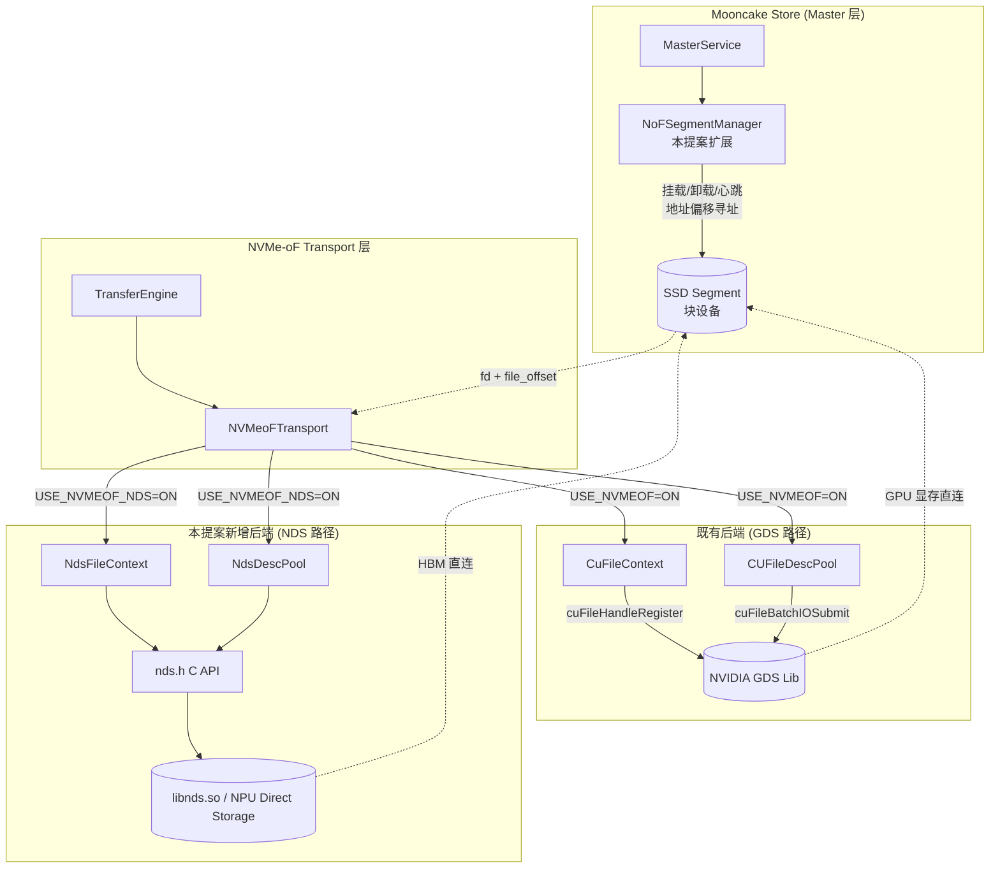

本提案覆盖两个层面：transport 层的 NDS 分支（替代 GDS API 完成数据搬运）与 master 层的 SSD segment 管理（在既有 `NoFSegmentManager` 基础上扩展共享/心跳/故障隔离能力）。SSD segment 基于普通块设备地址偏移寻址（`base + offset`），由 master 通过 fd + offset 向 transport 层下发任务。

### 3.2 编译期分支

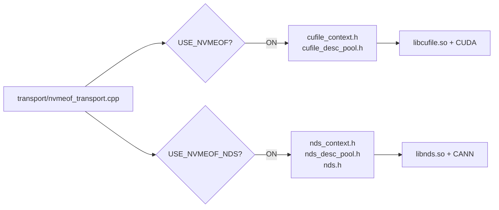

transport 层 GDS 分支由既有宏 `USE_NVMEOF` 启用，NDS 分支由本提案新增宏 `USE_NVMEOF_NDS` 启用，两者相互独立（store 层 SPDK 路径由既有宏 `USE_NOF` 启用，见第 2.4 节）：

- `USE_NVMEOF_NDS=ON`：编译 `nvmeof_transport.cpp` 的 NDS 分支 + `nds_desc_pool.cpp`，链接 `libnds.so` 与 `CANN`；同时启用 master 层 NoF segment 管理。可选 `NDS_USE_STUB=ON` 编译 `nds_stub.cpp`（无需真实 NDS 硬件即可测试）；
- `USE_NVMEOF_NDS=OFF`（默认）：不启用 NDS 分支，transport 层 GDS 分支行为由 `USE_NVMEOF` 决定。

## 4. Transport 层设计

### 4.1 类图

#### 4.1.1 NVMeoFTransport 与两条后端分支


#### 4.1.2 NDS C API 抽象（`nds.h`）

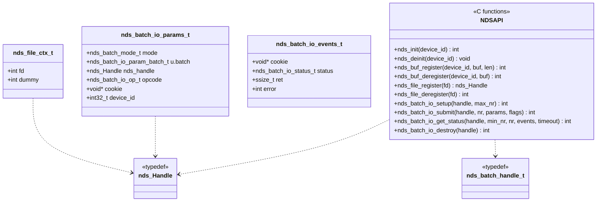

### 4.2 关键流程图

#### 4.2.1 初始化与内存注册流程

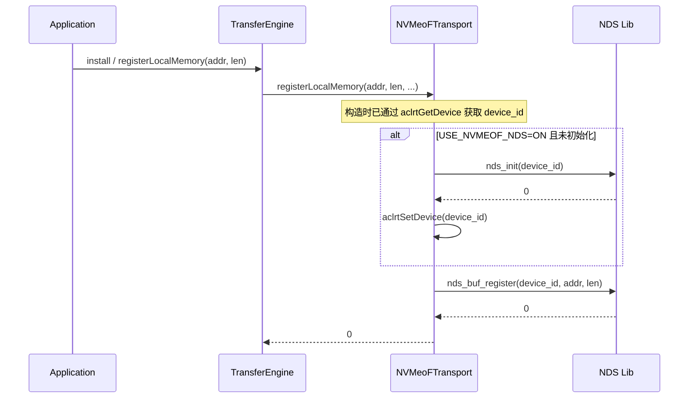

#### 4.2.2 Batch 提交与 Slice 执行流程（NDS 路径）

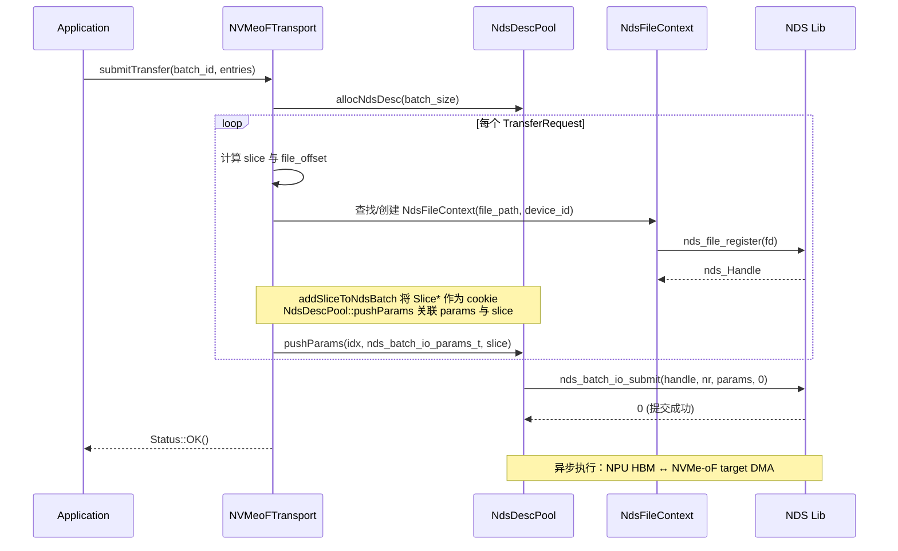

#### 4.2.3 状态查询流程

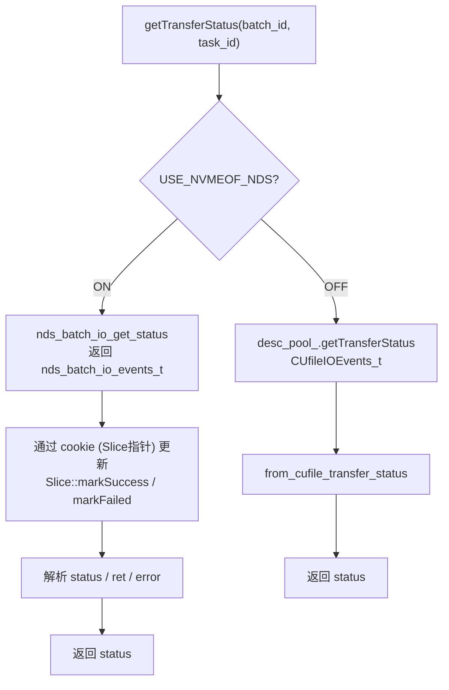

### 4.3 GDS 与 NDS 核心 API 对比

本节对照两条路径在 transport 层使用的关键 API，说明其在功能上的对应关系与差异。

#### 4.3.1 API 对照表

| 阶段         | GDS API (NVIDIA)                             | NDS API (Ascend)                             | 说明                                                    |
| ------------ | -------------------------------------------- | -------------------------------------------- | ------------------------------------------------------- |
| 驱动初始化   | `cuFileDriverOpen()`                       | `nds_init(device_id)`                      | NDS 显式接收`device_id`，与多卡场景对齐               |
| 驱动释放     | `cuFileDriverClose()`                      | `nds_deinit(device_id)`                    | —                                                      |
| 设备内存注册 | `cuFileBufRegister(addr, len, flags)`      | `nds_buf_register(device_id, buf, len)`    | NDS 同样以 HBM 地址为输入                               |
| 设备内存注销 | `cuFileBufDeregister(addr)`                | `nds_buf_deregister(device_id, buf)`       | —                                                      |
| 文件句柄注册 | `cuFileHandleRegister(&handle, &desc)`     | `nds_file_register(fd)`                    | NDS 直接接收 fd，返回`nds_Handle`                     |
| 文件句柄注销 | `cuFileHandleDeregister(handle)`           | `nds_file_deregister(fd)`                  | NDS 以 fd 为索引                                        |
| 批量提交     | `cuFileBatchIOSetUp / cuFileBatchIOSubmit` | `nds_batch_io_setup / nds_batch_io_submit` | 两者均支持批量异步 IO，参数结构不同                     |
| 批量状态查询 | `cuFileBatchIOGetStatus`                   | `nds_batch_io_get_status`                  | NDS 返回`nds_batch_io_events_t`，含 cookie/status/ret |
| 批量销毁     | `cuFileBatchIODestroy`                     | `nds_batch_io_destroy`                     | —                                                      |

#### 4.3.2 设计差异说明

- **设备标识**：GDS 通过 CUDA context 隐式确定设备；NDS 在每个 API 显式传入 `device_id`，便于在多 NPU 卡场景下精确路由。
- **批量能力**：GDS 与 NDS 均提供完整的 batch 异步 IO API（`setup / submit / get_status / destroy`）。NDS 的 batch 参数通过 `nds_batch_io_params_t` 描述（含 `mode`、`nds_handle`、`opcode`、`cookie`、`device_id`），与 GDS 的 `CUfileIOParams_t` 语义对等。
- **句柄语义**：GDS 的 `CUfileHandle_t` 是不透明指针；NDS 的 `nds_Handle` 同样为不透明指针，但其生命周期与 fd 绑定，注销时以 fd 为索引。

## 5. Master 层 SSD Segment 管理与 NDS 路径接入

本节描述 master 层针对普通块设备地址偏移寻址 SSD 盘的 segment 管理设计，核心能力包括多 client 共享 segment、心跳健康检查、故障隔离。本提案面向基于块设备地址偏移寻址的普通 SSD 盘，segment 内空间由既有 `OffsetBufferAllocator` 管理，与现有 `NoFSegmentManager` 的寻址模型保持一致。

### 5.1 设计要点

| 要点                   | 说明                                                                                                                                           |
| ---------------------- | ---------------------------------------------------------------------------------------------------------------------------------------------- |
| Segment 寻址模型       | 普通块设备地址偏移寻址（`base + offset`），复用既有 `OffsetBufferAllocator`                                                                |
| 多 client 共享 segment | 一块物理 SSD 可被多个 client 同时挂载使用，通过`client_refs` 引用计数管理生命周期；重复挂载同一 `device_name` 仅增加引用，不创建新 segment |
| 卸载语义               | `Unmount(device_name, client_id)`：引用计数减一；引用归零才真正销毁 segment。与既有 `NoFSegmentManager` 的 1:1 挂载语义不同                |
| 心跳健康检查           | 后台线程定期探测每个 OK 状态的 SSD segment，连续失败超阈值（`interval × threshold`）触发强制卸载，使新写入自动流向健康 segment              |
| 故障处理               | 设备不可达时直接`ForceUnmountSegment` 强制卸载（绕过 `client_refs`），**不走 Drain 路径**——故障设备无法读取也就无法迁移数据        |
| Client 透明            | Client 每次操作向 master 请求 descriptor，故障段的 descriptor 会被`ClearInvalidHandles` 清理；Client 无需显式感知卸载                        |

### 5.2 类图


### 5.3 挂载与卸载流程

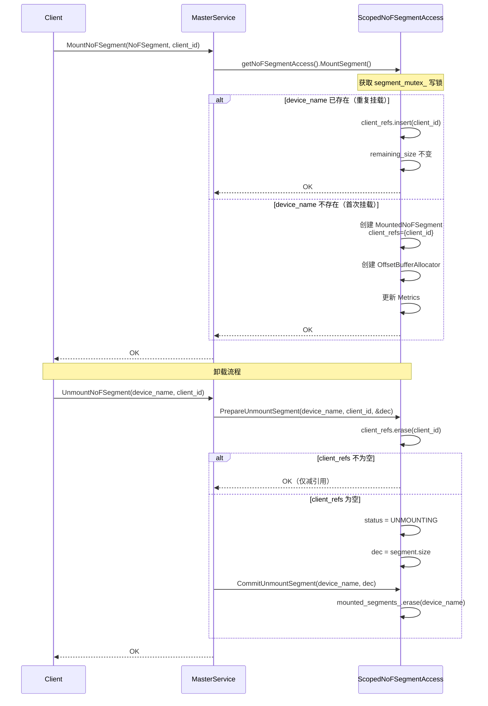

### 5.4 心跳与健康检查

后台心跳线程每 100ms 醒来，对所有 OK 状态的 SSD segment 进行轮询探测。`NoFProbeFn` 以函数注入方式提供（master 不依赖具体驱动实现），探针实现由 transport 层提供——在 NDS 路径下基于一次轻量 `nds_read` 完成。

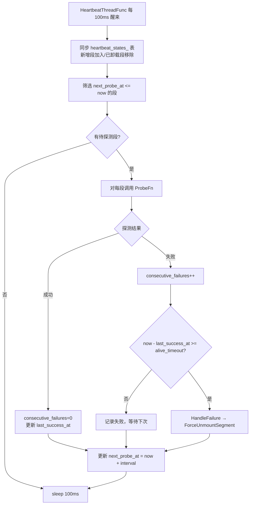

`alive_timeout = interval × threshold`（如默认 10s × 3 = 30s）。

### 5.5 故障处理与强制卸载

故障设备不可达，**不走 Drain 路径**（Drain 要求源段可读以迁移数据）。直接 `ForceUnmountSegment` 强制卸载：绕过 `client_refs` 检查、清空引用集合、清理 `client_segments_` 中所有引用、置 `UNMOUNTING`，随后通过 `ClearInvalidHandles` 遍历 `ObjectMetadata` 删除匹配 `device_name` 的副本（对象仍有其他健康副本则降级存活，否则删除 key），最终 `CommitUnmountSegment` 移除 segment 并扣减容量指标。

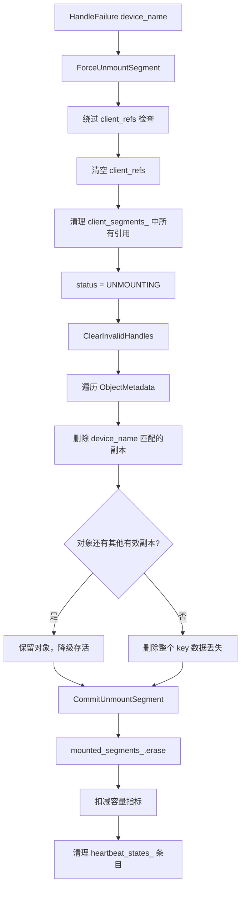

数据丢失是硬件故障的必然结果，系统采取的措施包括：新写入自动分配到健康段（`Allocate()` 跳过非 OK 段）、有冗余的对象降级存活、无冗余的对象返回 `OBJECT_NOT_FOUND`。Client 无需显式感知卸载，通过现有 `GetReplicaList` 机制切换到健康副本。

### 5.6 Store 层路由扩展

当前 `TransferSubmitter::submit()` 中 NoF 副本的处理分支仅支持 SPDK 路径，适配方案是在该分支中增加 `USE_NVMEOF_NDS` 定义的 NDS 备选路径：

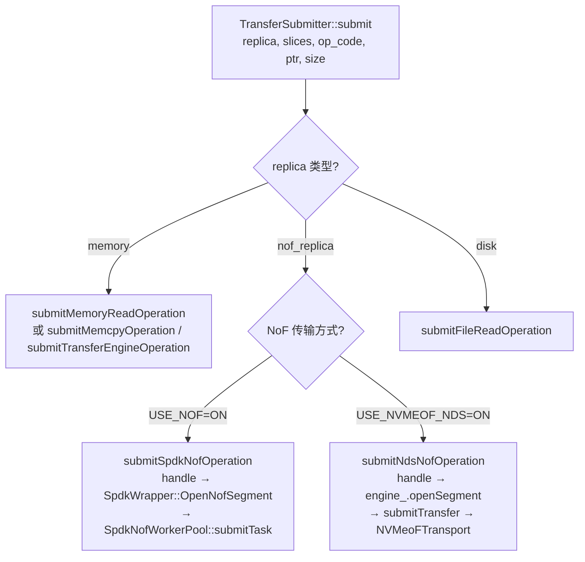

新增的 `submitNdsNofOperation` 核心逻辑：

| 步骤 | 操作                                                | 说明                                                                                                 |
| ---- | --------------------------------------------------- | ---------------------------------------------------------------------------------------------------- |
| 1    | `engine_.openSegment(handle.transport_endpoint_)` | 以`transport_endpoint_` 作为 segment name 打开 segment，获取 `SegmentHandle`                     |
| 2    | 构造`TransferRequest`                             | `target_id = seg`，`target_offset = handle.buffer_address_`，`source = ptr`，`length = size` |
| 3    | `submitTransfer({request})`                       | 通过 TransferEngine 提交，由`NVMeoFTransport`（NDS 分支）执行                                      |

此方案复用现有的 `submitTransfer` 路径（与 `submitTransferEngineOperation` 一致），无需在 store 层新增 worker 线程池。

### 5.7 Segment 元数据注册与挂载

#### 5.7.1 NoFSegment 结构体适配

当前 `NoFSegment` 结构体定义如下（`mooncake-store/include/types.h`）：

```cpp
struct NoFSegment {
    UUID id{0, 0};
    std::string name{};    // 逻辑段名称，用于优选分配
    uintptr_t base{0};     // NVMe 命名空间偏移量
    size_t size{0};        // 段容量（字节）
    std::string te_endpoint{};  // TE p2p 端点（ip:port）
};
```

**NDS 路径下的需求分析**：NDS 路径需要走 TransferEngine，client 侧通过 `TransferEngine::openSegment()` 对接 `SegmentDesc`。`SegmentDesc.nvmeof_buffers` 为 `NVMeoFBufferDesc` 结构（`mooncake-transfer-engine/include/transfer_metadata.h`）：

```cpp
struct NVMeoFBufferDesc {
    std::string file_path;                                     // 远端地址
    uint64_t length;
    std::unordered_map<std::string, std::string> local_path_map;  // 远端地址 → 本地设备路径
};
```

即一个 NoF 段需要同时具备**远端地址**（`file_path`，作为 `SegmentDesc.name` 供路由）与**本地地址**（`local_path_map[local_server_name_]`，供 `NdsFileContext` 打开并注册 NDS 句柄）。因此 `NoFSegment` 需新增 `device_path` 字段存储本地地址；远端地址（`remote_path`）复用既有 `te_endpoint` 字段，在 NDS 路径下其语义为远端标识：

```cpp
struct NoFSegment {
    UUID id{0, 0};
    std::string name{};    // 逻辑段名称，用于优选分配
    uintptr_t base{0};     // NVMe 命名空间偏移量
    size_t size{0};        // 段容量（字节）
    std::string te_endpoint{};  // SPDK：NVMe-oF transport string；NDS：远端地址（remote_path），作为 SegmentDesc.name
    std::string device_path{};  // 新增：本地 NVMe 块设备路径，供 NdsFileContext 打开并注册 NDS 句柄
};
```

- **`remote_path`（= `te_endpoint`）**：远端标识，格式为 `"远端ip:设备路径"`（如 `"10.0.0.1:/dev/nvme0n1"`）。用于确认 segment 的唯一性，同时作为 `SegmentDesc.name` 与 `nvmeof_buffers[].file_path` 供 `TransferEngine::openSegment()` 路由定位。
- **`local_path`（= `device_path`）**：本地 NVMe 块设备路径，用于本地 NDS 读写——`NdsFileContext` 对其 `open()` 后经 `nds_file_register()` 建立 NDS 句柄。仅挂载该段的节点本地有效。

| 字段                    | NDS 路径用途                                                                                                                                                                               | SPDK 路径                                                  |
| ----------------------- | ------------------------------------------------------------------------------------------------------------------------------------------------------------------------------------------ | ---------------------------------------------------------- |
| `name`                | 作为 segment 标识，与现有逻辑一致                                                                                                                                                          | 同                                                         |
| `base`                | NVMe 命名空间偏移（对 NDS 同样有效）                                                                                                                                                       | 同                                                         |
| `size`                | 段容量，构造`nvmeof_buffers[].length`                                                                                                                                                    | 同                                                         |
| `te_endpoint`         | 远端地址（`remote_path`，格式`远端ip:设备路径`），用于确认 segment 唯一性，并作为 `SegmentDesc.name` 与 `nvmeof_buffers[].file_path` 供 `TransferEngine::openSegment()` 路由定位 | NVMe-oF transport string（网络地址），SPDK 直连远端 target |
| `device_path`（新增） | 本地块设备路径（`local_path`），写入 `nvmeof_buffers[].local_path_map[local_server_name_]`，供 `NdsFileContext` 打开并注册 NDS 句柄用于本地 NDS 读写                                 | 不需要（SPDK 通过 transport string 直连）                  |

新增字段对既有 SPDK 路径透明：`MountSegment()` 中已有字段均保持不变，`device_path` 仅在 NDS 路径下被读取。

#### 5.7.2 设备路径配置与手动挂载

设备路径的传入方式参考已有 `ssd_offload_path` 参数模式：在 `store.setup()` 调用时通过新增参数 `nof_device_path` 指定，类型为**字符串列表**，每个元素格式为 **`"remote_path:local_path"`**（两段语义见 5.7.1），按**最后一个冒号**分割，一次调用可挂载多个 NoF 盘：

例如 `setup(nof_device_path=["10.0.0.1:/dev/nvme0n1:/dev/nvme0n1", "10.0.0.1:/dev/nvme1n1:/dev/nvme1n1"])` 一次注册两个段。

由于只有本地挂载了该段才能使用，**挂载仅对当前 client 生效**：每个 client 在 `setup()` 中指定本机已挂载的段列表，由 client 在初始化阶段完成注册与挂载，不做全局刷新。

注册与挂载流程如下：

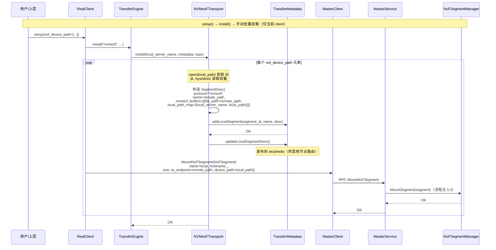

流程要点（详细步骤已由上图展示，此处仅列出关键动作）：

1. **参数传入**：`setup(nof_device_path=[...])` 经 `RealClient::setup_internal()` 传入 `NVMeoFTransport::install()`；每个元素按**最后一个冒号**分割为 `remote_path:local_path`（语义见 5.7.1）。
2. **注册 SegmentDesc**（`install()` 内逐元素执行）：对 `local_path` 设备 `open()` 获取 fd，从 `/sys/block/<device>/size` × 512 读取容量；构造 `SegmentDesc`（`name = remote_path`、`file_path = remote_path`、`local_path_map[local_server_name_] = local_path`、`protocol = "nvmeof"`）；调用 `metadata_->addLocalSegment()` 与 `metadata_->updateLocalSegmentDesc()` 完成本地注册与发布（复用 RDMA TE 已有接口）。
3. **Client 主动挂载**：`setup_internal()` 中构造 `NoFSegment`（`name = local_hostname_`、`te_endpoint = remote_path`、`device_path = local_path`），调用 `MasterClient::MountNoFSegment()` 发起 RPC，由 `MasterService` 转交 `NoFSegmentManager::MountSegment()` 完成挂载（RPC 链路为既有接口，挂载细节见第 5.3 节）。

`SegmentDesc` 各字段的填充规则：

| 字段                                | 来源                                   | 说明                                                                                                 |
| ----------------------------------- | -------------------------------------- | ---------------------------------------------------------------------------------------------------- |
| `name`                            | `nof_device_path` 的 `remote_path` | 远端标识（远端ip + 设备路径），确认 segment 唯一性，与`transport_endpoint_`（`te_endpoint`）一致 |
| `protocol`                        | 固定`"nvmeof"`                       | 使`TransferSubmitter::submitTransfer` 能识别并路由到 `NVMeoFTransport`                           |
| `nvmeof_buffers[].file_path`      | `nof_device_path` 的 `remote_path` | 远端标识（远端ip + 设备路径），与`SegmentDesc.name` 一致                                           |
| `nvmeof_buffers[].local_path_map` | `nof_device_path` 的 `local_path`  | 本地 NVMe 块设备路径（本地 NDS 读写使用），如`/dev/nvme0n1`，键为`local_server_name_`            |
| `nvmeof_buffers[].length`         | `NoFSegment.size`（从 sysfs 读取）   | segment 总大小                                                                                       |

## 6. 配置与可观测性

通过编译选项与运行参数进行配置：

| 配置项                            | 含义                                                                    | 默认值                   |
| --------------------------------- | ----------------------------------------------------------------------- | ------------------------ |
| `USE_NVMEOF`（编译期，既有）    | 启用 transport 层 GDS 分支                                              | `OFF`                  |
| `USE_NOF`（编译期，既有）       | 启用 store 层 SPDK NoF 路径                                             | `OFF`                  |
| `USE_NVMEOF_NDS`（编译期）      | 一次性启用 NDS 分支：master 层 NoF segment 管理 + transport 层 NDS 传输 | `OFF`                  |
| `nof_device_path`（setup 参数） | 远端ip+本地路径列表（`["远端ip:设备路径:本地路径", ...]`）            | 空（不启用 NoF segment） |

master 层 SSD segment 的心跳参数（探测间隔、超时、失败阈值）通过 `MasterServiceConfig` 注入，默认值参见第 5.4 节。

状态查询在 NDS 路径下通过 `nds_batch_io_get_status` 获取 `nds_batch_io_events_t`（含 `status`、`ret`、`error`），与 GDS 路径基于 `CUfileIOEvents_t` 的查询语义保持一致（参见第 4.2.3 节）。

## 7. 与社区路线的协同

- 与 SPDK 路线互补（定位差异见第 2.4 节）：本提案在 transport 层引入 NPU 直连分支，并在 master 层扩展 NoF segment 的共享/心跳/故障隔离能力。运维工具等仍可由 SPDK 路线提供，二者可叠加使用。
- 不修改既有 GDS 分支：`CuFileContext`、`CUFileDescPool` 保持原样，存量用户编译/行为不变。

## 8. 后续工作

后续工作按 PR 粒度拆分，共 5 项：

1. **合入 transport 层 NDS 分支**：`NdsFileContext`、`NdsDescPool` 及 `NVMeoFTransport` 的 NDS 编译分支（第 4 章），作为独立 PR 合入社区 `mooncake-transfer-engine`；
2. **扩展 master 层 NoF segment 管理**：多 client 共享（`client_refs`）、探针抽象（`NoFProbeFn`），并为 `USE_NVMEOF_NDS` 绑定基于 `nds_read` 的默认探针、替换 SPDK 探针（第 5.1-5.4 节）；
3. **client 侧接入**：实现 `submitNdsNofOperation` 及 `TransferSubmitter` 的 `USE_NVMEOF_NDS` 路由分支（第 5.6 节）；在 `NoFSegment` 中增加 `device_path` 字段、`store.setup()` 新增 `nof_device_path` 列表参数（元素格式 `远端ip:设备路径:本地路径`），由 `NVMeoFTransport::install()` 遍历完成 device 验证与 SegmentDesc 注册，并在 `setup_internal()` 中调用 `MasterClient::MountNoFSegment()` 完成挂载（第 5.7 节）；
4. **补齐 transport 层 QoS 流控**：使 `NVMeoFTransport` 达到与 SPDK 路径 `SpdkNofQos` 对等的水平；
5. **评估公共抽象基类**：统一 GDS/NDS 句柄管理（`NvmeOfFileContext`）以及 master 层引用计数与心跳接口（`ScopedNoFSegmentAccess` 与 `ScopedSegmentAccess`）。

## 9. 参考文献

- [#1940 SSD pool over NVMe-oF](https://github.com/kvcache-ai/Mooncake/issues/1940)
- [#2084 NVMe-oF SSD cache support](https://github.com/kvcache-ai/Mooncake/pull/2084)
- NVIDIA GDS: https://docs.nvidia.com/gpudirect-storage/
