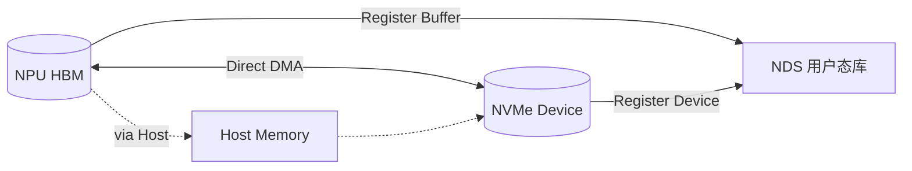
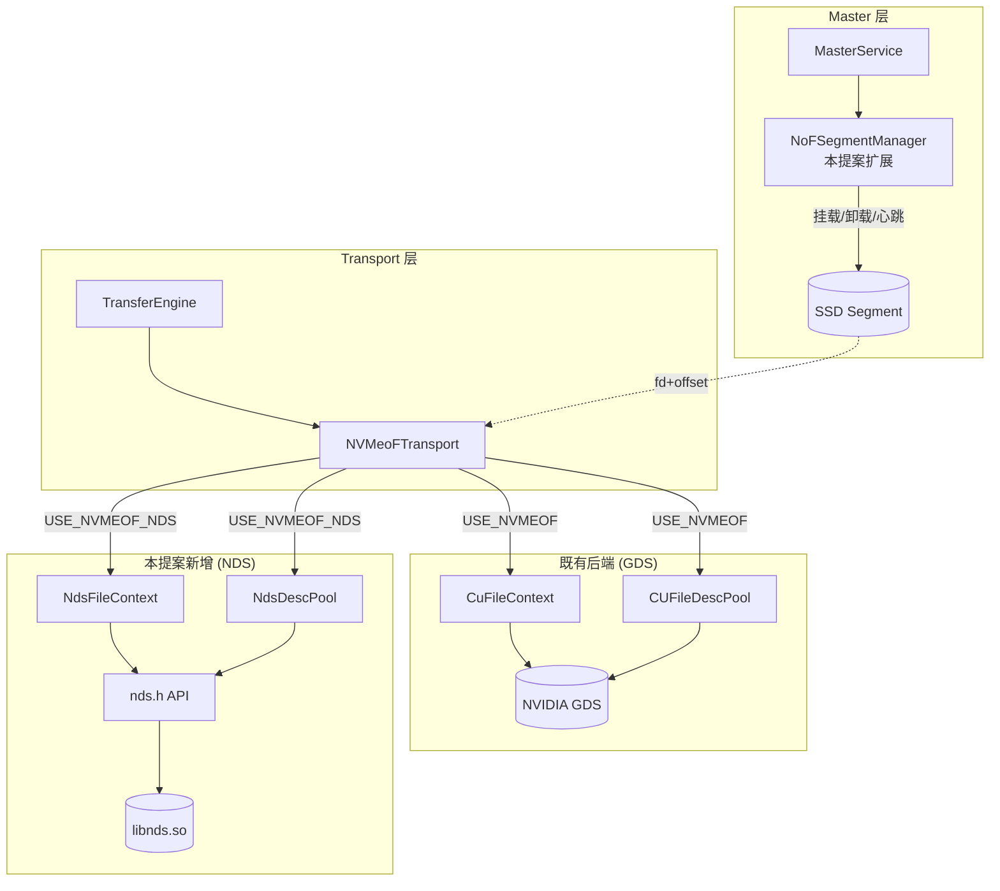
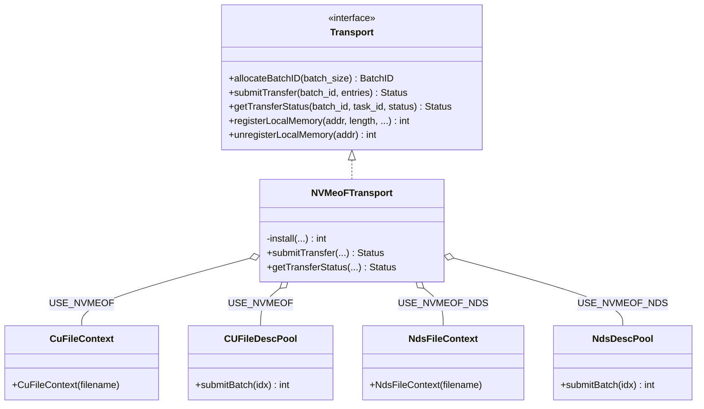
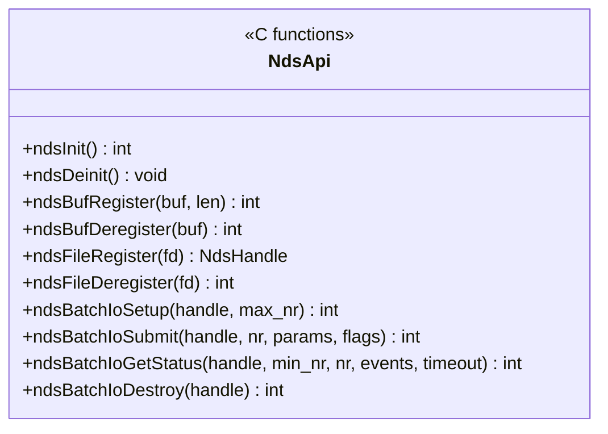
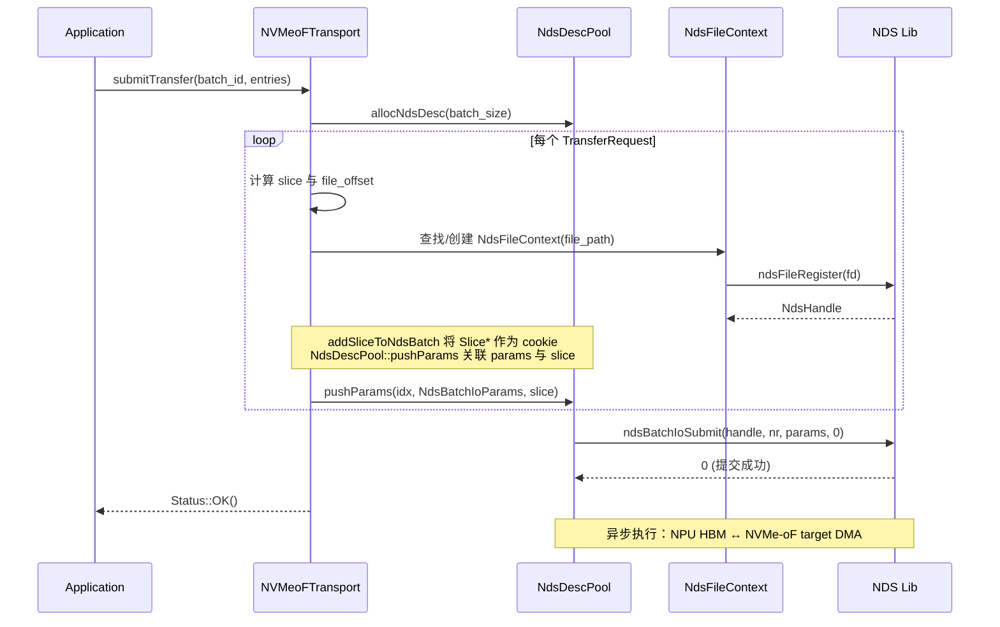
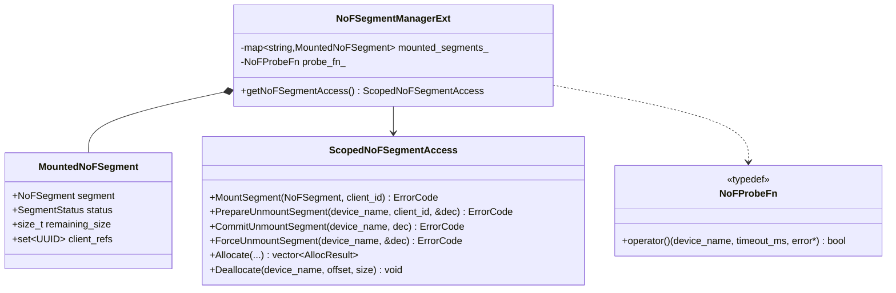
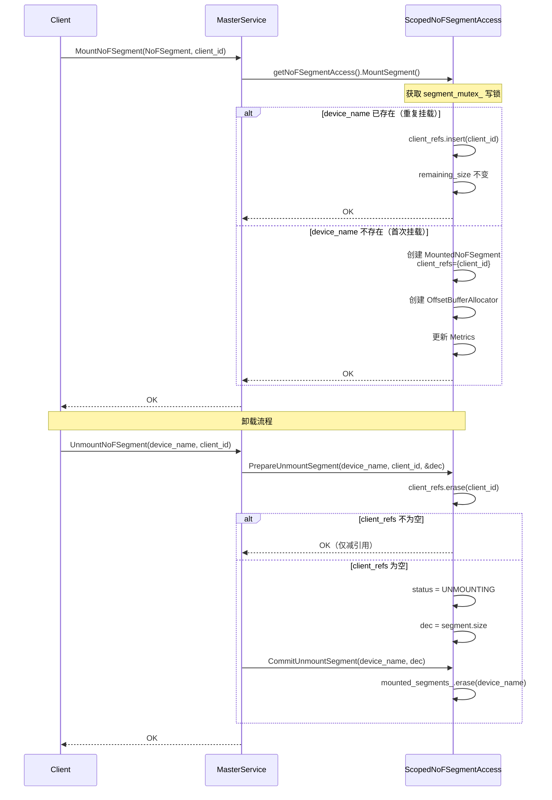
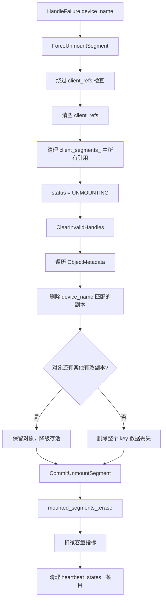
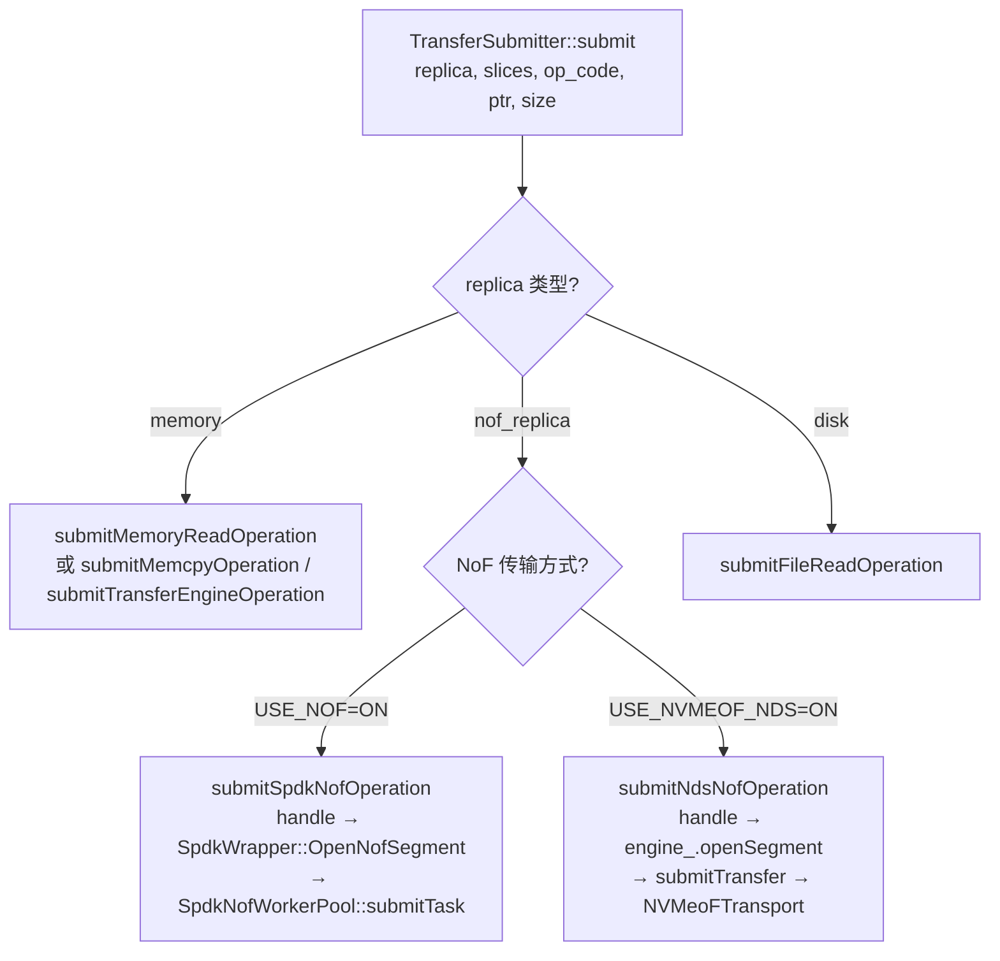
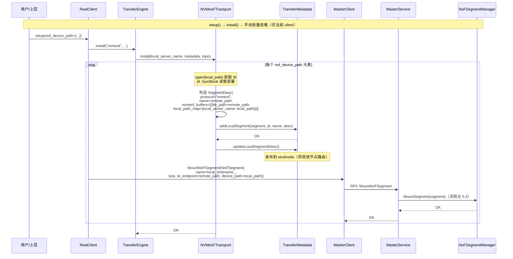

# RFC: 引入 NDS 分支并扩展 Master 层 SSD Segment 管理以支持昇腾 NPU 直连 NVMe-oF 存储

## 1. 引言

本 RFC 提议为昇腾 NPU 场景补齐 NVMe-oF 直连存储能力，包含两项配套改动：

1. **Transport 层 NDS 分支**：在 `nvmeof_transport` 中增加与 GDS 平行的 **NDS（NPU Direct Storage）分支**，使昇腾 NPU 推理/训练场景能直接通过 NVMe-oF 访问远端 SSD Pool，扩展 KV Cache 容量上限。
2. **Master 层 SSD Segment 管理扩展**：在既有 `NoFSegmentManager` 基础上扩展多 client 共享（`client_refs` 引用计数）、探针注入（`NoFProbeFn`），复用既有故障强制卸载与副本清理链路，使 NDS 与 SPDK 路径共享同一套 segment 生命周期管理框架。

本提案与社区 SPDK NoF 路线（[#1940](https://github.com/kvcache-ai/Mooncake/issues/1940)、[#2084](https://github.com/kvcache-ai/Mooncake/pull/2084)）互补不重叠，通过编译宏 `USE_NVMEOF_NDS` 启用。NPU HBM 直接经 NDS 与 NVMe-oF target 间 DMA，无需像 SPDK 路径那样分配 host 侧 DMA buffer。

## 2. 背景与动机

### 2.1 NDS 简介

NDS（NPU Direct Storage，CCDK/nds）是华为昇腾平台的 NPU 直连存储用户态库，与 NVIDIA GDS 角色对等：将 NPU HBM 与 NVMe 设备间的数据搬运直接下放到硬件 DMA，避免 host 内存中转。



NDS 提供五大功能域：**生命周期管理**（`ndsInit`/`ndsDeinit`）、**HBM 缓冲注册与导出**（`ndsBufRegister`/`ndsBufDeregister`）、**文件/块设备注册**（`ndsFileRegister`/`ndsFileDeregister`）、**同步读写**、**异步批量 I/O**（`ndsBatchIoSetup`/`ndsBatchIoSubmit`/`ndsBatchIoGetStatus`）。

### 2.2 技术可行性分析

在引入 NDS 分支之前，需确认以下关键前提：

- **NDS 对块设备 I/O 的兼容性**：NDS 对块设备（`/dev/nvmeXnY`）的支持状态与限制。若 NDS 不支持块设备，则需评估是否通过文件系统层间接支持。
- **NVMe-oF 协议数据的提交与确认机制**：判断 NDS 与 NVMe-oF target 间的 I/O 模型是否兼容，特别是 NDS 批量 I/O 接口对 target 端 NVMe 队列的适应性。
- **多路径与并发 I/O**：多个 client 同时通过 NDS 对同一物理 SSD 发起 I/O 时的并发安全性与锁模型。
- **NDS 对远端存储的语义支持**：NDS 接口在远端存储（如 NVMe-oF target 暴露的块设备）上与本地块设备行为是否一致。
- **NDS 生命周期与容错**：NDS 的初始化、去初始化、以及设备热插拔场景下的行为。

### 2.3 NPU 直连存储路径缺失

当前仓库中两条 NVMe-oF 直连路径均面向 NVIDIA GPU：

- **GDS 参考实现**（transport 层）：依赖 `cufile.h`，提供 `CuFileContext` 句柄注册与 `CUFileDescPool` 批量提交，需用户自行挂载远端 target，无自动化 segment 管理。
- **SPDK 路线**（store 层，#1940/#2084）：通过 SPDK 用户态驱动直连远端 target，提供完整的 NoF segment 管理、心跳、故障隔离与多副本支持。

共同问题：两者均依赖 CUDA，昇腾 NPU 场景缺失。昇腾侧已提供对等的 NDS 用户态库，具备构建直连路径的底层能力，因此本提案在 transport 层引入 NDS 分支。

### 2.4 Master 层 SSD 生命周期管理

Transport 层只负责"在给定 fd + offset 上发起一次 DMA"，不感知 SSD 的挂载归属、健康状态或容量。这些职责由 master 层 `NoFSegmentManager` 承担。现有实现存在两处不匹配：

1. **1:1 挂载语义 vs. 多 client 共享**：物理 SSD 常被多个 client 同时挂载。**本提案扩展 `client_refs` 引用计数**，重复挂载同一 `device_name` 仅增加引用，不创建新 segment。
2. **心跳探针与 SPDK 驱动绑定**：既有心跳直接调用 `SpdkWrapper::ProbeNofSegment`，NDS 路径下不可用。**本提案将探针抽象为 `NoFProbeFn` 函数注入**，由 transport 层按路径提供实现。

故障强制卸载链路（`ForceUnmountSegment` + `ClearInvalidHandles`）已在 SPDK 路线中实现，本提案直接复用。

### 2.5 与 SPDK 路线定位差异

三条路径由三个独立编译宏启用，互不依赖：

| 维度 | SPDK 路线 (#1940/#2084) | 本提案 (NDS 路线) |
|---|---|---|
| 适用硬件 | NVIDIA GPU（依赖 CUDA） | 昇腾 NPU（基于 NDS 库） |
| 存储后端 | SPDK 用户态驱动直连 | 复用 NDS C API |
| Host 内存 | 分配 host 侧 DMA buffer | 不涉及，HBM 直接经 NDS 落盘 |
| Segment 管理 | 独立 `NoFSegmentManager` + 心跳 | 扩展既有 `NoFSegmentManager`（共享/探针/故障隔离） |
| Transport 改动 | 新增 store 层模块 | transport 层新增平行分支 + master 层扩展 |
| 集群级共存 | GPU 节点编译 `USE_NOF`，NPU 节点编译 `USE_NVMEOF_NDS`，共享 master 与 segment 池 |

## 3. 总体架构

### 3.1 模块结构



NDS 路径覆盖两层：transport 层 NDS 分支（替代 GDS 完成数据搬运）与 master 层 segment 管理（扩展共享/心跳/故障隔离）。SSD 基于块设备地址偏移寻址（`base + offset`），由 master 通过 fd + offset 下发任务。

### 3.2 编译期分支

| 宏 | 作用 |
|---|---|
| `USE_NVMEOF`（既有） | 启用 transport 层 GDS 分支（`CuFileContext`/`CUFileDescPool`） |
| `USE_NOF`（既有） | 启用 store 层 SPDK NoF 路径（`SpdkWrapper` + `SpdkNofWorkerPool`） |
| `USE_NVMEOF_NDS`（新增） | 启用 NDS 分支：master 层 NoF segment 管理 + transport 层 NDS 传输 |

`USE_NVMEOF_NDS=ON` 编译 `nvmeof_transport.cpp` NDS 分支 + `nds_desc_pool.cpp`，链接 `libnds.so` 与 `CANN`。

## 4. Transport 层设计

### 4.1 类图



NDS C API 抽象（`nds.h`）：



### 4.2 关键流程

**初始化与内存注册**：`registerLocalMemory` 触发 `ndsInit` + `ndsBufRegister`。

**Batch 提交**（NDS 路径）：



**状态查询**：`getTransferStatus` 根据 `USE_NVMEOF_NDS` 分流到 `ndsBatchIoGetStatus`（返回 `NdsBatchIoEvents`）或 `CUFileDescPool::getTransferStatus`（返回 `CUfileIOEvents_t`）。

### 4.3 GDS 与 NDS API 对照

| 阶段 | GDS API | NDS API | 说明 |
|---|---|---|---|
| 初始化 | `cuFileDriverOpen()` | `ndsInit()` | 均隐式确定设备上下文 |
| 内存注册 | `cuFileBufRegister(addr, len, flags)` | `ndsBufRegister(buf, len)` | 均以 HBM 地址为输入 |
| 文件注册 | `cuFileHandleRegister(&handle, &desc)` | `ndsFileRegister(fd)` | NDS 直接接收 fd |
| 批量提交 | `cuFileBatchIOSetUp / cuFileBatchIOSubmit` | `ndsBatchIoSetup / ndsBatchIoSubmit` | 均支持批量异步 IO |
| 状态查询 | `cuFileBatchIOGetStatus` | `ndsBatchIoGetStatus` | NDS 返回 `NdsBatchIoEvents` |
| 批量销毁 | `cuFileBatchIODestroy` | `ndsBatchIoDestroy` | — |

## 5. Master 层 SSD Segment 管理

### 5.1 设计要点

| 要点 | 说明 |
|---|---|
| 寻址模型 | 块设备地址偏移寻址（`base + offset`），复用 `OffsetBufferAllocator` |
| 多 client 共享 | `client_refs` 引用计数管理生命周期；重复挂载仅增引用，不创建新 segment |
| 卸载语义 | `Unmount(device_name, client_id)`：引用归零才真正销毁 |
| 心跳 | 后台线程每 100ms 探测 OK 段，连续失败超阈值触发强制卸载 |
| 故障处理 | 设备不可达时 `ForceUnmountSegment` 绕过 `client_refs`，**不走 Drain 路径** |
| Client 透明 | 故障段 descriptor 经 `ClearInvalidHandles` 清理，client 无需感知卸载 |

### 5.2 类图



### 5.3 挂载与卸载



### 5.4 探针函数设计

`NoFProbeFn` 以函数注入方式解耦 master 层与具体驱动，master 层仅通过该抽象判断设备健康状态，不关心底层实现。

```cpp
// 函数签名
using NoFProbeFn = std::function<bool(
    const std::string& device_name,  // 设备标识
    int timeout_ms,                   // 单次探测超时
    std::string* error                // 错误信息输出
)>;
```

**返回值语义**：
- `true`：设备可达，segment 健康
- `false`：设备不可达，需通过 `error` 输出原因

**NDS 路径实现**（默认绑定）：
1. 打开 `device_name` 对应的本地块设备 fd
2. 发起一次轻量 `nds_read`（仅读取 1 字节，不关心数据内容）
3. 超时控制：`timeout_ms` 内未返回即视为失败
4. 若 `nds_read` 返回错误码，将错误信息填入 `error`，返回 `false`

**SPDK 路径实现**：直接调用 `SpdkWrapper::ProbeNofSegment(device_name, timeout_ms, error)`。

**心跳线程**（master 层已有逻辑，本提案不修改）：每 100ms 轮询，对 OK 状态的 segment 调用 `ProbeFn`，连续失败超过阈值（默认 `10s × 3`）触发 `ForceUnmountSegment`。

### 5.5 故障处理

设备不可达时直接强制卸载，不走 Drain 路径（源段不可读，无法迁移数据）：



新写入自动分配到健康段（`Allocate()` 跳过非 OK 段）。Client 通过 `GetReplicaList` 切换到健康副本。

### 5.6 Store 层路由扩展

`TransferSubmitter::submit()` 中 NoF 副本分支增加 NDS 路径：



`submitNdsNofOperation` 核心逻辑：

1. `engine_.openSegment(handle.transport_endpoint_)` — 打开 segment 获取 `SegmentHandle`
2. 构造 `TransferRequest{target_id=seg, target_offset=buffer_address_, source=ptr, length=size}`
3. `submitTransfer({request})` — 经 `NVMeoFTransport`（NDS 分支）执行

复用现有 `submitTransfer` 路径，无需 store 层新增 worker 线程池。

### 5.7 Segment 元数据注册与挂载

**NoFSegment 结构体**（`mooncake-store/include/types.h`）新增 `device_path` 字段：

```cpp
struct NoFSegment {
    UUID id{0, 0};
    std::string name{};        // 逻辑段名称
    uintptr_t base{0};         // NVMe 命名空间偏移
    size_t size{0};            // 段容量（字节）
    std::string te_endpoint{}; // SPDK: transport string; NDS: 远端地址（remote_path）
    std::string device_path{}; // 新增: 本地 NVMe 块设备路径
};
```

| 字段 | NDS 用途 | SPDK 用途 |
|---|---|---|
| `te_endpoint` | 远端标识 `remote_ip:device_path`，作为 `SegmentDesc.name` 路由 | NVMe-oF transport string |
| `device_path`（新增） | 本地块设备路径，`NdsFileContext` 打开后注册 NDS 句柄 | 不需要 |

**配置与挂载流程**：通过 `store.setup(nof_device_path=[...])` 传入，元素格式 `"remote_ip:device_path:local_path"`，按最后一个冒号分割。挂载仅对当前 client 生效：



## 6. 配置与可观测性

| 配置项 | 含义 | 默认值 |
|---|---|---|
| `USE_NVMEOF`（编译期，既有） | 启用 transport 层 GDS 分支 | `OFF` |
| `USE_NOF`（编译期，既有） | 启用 store 层 SPDK NoF 路径 | `OFF` |
| `USE_NVMEOF_NDS`（编译期） | 启用 NDS 分支（master + transport） | `OFF` |
| `nof_device_path`（setup 参数） | 远端+本地路径列表 `["remote_ip:dev_path:local_path", ...]` | 空 |

心跳参数（探测间隔、超时、阈值）通过 `MasterServiceConfig` 注入。NDS 路径下状态查询通过 `ndsBatchIoGetStatus` 获取 `NdsBatchIoEvents`（`status`/`ret`/`error`），与 GDS 路径 `CUfileIOEvents_t` 语义一致。

## 7. 与社区路线协同

- **SPDK 路线**（#1940/#2084）：定位差异见第 2.5 节。
- **GDS 分支**：不修改，`CuFileContext`/`CUFileDescPool` 保持原样。
- **Roadmap 对齐**（[#1883](https://github.com/kvcache-ai/Mooncake/issues/1883)）：NVMe-oF 提议集中在 Milestone 13（SSD Offload Support），含 [#1940](https://github.com/kvcache-ai/Mooncake/issues/1940)、[#2084](https://github.com/kvcache-ai/Mooncake/pull/2084)、[#2172](https://github.com/kvcache-ai/Mooncake/pull/2172)。Milestone 6 的昇腾适配条目为本提案提供路线依据。

## 8. 后续工作

按 PR 粒度拆分，共 5 项：

1. **合入 transport 层 NDS 分支**：`NdsFileContext`、`NdsDescPool` 及 `NVMeoFTransport` 的 NDS 编译分支，作为独立 PR 合入 `mooncake-transfer-engine`。
2. **扩展 master 层 NoF segment 管理**：多 client 共享（`client_refs`）、探针抽象（`NoFProbeFn`），绑定 NDS 默认探针。
3. **Client 侧接入**：实现 `submitNdsNofOperation` 及 `TransferSubmitter` 路由分支；`NoFSegment` 增加 `device_path` 字段；`store.setup()` 新增 `nof_device_path` 列表参数；`NVMeoFTransport::install()` 完成 device 验证与 SegmentDesc 注册；`setup_internal()` 中调用 `MountNoFSegment()` 完成挂载。
4. **补齐 transport 层 QoS 流控**：使 `NVMeoFTransport` 达到与 `SpdkNofQos` 对等的水平。
5. **评估公共抽象基类**：统一 GDS/NDS 句柄管理（`NvmeOfFileContext`）及 master 层引用计数与心跳接口。

## 9. 参考文献

- Mooncake Official Roadmap: https://github.com/kvcache-ai/Mooncake/issues/1883
- [#1940 SSD pool over NVMe-oF](https://github.com/kvcache-ai/Mooncake/issues/1940)
- [#2084 NVMe-oF SSD cache support](https://github.com/kvcache-ai/Mooncake/pull/2084)
- [#2172 feat(store): add SPDK NoF worker pool](https://github.com/kvcache-ai/Mooncake/pull/2172)
- [#2176 Store L2→L1 promotion-on-hit](https://github.com/kvcache-ai/Mooncake/pull/2176)
- [#1058 Mooncake Transfer Engine NEXT](https://github.com/kvcache-ai/Mooncake/issues/1058)
- NVIDIA GDS: https://docs.nvidia.com/gpudirect-storage/