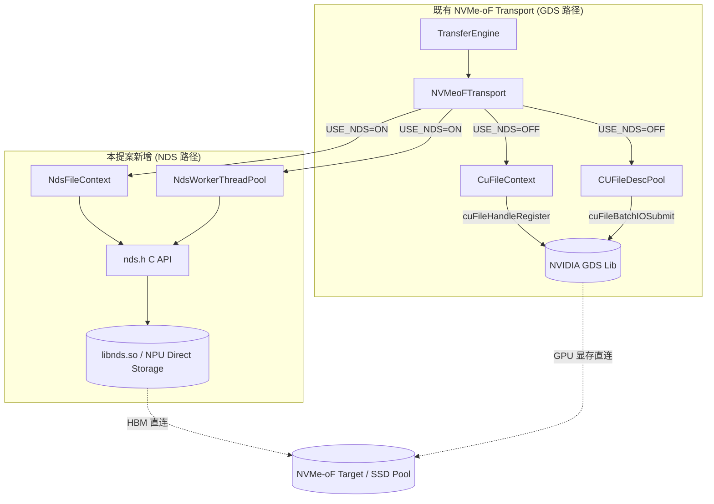
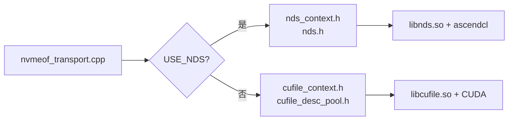
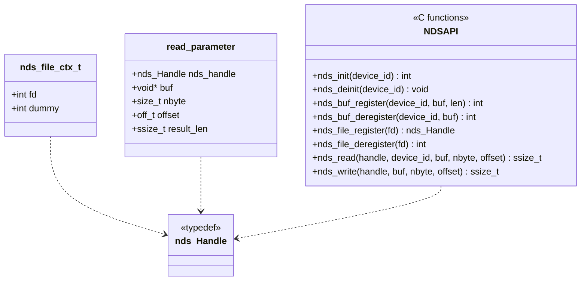
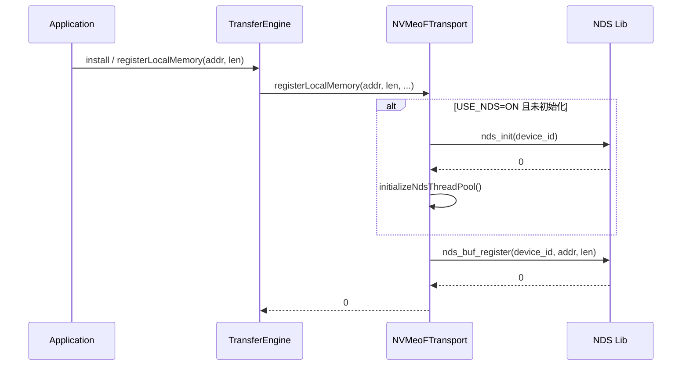
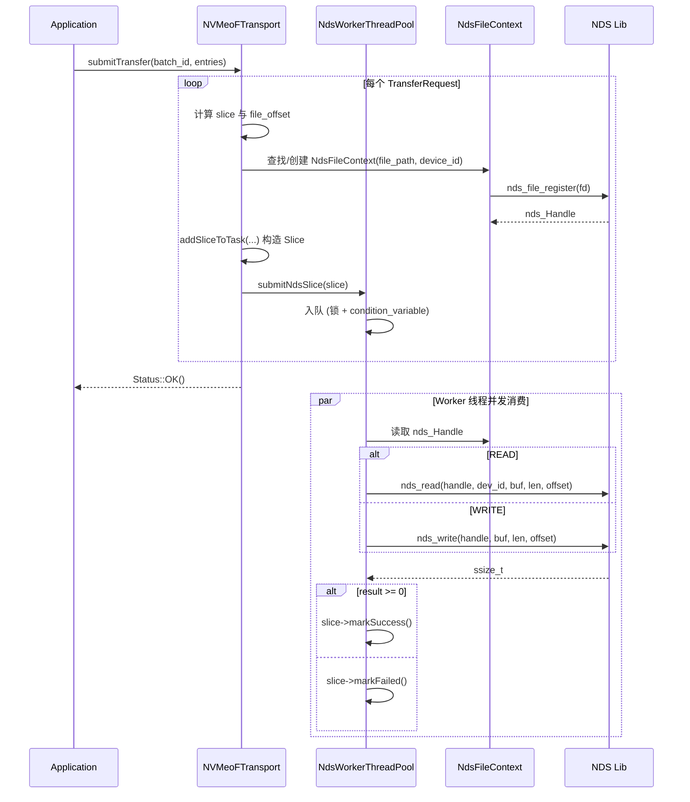
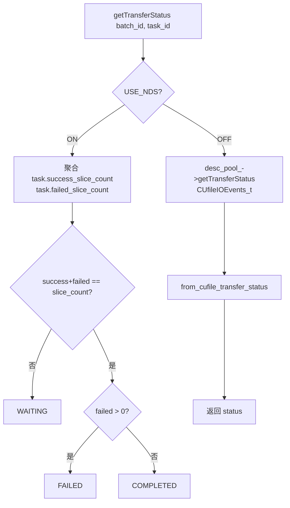
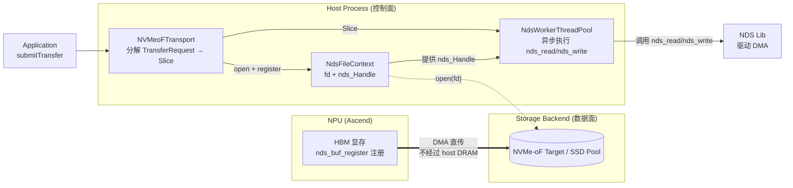

# RFC: 在 NVMe-oF Transport 中引入 NDS (NPU Direct Storage) 分支以支持昇腾 NPU 直连存储

## 1. 引言

本 RFC 提议在现有的 `nvmeof_transport` 中增加一条与 GDS（GPU Direct Storage）平行的 **NDS（NPU Direct Storage）分支**，使得基于昇腾 NPU（HBM）的推理/训练场景也能像 NVIDIA GPU + GDS 一样，直接通过 NVMe-oF 访问远端 SSD Pool，从而扩展 KV Cache 的容量上限。

需要先指出的是，**当前仓库中的 GDS 参考实现本身并不完善**：它仅提供 transport 层的最小可运行路径（`CuFileContext` 句柄注册、`CUFileDescPool` 批量提交、基于 `CUfileIOEvents_t` 的状态查询），要求用户自行发现并挂载远端 NVMe-oF target，缺少自动化的 segment 生命周期管理、心跳检测、副本放置策略等上层能力。因此，本提案以"参考实现"的同等定位引入 NDS 分支，与既有 GDS 路径并列共存，后续可由社区共同补齐上层能力。

本提案与社区已有的两条相关工作互补但不重叠：

- [#1940 SSD pool over NVMe-oF (SPDK 路线)](https://github.com/kvcache-ai/Mooncake/issues/1940)：在 host 侧通过 SPDK wrapper 走存储后端，并改造 LMCache 内存为 huge page + `cudaHostRegister` 以实现 zero-copy。
- [#2084 SPDK 集成补充](https://github.com/kvcache-ai/Mooncake/pull/2084)：在 1940 基础上补齐了 SSD 注册脚本、NoF 心跳、多副本清理与监控指标等。

我们的方案与上述两条路线的区别在于：**保留 transport 层的 GDS 抽象，平行引入 NDS 后端**，无需引入 SPDK、无需替换既有 CUDA pinned memory 分配逻辑，对存量 GDS 路径零侵入。

## 2. 背景与动机

### 2.1 现状

当前 `mooncake-transfer-engine/src/transport/nvmeof_transport/` 中存在一份 NVMe-oF transport 参考实现，但它强依赖于 NVIDIA GDS（`cufile.h`），只能在 NVIDIA GPU + CUDA 环境下使用：

- `CuFileContext` 通过 `cuFileHandleRegister` 注册文件句柄；
- `CUFileDescPool` 通过 `cuFileBatchIOSetUp / cuFileBatchIOSubmit` 进行批量提交；
- `NVMeoFTransport::registerLocalMemory` 调用 `cuFileBufRegister` 注册 GPU 显存。

这导致以下问题：

1. **NPU（昇腾）用户无法使用该 transport**：`cufile.h` 不存在于昇腾环境，编译直接失败；
2. **现有社区方案改造面较大**：#1940 / #2084 引入了 SPDK wrapper、NoF segment manager、心跳与脚本化注册，并且需要把 LMCache 的 pinned memory 由 `cudaHostAlloc` 改为 SPDK huge page + `cudaHostRegister`，对宿主内存管理改动较大；
3. **缺少一条与 GDS 对称、最小侵入的 NPU 直连路径**：在已有 NDS（NPU Direct Storage，昇腾提供的用户态库，等价于 GDS 的角色）能力下，理论上可以复用 transport 层的绝大多数逻辑，仅替换底层 API。

### 2.2 目标

- **零侵入 GDS 路径**：通过编译宏 `USE_NDS` 切换，不破坏现有 NVIDIA + GDS 用户的使用。
- **NPU HBM 与 NVMe-oF 直连**：通过 NDS 库（`nds_init / nds_buf_register / nds_read / nds_write`）实现 HBM ↔ NVMe-oF 的直接搬运，无需经过 host 内存中转。
- **不引入 SPDK 依赖**：避免对 LMCache pinned memory 做替换，避免新增 SPDK wrapper、NoF segment manager 等模块。
- **与现有 batch 提交模型解耦**：NDS 当前未提供 batch API，因此采用线程池 + 任务队列模型，保留后续切换为 batch API 的接口空间。

### 2.3 与 #1940 / #2084 的对比

| 维度             | #1940 / #2084 (SPDK 路线)                                            | 本提案 (NDS 路线)                             |
| ---------------- | -------------------------------------------------------------------- | --------------------------------------------- |
| 适用硬件         | NVIDIA GPU（仍依赖 CUDA）                                            | 昇腾 NPU（基于 NDS 用户态库）                 |
| 存储后端接入方式 | 自研`SpdkWrapper` + `SpdkNofWorkerPool`                          | 复用 NDS C API，无 SPDK 依赖                  |
| Host 内存改造    | 需把 LMCache pinned memory 改为 SPDK huge page +`cudaHostRegister` | 不改动，NPU HBM 直接经 NDS 落盘               |
| Segment 管理     | 新增`NoFSegmentManager`、心跳、注册脚本等                          | 复用既有`nvmeof_buffers` 与 `SegmentDesc` |
| Transport 改动   | 新增 store 层模块                                                    | 仅在`nvmeof_transport` 内部新增平行分支     |
| 与 GDS 关系      | 替代/并行于既有 transport                                            | 与 GDS 完全平行，编译宏切换                   |
| 风险面           | 较大（内存管理 + SPDK 部署）                                         | 较小（仅 transport 内部分支）                 |

## 3. 总体架构

### 3.1 模块结构图

### 3.2 编译期分支

`CMakeLists.txt` 中通过 `USE_NDS` 选项控制：

- `USE_NDS=ON`：仅编译 `nvmeof_transport.cpp`，链接 `libnds.so` 与 `ascendcl`；
- `USE_NDS=OFF`（默认）：额外编译 `cufile_context.cpp`、`cufile_desc_pool.cpp`，链接 GDS。

## 4. 类图设计

### 4.1 NVMeoFTransport 与两条后端分支

### 4.2 NDS C API 抽象（`nds.h`）

## 5. 关键流程图

### 5.1 初始化与内存注册流程

### 5.2 Batch 提交与 Slice 执行流程（NDS 路径）

### 5.3 状态查询流程

### 5.4 NDS 路径整体数据流

本节描述一次完整的 read/write 请求在 NDS 路径下的端到端数据流向，用于说明各组件的职责边界与"直连"语义。

**参与角色**

- **NPU (Ascend)**：物理 NPU 卡，其 HBM 是 KV Cache 数据的实际驻留位置。HBM 缓冲区在初始化阶段通过 `nds_buf_register` 注册到 NDS 库，NDS 后续可直接对该地址发起 DMA。
- **Host Process**：运行 `mooncake-transfer-engine` 的用户态进程，包含三个组件：
  - `NVMeoFTransport`：负责将上层 `TransferRequest` 分解为若干 `Slice`，每个 Slice 描述一段 (HBM 地址, 文件偏移, 长度) 的映射；
  - `NdsWorkerThreadPool`：异步执行器，维护一个任务队列与一组 worker 线程，把 Slice 转化为 `nds_read / nds_write` 调用；
  - `NdsFileContext`：持有目标文件 `fd` 与 NDS 句柄 `nds_Handle`，是 worker 调用 NDS API 时必须的上下文。
- **Storage Backend**：远端 NVMe-oF target / SSD Pool，对 host 表现为一个块设备文件路径。

**数据流要点**

1. **控制流经 host，数据流不经过 host**：`NVMeoFTransport` 与 `NdsWorkerThreadPool` 都运行在 host CPU 上，但它们只负责"任务分解"和"调用 NDS API"；真正搬运数据的 DMA 由 NDS 库在 NPU HBM 与 NVMe-oF target 之间直接完成，**不经过 host 内存中转**，从而实现与 GDS 对称的 zero-copy 语义。
2. **文件句柄由 host 打开**：`NdsFileContext` 通过 `open(filename, O_RDWR)` 获得宿主机视角的 `fd`，再经 `nds_file_register(fd)` 转换为 NDS 句柄。这一步是控制面操作，不涉及数据拷贝。
3. **NDS API 的执行者**：worker 线程在持有 `nds_Handle` 与已注册的 HBM 地址后，调用 `nds_read / nds_write`；返回 `ssize_t` 表示实际传输字节数，worker 据此更新 Slice 状态。
4. **与 GDS 路径的对称性**：GDS 路径下 `cuFileBatchIOSubmit` 在 GPU 显存与 NVMe-oF target 间直接 DMA；NDS 路径下 `nds_read / nds_write` 在 HBM 与 NVMe-oF target 间直接 DMA。两者都绕过 host DRAM，差别仅在底层库与目标设备。

**与 GDS 路径的对照**

| 阶段       | GDS 路径                            | NDS 路径                          |
| ---------- | ----------------------------------- | --------------------------------- |
| 内存注册   | `cuFileBufRegister` 注册 GPU 显存 | `nds_buf_register` 注册 HBM     |
| 文件句柄   | `cuFileHandleRegister` 注册 fd    | `nds_file_register` 注册 fd     |
| 数据搬运   | `cuFileBatchIOSubmit` 批量 DMA    | `nds_read / nds_write` 单次 DMA |
| 控制流位置 | host CPU                            | host CPU                          |
| 数据流路径 | GPU 显存 ↔ NVMe-oF target          | NPU HBM ↔ NVMe-oF target         |

## 6. GDS 与 NDS 核心 API 对比

本节对照两条路径在 transport 层使用的关键 API，说明其在功能上的对应关系与差异，便于评审者快速理解 NDS 分支的"平行"含义。

### 6.1 API 对照表

| 阶段         | GDS API (NVIDIA)                               | NDS API (Ascend)                                  | 说明                                                 |
| ------------ | ---------------------------------------------- | ------------------------------------------------- | ---------------------------------------------------- |
| 驱动初始化   | `cuFileDriverOpen()`                         | `nds_init(device_id)`                           | NDS 显式接收`device_id`，与多卡场景对齐            |
| 驱动释放     | `cuFileDriverClose()`                        | `nds_deinit(device_id)`                         | —                                                   |
| 设备内存注册 | `cuFileBufRegister(addr, len, flags)`        | `nds_buf_register(device_id, buf, len)`         | NDS 同样以 HBM 地址为输入                            |
| 设备内存注销 | `cuFileBufDeregister(addr)`                  | `nds_buf_deregister(device_id, buf)`            | —                                                   |
| 文件句柄注册 | `cuFileHandleRegister(&handle, &desc)`       | `nds_file_register(fd)`                         | NDS 直接接收 fd，返回`nds_Handle`                  |
| 文件句柄注销 | `cuFileHandleDeregister(handle)`             | `nds_file_deregister(fd)`                       | NDS 以 fd 为索引                                     |
| 单次读       | `cuFileRead(handle, buf, len, offset, ...)`  | `nds_read(handle, device_id, buf, len, offset)` | NDS 显式传入`device_id`                            |
| 单次写       | `cuFileWrite(handle, buf, len, offset, ...)` | `nds_write(handle, buf, len, offset)`           | —                                                   |
| 批量提交     | `cuFileBatchIOSetUp / cuFileBatchIOSubmit`   | (暂未提供)                                        | NDS 当前无 batch API，由线程池+任务队列替代          |
| 批量状态查询 | `cuFileBatchIOGetStatus`                     | (暂未提供)                                        | NDS 路径通过`task.success/failed_slice_count` 聚合 |

### 6.2 设计差异说明

- **设备标识**：GDS 通过 CUDA context 隐式确定设备；NDS 在每个 API 显式传入 `device_id`，便于在多 NPU 卡场景下精确路由。
- **批量能力**：GDS 提供完整的 batch 提交/查询 API，可在一次 syscall 内完成多段 IO；NDS 当前仅提供单次 read/write，本提案以线程池并发弥补，待 NDS 后续提供 batch API 后可平滑切换（见第 9 节后续工作）。
- **句柄语义**：GDS 的 `CUfileHandle_t` 是不透明指针；NDS 的 `nds_Handle` 同样为不透明指针，但其生命周期与 fd 绑定，注销时以 fd 为索引。

## 7. 配置与可观测性

通过环境变量进行运行时配置（无需改代码）：

| 环境变量                    | 含义              | 默认值              |
| --------------------------- | ----------------- | ------------------- |
| `USE_NDS`（编译期）       | 启用 NDS 分支     | `OFF`             |
| `MC_NDS_DEVICE_ID`        | NPU device id     | `-1`（不初始化）  |
| `MC_NDS_THREAD_POOL_SIZE` | NDS worker 线程数 | `8`（范围 1–64） |

状态查询在 NDS 路径下直接基于 `task.success_slice_count / failed_slice_count` 聚合，与 GDS 路径基于 `CUfileIOEvents_t` 的查询语义保持一致（参见 5.3）。

## 8. 与社区路线的协同

- 与 #1940 / #2084 互补：本提案聚焦 transport 层的 NPU 直连，不触及 store 层的 NoF segment 管理、心跳、SSD 注册脚本，这些能力可由 #1940 / #2084 提供，二者可叠加使用。
- 不修改既有 GDS 分支：`CuFileContext`、`CUFileDescPool` 保持原样，存量用户编译/行为不变。
- 不替换 LMCache pinned memory：#1940 为满足 SPDK 的 huge page 要求，将 LMCache 的 `cudaHostAlloc()` 改造为「SPDK 分配 huge page + `cudaHostRegister()`」。NDS 路径下数据直接在 NPU HBM 与 NVMe-oF target 间 DMA，不经过 host CPU 内存，因此无需触动 LMCache 的既有分配逻辑，降低跨组件耦合。

## 9. 后续工作

1. 在 NDS 提供 batch API 后，将 `NdsWorkerThreadPool` 替换为与 `CUFileDescPool` 对称的 batch 提交模型；
2. 在 `Slice` 层面引入更细粒度的 `transferred_bytes` 上报，对齐 GDS 路径的事件粒度；
3. 评估是否抽取公共 `NvmeOfFileContext` 抽象基类，统一 GDS/NDS 的句柄管理接口。

## 10. 参考文献

- [#1940 SSD pool over NVMe-oF (SPDK)](https://github.com/kvcache-ai/Mooncake/issues/1940)
- [#2084 NVMe-oF SSD cache support (SPDK 补充)](https://github.com/kvcache-ai/Mooncake/pull/2084)
- NVIDIA GDS: https://docs.nvidia.com/gpudirect-storage/
