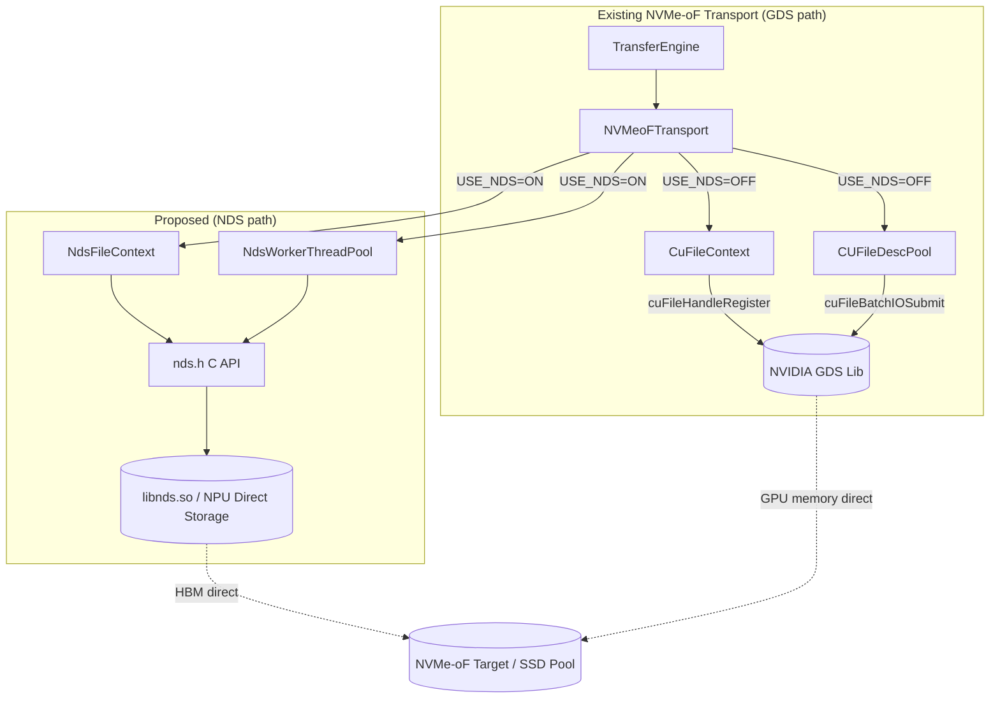
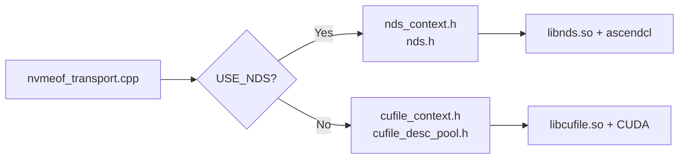
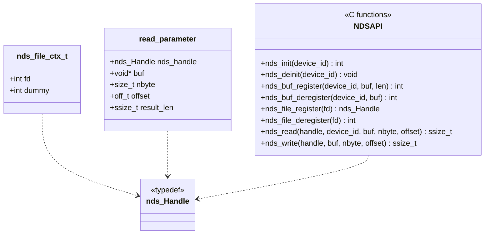
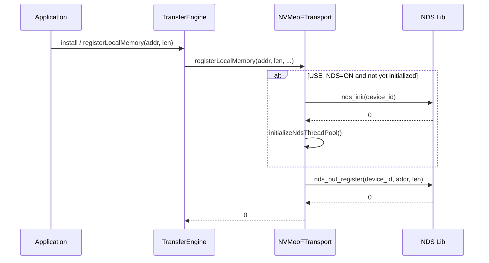
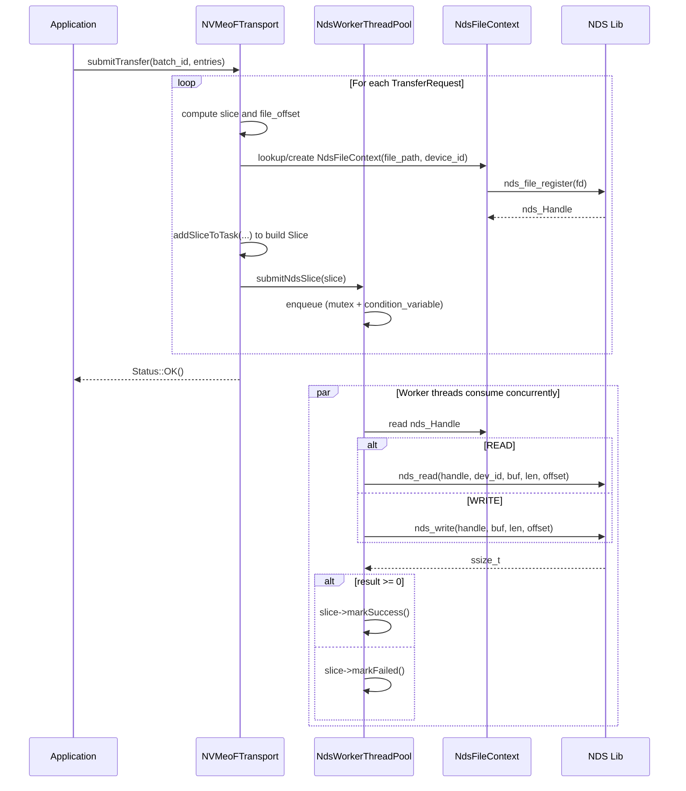
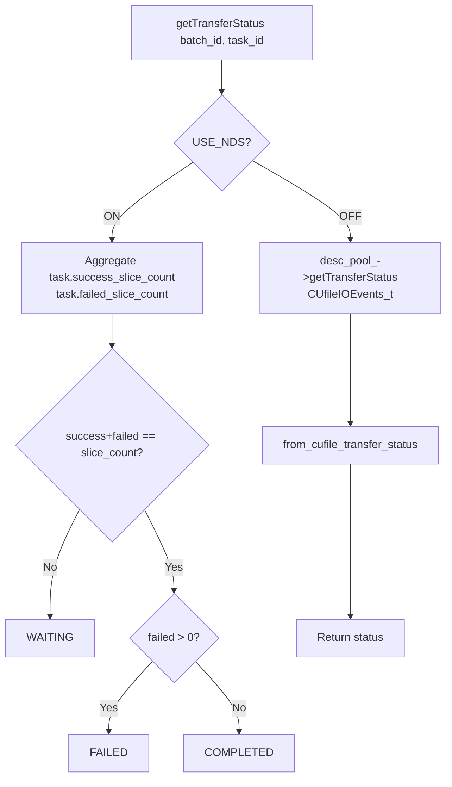
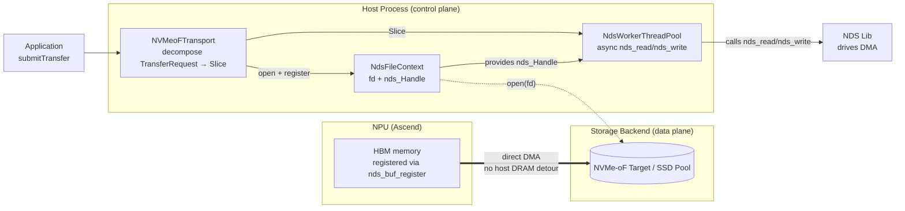
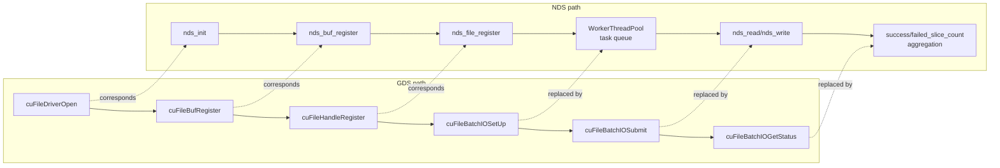

# RFC: Introduce an NDS (NPU Direct Storage) Branch in NVMe-oF Transport to Support Ascend NPU Direct-to-Storage Access

## 1. Introduction

This RFC proposes adding a **NDS (NPU Direct Storage) branch** parallel to the existing GDS (GPU Direct Storage) path inside `nvmeof_transport`. With this branch, inference/training workloads running on Ascend NPU (HBM) can directly access remote SSD pools over NVMe-oF, just as NVIDIA GPUs do via GDS, thereby extending the capacity ceiling of KV Cache.

It should be noted up front that **the current GDS reference implementation in the repository is itself incomplete**: it provides only the minimal runnable transport-layer path (`CuFileContext` handle registration, `CUFileDescPool` batch submission, `CUfileIOEvents_t`-based status query) and expects users to discover and mount remote NVMe-oF targets manually. It lacks automated segment lifecycle management, heartbeat detection, replica placement policies, and other higher-level capabilities. Accordingly, this proposal introduces the NDS branch at the same "reference implementation" level as the existing GDS path; the two coexist in parallel, and the upper-layer capabilities can be filled in by the community later.

This proposal is complementary to, but does not overlap with, two existing community efforts:

- [#1940 SSD pool over NVMe-oF (SPDK path)](https://github.com/kvcache-ai/Mooncake/issues/1940): routes the storage backend through an in-house SPDK wrapper on the host side, and reworks LMCache memory into huge pages + `cudaHostRegister` to achieve zero-copy.
- [#2084 SPDK integration supplement](https://github.com/kvcache-ai/Mooncake/pull/2084): builds on #1940 with SSD registration scripts, NoF heartbeat, multi-replica cleanup, and monitoring metrics.

Our approach differs from the two above in that we **keep the GDS abstraction in the transport layer and introduce NDS as a parallel backend**, without pulling in SPDK and without replacing the existing CUDA pinned-memory allocation logic. The existing GDS path remains untouched.

## 2. Background and Motivation

### 2.1 Current State

The current `mooncake-transfer-engine/src/transport/nvmeof_transport/` ships a reference NVMe-oF transport, but it hard-depends on NVIDIA GDS (`cufile.h`) and only works under NVIDIA GPU + CUDA environments:

- `CuFileContext` registers file handles via `cuFileHandleRegister`;
- `CUFileDescPool` performs batch submission via `cuFileBatchIOSetUp / cuFileBatchIOSubmit`;
- `NVMeoFTransport::registerLocalMemory` registers GPU memory via `cuFileBufRegister`.

This leads to the following issues:

1. **NPU (Ascend) users cannot use this transport**: `cufile.h` is unavailable in the Ascend environment, so compilation fails outright.
2. **Existing community solutions require substantial rework**: #1940 / #2084 introduce an SPDK wrapper, a NoF segment manager, heartbeat, and scripted registration; they also require changing LMCache pinned memory from `cudaHostAlloc` to SPDK huge pages + `cudaHostRegister`, which is intrusive to host-side memory management.
3. **No GDS-symmetric, minimally invasive NPU direct path exists**: With NDS (NPU Direct Storage — a user-space library from Ascend that plays the same role as GDS) already available, the vast majority of the transport-layer logic could be reused by simply swapping the underlying API.

### 2.2 Goals

- **Zero intrusion into the GDS path**: switch via the compile-time macro `USE_NDS`; existing NVIDIA + GDS users are unaffected.
- **NPU HBM ↔ NVMe-oF direct access**: via the NDS library (`nds_init / nds_buf_register / nds_read / nds_write`), data is moved directly between HBM and NVMe-oF, with no host-memory detour.
- **No SPDK dependency**: we avoid rewriting LMCache pinned memory and avoid introducing SPDK wrapper / NoF segment manager modules.
- **Decouple from the existing batch submission model**: NDS does not currently expose a batch API, so we adopt a thread-pool + task-queue model, leaving room to switch to a batch API later.

### 2.3 Comparison with #1940 / #2084

| Dimension | #1940 / #2084 (SPDK path) | This proposal (NDS path) |
| --- | --- | --- |
| Target hardware | NVIDIA GPU (still depends on CUDA) | Ascend NPU (via NDS user-space library) |
| Storage backend access | In-house `SpdkWrapper` + `SpdkNofWorkerPool` | Reuse NDS C API, no SPDK dependency |
| Host memory changes | LMCache pinned memory → SPDK huge page + `cudaHostRegister` | None; NPU HBM written to disk directly via NDS |
| Segment management | New `NoFSegmentManager`, heartbeat, registration scripts | Reuse existing `nvmeof_buffers` and `SegmentDesc` |
| Transport-layer changes | New store-layer modules | Only a new parallel branch inside `nvmeof_transport` |
| Relationship with GDS | Replaces / runs alongside existing transport | Fully parallel to GDS, switched by compile macro |
| Risk surface | Large (memory management + SPDK deployment) | Small (transport-internal branch only) |

## 3. Overall Architecture

### 3.1 Module Structure

### 3.2 Compile-time Branching

`CMakeLists.txt` controls the switch via the `USE_NDS` option:

- `USE_NDS=ON`: compile only `nvmeof_transport.cpp`; link `libnds.so` and `ascendcl`.
- `USE_NDS=OFF` (default): additionally compile `cufile_context.cpp` and `cufile_desc_pool.cpp`; link GDS.

## 4. Class Diagrams

### 4.1 NVMeoFTransport and the Two Backend Branches

### 4.2 NDS C API Abstraction (`nds.h`)

## 5. Key Flow Diagrams

### 5.1 Initialization and Memory Registration

### 5.2 Batch Submission and Slice Execution (NDS path)

### 5.3 Status Query Flow

### 5.4 End-to-End Data Flow (NDS path)

This subsection describes the end-to-end data flow of a single read/write request on the NDS path, in order to clarify the responsibility boundaries of each component and the "direct access" semantics.

**Participants**

- **NPU (Ascend)**: the physical NPU card; its HBM is where KV Cache data actually resides. The HBM buffer is registered with the NDS library via `nds_buf_register` during initialization, after which NDS can issue DMA directly against that address.
- **Host Process**: the user-space process running `mooncake-transfer-engine`, containing three components:
  - `NVMeoFTransport`: decomposes upper-layer `TransferRequest`s into a number of `Slice`s, each describing a (HBM address, file offset, length) mapping;
  - `NdsWorkerThreadPool`: an asynchronous executor that maintains a task queue and a set of worker threads, converting Slices into `nds_read / nds_write` calls;
  - `NdsFileContext`: holds the target file `fd` and the NDS handle `nds_Handle`, the context required by workers when invoking the NDS API.
- **Storage Backend**: the remote NVMe-oF target / SSD Pool, exposed to the host as a block-device file path.

**Key points of the data flow**

1. **Control flow goes through the host; data flow does not.** `NVMeoFTransport` and `NdsWorkerThreadPool` both run on the host CPU, but they only perform "task decomposition" and "NDS API invocation". The actual data-carrying DMA is performed by the NDS library directly between NPU HBM and the NVMe-oF target, **bypassing host memory**, achieving zero-copy semantics symmetric with GDS.
2. **File handles are opened by the host.** `NdsFileContext` obtains a host-side `fd` via `open(filename, O_RDWR)`, then converts it to an NDS handle via `nds_file_register(fd)`. This is a control-plane operation and involves no data copy.
3. **Who executes the NDS API.** Once a worker thread holds the `nds_Handle` and the registered HBM address, it calls `nds_read / nds_write`. The returned `ssize_t` indicates the number of bytes actually transferred; the worker uses it to update the Slice state.
4. **Symmetry with the GDS path.** In the GDS path, `cuFileBatchIOSubmit` performs DMA directly between GPU memory and the NVMe-oF target; in the NDS path, `nds_read / nds_write` performs DMA directly between HBM and the NVMe-oF target. Both bypass host DRAM; the only differences are the underlying library and the target device.

**Comparison with the GDS path**

| Stage | GDS path | NDS path |
| --- | --- | --- |
| Memory registration | `cuFileBufRegister` registers GPU memory | `nds_buf_register` registers HBM |
| File handle | `cuFileHandleRegister` registers fd | `nds_file_register` registers fd |
| Data transfer | `cuFileBatchIOSubmit` batched DMA | `nds_read / nds_write` single DMA |
| Control flow location | host CPU | host CPU |
| Data flow path | GPU memory ↔ NVMe-oF target | NPU HBM ↔ NVMe-oF target |

## 6. Core API Comparison: GDS vs. NDS

This section compares the key APIs used by the two paths at the transport layer, explaining their functional correspondences and differences, so that reviewers can quickly grasp what "parallel" means for the NDS branch.

### 6.1 API Mapping Table

| Stage | GDS API (NVIDIA) | NDS API (Ascend) | Notes |
| --- | --- | --- | --- |
| Driver init | `cuFileDriverOpen()` | `nds_init(device_id)` | NDS takes an explicit `device_id`, aligned with multi-card scenarios |
| Driver deinit | `cuFileDriverClose()` | `nds_deinit(device_id)` | — |
| Device memory register | `cuFileBufRegister(addr, len, flags)` | `nds_buf_register(device_id, buf, len)` | NDS also takes the HBM address as input |
| Device memory deregister | `cuFileBufDeregister(addr)` | `nds_buf_deregister(device_id, buf)` | — |
| File handle register | `cuFileHandleRegister(&handle, &desc)` | `nds_file_register(fd)` | NDS takes fd directly and returns `nds_Handle` |
| File handle deregister | `cuFileHandleDeregister(handle)` | `nds_file_deregister(fd)` | NDS uses fd as the key |
| Single read | `cuFileRead(handle, buf, len, offset, ...)` | `nds_read(handle, device_id, buf, len, offset)` | NDS requires explicit `device_id` |
| Single write | `cuFileWrite(handle, buf, len, offset, ...)` | `nds_write(handle, buf, len, offset)` | — |
| Batch submit | `cuFileBatchIOSetUp / cuFileBatchIOSubmit` | (not yet provided) | NDS currently has no batch API; replaced by thread pool + task queue |
| Batch status query | `cuFileBatchIOGetStatus` | (not yet provided) | NDS path aggregates via `task.success/failed_slice_count` |

### 6.2 Correspondence Diagram

### 6.3 Design Differences

- **Device identification**: GDS determines the device implicitly via the CUDA context; NDS takes an explicit `device_id` on every API, which is convenient for precise routing in multi-NPU configurations.
- **Batch capability**: GDS provides a full batch submit/query API, allowing multiple IO segments to be completed in a single syscall. NDS currently provides only single-shot read/write; this proposal compensates with a thread-pool concurrency model. Once NDS exposes a batch API, the switch can be made smoothly (see Section 9, Future Work).
- **Handle semantics**: GDS's `CUfileHandle_t` is an opaque pointer; NDS's `nds_Handle` is also opaque, but its lifetime is bound to the fd, and deregistration is keyed by fd.

## 7. Configuration and Observability

Runtime configuration via environment variables (no code changes required):

| Variable | Meaning | Default |
| --- | --- | --- |
| `USE_NDS` (compile-time) | Enable the NDS branch | `OFF` |
| `MC_NDS_DEVICE_ID` | NPU device id | `-1` (do not initialize) |
| `MC_NDS_THREAD_POOL_SIZE` | Number of NDS worker threads | `8` (range 1–64) |

On the NDS path, status queries directly aggregate `task.success_slice_count / failed_slice_count`, which is semantically consistent with the GDS path's `CUfileIOEvents_t`-based queries (see 5.3).

## 8. Coordination with Community Roadmap

- Complementary to #1940 / #2084: this proposal focuses on NPU direct access at the transport layer and does not touch the store-layer NoF segment management, heartbeat, or SSD registration scripts. Those capabilities can be provided by #1940 / #2084 and stacked with this work.
- No changes to the existing GDS branch: `CuFileContext` and `CUFileDescPool` remain as-is; existing users see no behavioral or compilation changes.
- No replacement of LMCache pinned memory: to meet SPDK's huge-page requirement, #1940 reworks LMCache's `cudaHostAlloc()` into "SPDK allocates huge pages + `cudaHostRegister()`". On the NDS path, data is DMA'd directly between NPU HBM and the NVMe-oF target without touching host CPU memory, so LMCache's existing allocation logic does not need to be modified, reducing cross-component coupling.

## 9. Future Work

1. Once NDS exposes a batch API, replace `NdsWorkerThreadPool` with a batch submission model symmetric to `CUFileDescPool`.
2. Introduce finer-grained `transferred_bytes` reporting at the `Slice` level to align with the event granularity of the GDS path.
3. Evaluate extracting a common `NvmeOfFileContext` abstract base class to unify the handle-management interface across GDS / NDS.

## 10. References

- [#1940 SSD pool over NVMe-oF (SPDK)](https://github.com/kvcache-ai/Mooncake/issues/1940)
- [#2084 NVMe-oF SSD cache support (SPDK supplement)](https://github.com/kvcache-ai/Mooncake/pull/2084)
- NVIDIA GDS: https://docs.nvidia.com/gpudirect-storage/
