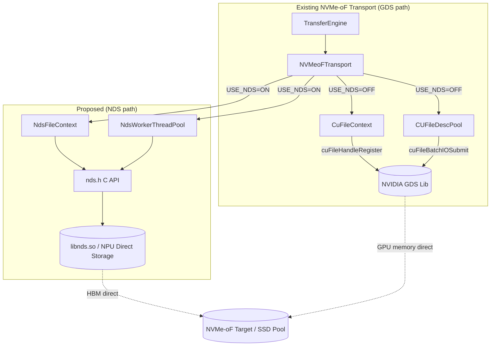
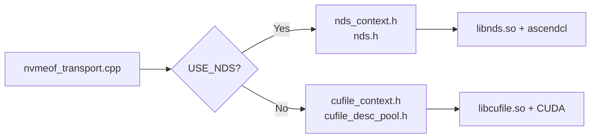
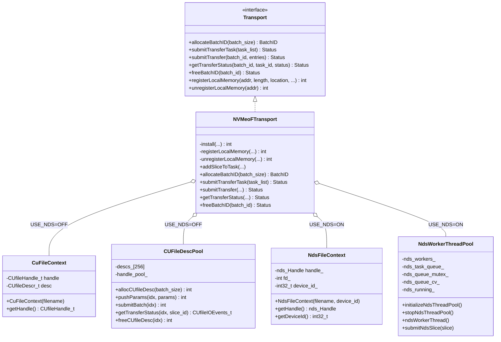
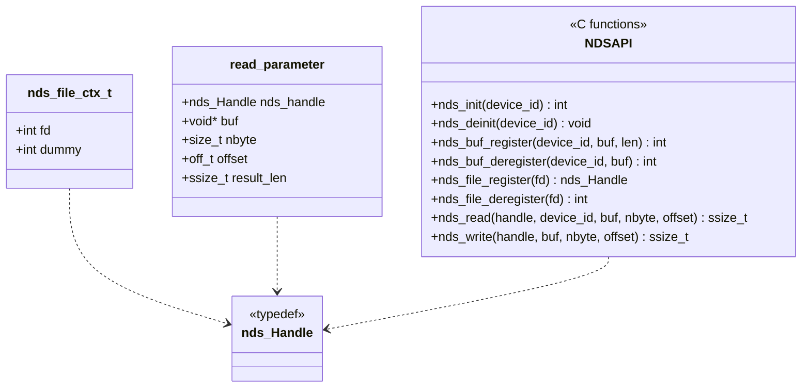
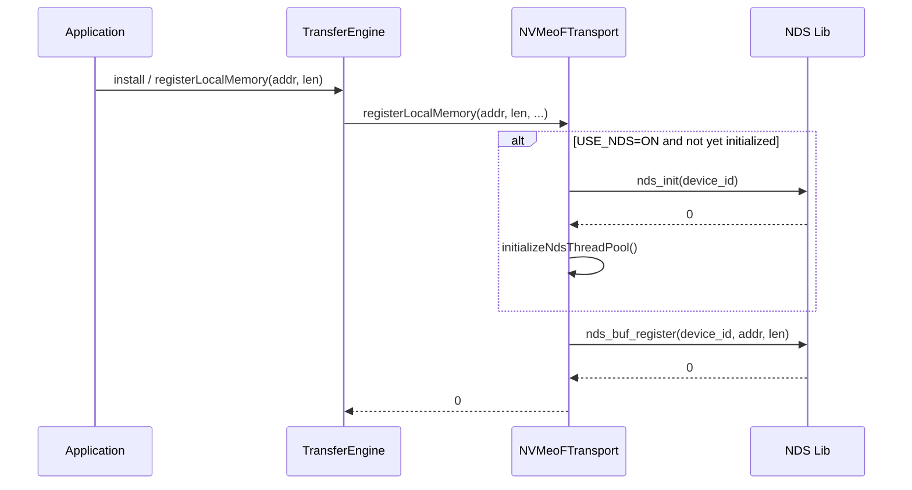
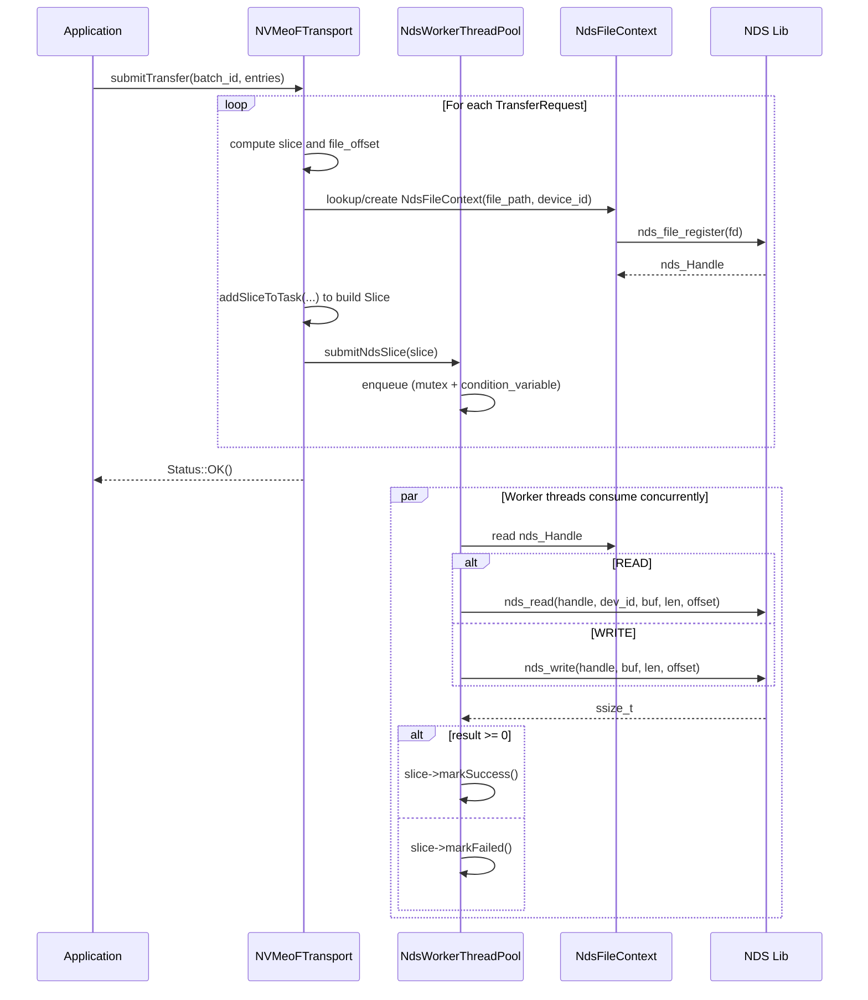
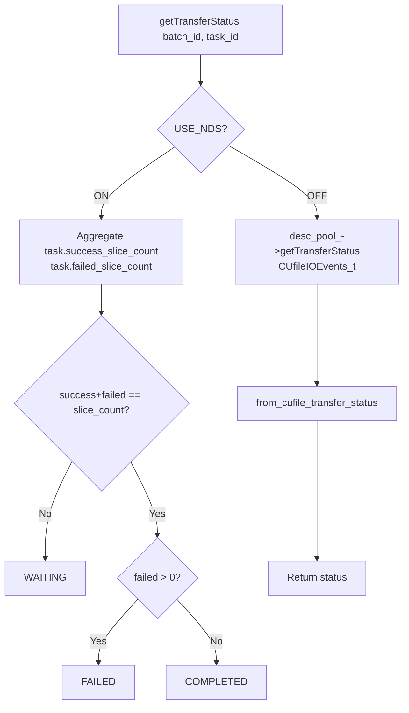
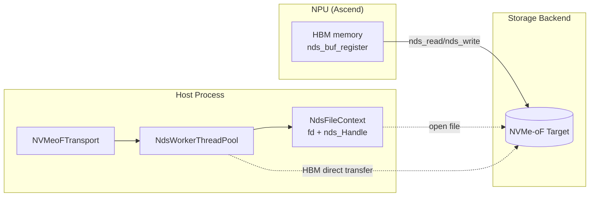
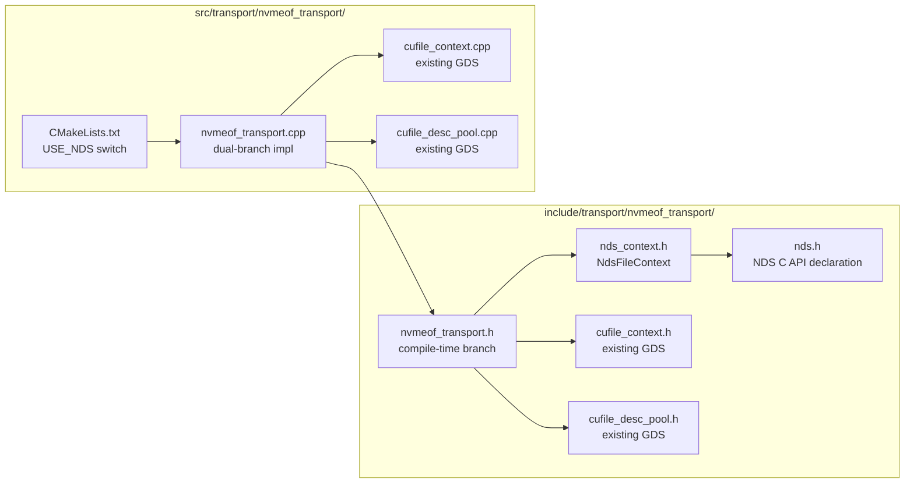

# RFC: Introduce an NDS (NPU Direct Storage) Branch in NVMe-oF Transport to Support Ascend NPU Direct-to-Storage Access

## 1. Introduction

This RFC proposes adding a **NDS (NPU Direct Storage) branch** parallel to the existing GDS (GPU Direct Storage) path inside `nvmeof_transport`. With this branch, inference/training workloads running on Ascend NPU (HBM) can directly access remote SSD pools over NVMe-oF, just as NVIDIA GPUs do via GDS, thereby extending the capacity ceiling of KV Cache.

This proposal is complementary to, but does not overlap with, two existing community efforts:

- [#1940 SSD pool over NVMe-oF (SPDK path)](https://github.com/kvcache-ai/Mooncake/issues/1940): routes the storage backend through an in-house SPDK wrapper on the host side, and reworks LMCache memory into huge pages + `cudaHostRegister` to achieve zero-copy.
- [#2084 SPDK integration supplement](https://github.com/kvcache-ai/Mooncake/pull/2084): builds on #1940 with SSD registration scripts, NoF heartbeat, multi-replica cleanup, and monitoring metrics.

Our approach differs from the two above in that we **keep the GDS abstraction in the transport layer and introduce NDS as a parallel backend**, without pulling in SPDK and without replacing the existing CUDA pinned-memory allocation logic. The existing GDS path remains untouched.

## 2. Background and Motivation

### 2.1 Current State

The current `mooncake-transfer-engine/src/transport/nvmeof_transport/` ships a reference NVMe-oF transport, but it hard-depends on NVIDIA GDS (`cufile.h`) and only works under NVIDIA GPU + CUDA environments:

- `CuFileContext` registers file handles via `cuFileHandleRegister`;
- `CUFileDescPool` performs batch submission via `cuFileBatchIOSetUp / cuFileBatchIOSubmit`;
- `NVMeoFTransport::registerLocalMemory` registers GPU memory via `cuFileBufRegister`.

This leads to the following issues:

1. **NPU (Ascend) users cannot use this transport**: `cufile.h` is unavailable in the Ascend environment, so compilation fails outright.
2. **Existing community solutions require substantial rework**: #1940 / #2084 introduce an SPDK wrapper, a NoF segment manager, heartbeat, and scripted registration; they also require changing LMCache pinned memory from `cudaHostAlloc` to SPDK huge pages + `cudaHostRegister`, which is intrusive to host-side memory management.
3. **No GDS-symmetric, minimally invasive NPU direct path exists**: With NDS (NPU Direct Storage — a user-space library from Ascend that plays the same role as GDS) already available, the vast majority of the transport-layer logic could be reused by simply swapping the underlying API.

### 2.2 Goals

- **Zero intrusion into the GDS path**: switch via the compile-time macro `USE_NDS`; existing NVIDIA + GDS users are unaffected.
- **NPU HBM ↔ NVMe-oF direct access**: via the NDS library (`nds_init / nds_buf_register / nds_read / nds_write`), data is moved directly between HBM and NVMe-oF, with no host-memory detour.
- **No SPDK dependency**: we avoid rewriting LMCache pinned memory and avoid introducing SPDK wrapper / NoF segment manager modules.
- **Decouple from the existing batch submission model**: NDS does not currently expose a batch API, so we adopt a thread-pool + task-queue model, leaving room to switch to a batch API later.

### 2.3 Comparison with #1940 / #2084

| Dimension | #1940 / #2084 (SPDK path) | This proposal (NDS path) |
| --- | --- | --- |
| Target hardware | NVIDIA GPU (still depends on CUDA) | Ascend NPU (via NDS user-space library) |
| Storage backend access | In-house `SpdkWrapper` + `SpdkNofWorkerPool` | Reuse NDS C API, no SPDK dependency |
| Host memory changes | LMCache pinned memory → SPDK huge page + `cudaHostRegister` | None; NPU HBM written to disk directly via NDS |
| Segment management | New `NoFSegmentManager`, heartbeat, registration scripts | Reuse existing `nvmeof_buffers` and `SegmentDesc` |
| Transport-layer changes | New store-layer modules | Only a new parallel branch inside `nvmeof_transport` |
| Relationship with GDS | Replaces / runs alongside existing transport | Fully parallel to GDS, switched by compile macro |
| Risk surface | Large (memory management + SPDK deployment) | Small (transport-internal branch only) |

## 3. Overall Architecture

### 3.1 Module Structure

### 3.2 Compile-time Branching

`CMakeLists.txt` controls the switch via the `USE_NDS` option:

- `USE_NDS=ON`: compile only `nvmeof_transport.cpp`; link `libnds.so` and `ascendcl`.
- `USE_NDS=OFF` (default): additionally compile `cufile_context.cpp` and `cufile_desc_pool.cpp`; link GDS.

## 4. Class Diagrams

### 4.1 NVMeoFTransport and the Two Backend Branches

### 4.2 NDS C API Abstraction (`nds.h`)

## 5. Key Flow Diagrams

### 5.1 Initialization and Memory Registration

### 5.2 Batch Submission and Slice Execution (NDS path)

### 5.3 Status Query Flow

### 5.4 End-to-End Data Flow (NDS path)

## 6. File Structure

## 7. Configuration and Observability

Runtime configuration via environment variables (no code changes required):

| Variable | Meaning | Default |
| --- | --- | --- |
| `USE_NDS` (compile-time) | Enable the NDS branch | `OFF` |
| `MC_NDS_DEVICE_ID` | NPU device id | `-1` (do not initialize) |
| `MC_NDS_THREAD_POOL_SIZE` | Number of NDS worker threads | `8` (range 1–64) |

On the NDS path, status queries directly aggregate `task.success_slice_count / failed_slice_count`, which is semantically consistent with the GDS path's `CUfileIOEvents_t`-based queries (see 5.3).

## 8. Coordination with Community Roadmap

- Complementary to #1940 / #2084: this proposal focuses on NPU direct access at the transport layer and does not touch the store-layer NoF segment management, heartbeat, or SSD registration scripts. Those capabilities can be provided by #1940 / #2084 and stacked with this work.
- No changes to the existing GDS branch: `CuFileContext` and `CUFileDescPool` remain as-is; existing users see no behavioral or compilation changes.
- No replacement of LMCache pinned memory: we avoid the `cudaHostAlloc` → SPDK huge page + `cudaHostRegister` rework from #1940, reducing cross-component coupling.

## 9. Future Work

1. Once NDS exposes a batch API, replace `NdsWorkerThreadPool` with a batch submission model symmetric to `CUFileDescPool`.
2. Introduce finer-grained `transferred_bytes` reporting at the `Slice` level to align with the event granularity of the GDS path.
3. Evaluate extracting a common `NvmeOfFileContext` abstract base class to unify the handle-management interface across GDS / NDS.

## 10. References

- [#1940 SSD pool over NVMe-oF (SPDK)](https://github.com/kvcache-ai/Mooncake/issues/1940)
- [#2084 NVMe-oF SSD cache support (SPDK supplement)](https://github.com/kvcache-ai/Mooncake/pull/2084)
- NVIDIA GDS: https://docs.nvidia.com/gpudirect-storage/
