# RFC: Introduce an NDS Branch and Extend Master-Layer SSD Segment Management to Support Ascend NPU Direct-to-NVMe-oF Storage Access

## 1. Introduction

This RFC proposes to fill the NVMe-oF direct-storage gap for the Ascend NPU scenario, comprising two tightly coupled changes:

1. **Transport-layer NDS branch**: add a **NDS (NPU Direct Storage) branch** parallel to the existing GDS (GPU Direct Storage) path inside `nvmeof_transport`. With this branch, inference/training workloads running on Ascend NPU (HBM) can directly access remote SSD pools over NVMe-oF, just as NVIDIA GPUs do via GDS, thereby extending the capacity ceiling of KV Cache.
2. **Master-layer SSD segment management extension**: for the sharing and failure characteristics of ordinary block-device offset-addressed SSDs, extend the existing `NoFSegmentManager` with multi-client shared segments (`client_refs` reference counting) and probe injection (`NoFProbeFn`), and reuse the existing forced-unmount and replica-cleanup chain, so that the NDS path and the existing SPDK path share a single segment-lifecycle-management framework.

The two changes go hand in hand: the transport layer provides the NPU-direct data plane, and the master layer provides a storage-backend-decoupled segment-management control plane. Together they constitute a complete NPU-direct SSD solution.

It should be noted up front that the current GDS reference implementation in the repository is itself incomplete: it provides only the minimal runnable transport-layer path (`CuFileContext` handle registration, `CUFileDescPool` batch submission, `CUfileIOEvents_t`-based status query) and expects users to discover and mount remote NVMe-oF targets manually. It lacks automated segment lifecycle management, heartbeat detection, replica placement policies, and other higher-level capabilities. Accordingly, this proposal introduces the NDS branch at the same "reference implementation" level as the existing GDS path; the two coexist in parallel, and the upper-layer capabilities can be filled in by the community later.

This proposal is complementary to, but does not overlap with, two existing community efforts:

- [#1940 SSD pool over NVMe-oF (SPDK path)](https://github.com/kvcache-ai/Mooncake/issues/1940): routes the storage backend through an in-house SPDK wrapper on the host side, and reworks LMCache memory into huge pages + `cudaHostRegister` to achieve zero-copy.
- [#2084 SPDK integration supplement](https://github.com/kvcache-ai/Mooncake/pull/2084): builds on #1940 with SSD registration scripts, NoF heartbeat, multi-replica cleanup, and monitoring metrics.

This proposal coexists with the existing GDS path via the compile-time macro `USE_NDS`. Because NPU HBM is DMA'd directly between NDS and the NVMe-oF target without touching host memory on the data plane, this proposal does not involve reworking SPDK or LMCache pinned memory.

## 2. Background and Motivation

The two changes in this proposal stem from two independent motivations: the transport-layer change stems from "the NPU direct-storage path is missing", and the master-layer change stems from "lifecycle management is insufficient under SSD sharing and failure scenarios". This section elaborates on each.

### 2.1 Transport Layer: The NPU Direct-Storage Path Is Missing

The repository currently has two implemented paths for NVMe-oF direct storage access, both targeting NVIDIA GPUs:

1. **GDS reference implementation (transport layer)**: `mooncake-transfer-engine/src/transport/nvmeof_transport/` hard-depends on NVIDIA GDS (`cufile.h`). `CuFileContext` registers handles via `cuFileHandleRegister`; `CUFileDescPool` submits batches via `cuFileBatchIOSubmit`; `registerLocalMemory` registers GPU memory via `cuFileBufRegister`. As noted in the introduction, this is only a minimal runnable path.
2. **SPDK path (#1940 / #2084, store + transport layer)**: introduces `SpdkWrapper`, `NoFSegmentManager`, heartbeat, and SSD registration scripts on the host side, and reworks LMCache pinned memory from `cudaHostAlloc` to SPDK huge pages + `cudaHostRegister` for zero-copy. This is a complete engineering-grade solution for the NVIDIA GPU + CUDA environment.

The common gap shared by both paths is: **the Ascend NPU scenario is missing**. `cufile.h` and CUDA pinned memory do not exist in the Ascend environment, so the GDS path fails to compile; the `cudaHostRegister` that the SPDK path depends on is also unavailable. In other words, NPU users currently have no usable NVMe-oF direct-storage path.

Meanwhile, Ascend already provides the **NDS (NPU Direct Storage) user-space library** (`nds_init / nds_buf_register / nds_read / nds_write`), which plays the same role as GDS and can issue DMA directly between NPU HBM and the NVMe-oF target, providing the low-level capability to build an equivalent direct path. This proposal therefore introduces an NDS branch parallel to GDS at the transport layer, giving NPU users an NVMe-oF direct-access capability equivalent to GDS.

### 2.2 Master Layer: Insufficient Lifecycle Management under SSD Sharing and Failure Scenarios

Regardless of whether the upper layer is GDS, SPDK, or NDS, the transport layer only "issues a DMA against a given fd + offset" — it is unaware of who mounted the SSD, whether it is still healthy, how much capacity remains, or whether other clients are also using it. These responsibilities are borne by the master-layer `NoFSegmentManager`. However, the existing `NoFSegmentManager` design has three gaps that do not match how SSDs are actually used, which this proposal must close:

1. **The 1:1 mount semantics cannot express multi-client sharing.** The existing `NoFSegmentManager` assumes that a segment is exclusively used by one client, with `Mount` / `Unmount` in one-to-one correspondence. In the NVMe-oF + SSD Pool scenario, however, a physical SSD is often mounted and used simultaneously by multiple inference/training clients (one NVMe-oF target, multiple host processes). If 1:1 semantics were kept, each client mounting its own copy would produce duplicate segment objects, duplicate capacity accounting, and duplicate probes; forcing serialization would in turn limit concurrency. This proposal introduces `client_refs` reference counting: re-mounting the same `device_name` only increments the reference, and the segment is destroyed only when the reference drops to zero, thereby supporting multi-client sharing of the same physical device.
2. **Lack of a health probe decoupled from a specific driver.** The existing heartbeat directly calls `SpdkWrapper::ProbeNofSegment`, so the probe is hard-bound to SPDK. On the NDS path there is no SPDK wrapper; if the existing implementation were reused, the heartbeat would be effectively dead. This proposal abstracts the probe into an injectable `NoFProbeFn` (a function object); the master does not depend on any specific driver. On the NDS path, a lightweight `nds_read`-based probe implementation is injected; on the SPDK path, the original implementation is kept unchanged. This allows the master-layer heartbeat, fault handling, and replica-cleanup chain to be shared by both paths, avoiding parallel fault-handling logic.
3. **The non-migratable nature of SSD failures requires a dedicated forced-unmount path.** Once an SSD / NVMe-oF target becomes unreachable, the data on it cannot be read, so the "migrate-then-unmount" Drain path is not viable. The existing code has already implemented a forced-unmount chain for the SPDK path: `ForceUnmountSegment` (bypassing reference counting) → `ClearInvalidHandles` (scan `ObjectMetadata` and delete replicas whose `device_name` matches; if the object still has other healthy replicas it degrades and survives, otherwise the key is deleted) → `CommitUnmountSegment`. This proposal reuses that chain directly, with the only difference being the probe implementation. This keeps the SSD failure semantics consistent across the NDS and SPDK paths, avoiding divergence.

In summary, the motivation for the master-layer extension is: **let the NDS path reuse the segment-lifecycle-management framework already validated by the SPDK path** (sharing, heartbeat, fault isolation, replica cleanup), rather than building a new parallel manager for NDS. This is how this proposal's "zero intrusion" manifests on the control plane.

### 2.3 Goals

Based on the two independent motivations above, this proposal aims to:

- **Fill the NPU direct-storage path**: introduce an NDS branch parallel to GDS at the transport layer via the compile-time macro `USE_NDS`.
- **NPU HBM ↔ NVMe-oF direct access**: via the NDS library, data is moved directly between HBM and NVMe-oF, with no host-memory detour on the data plane.
- **Zero intrusion into existing paths**: no changes to the GDS branch, no SPDK dependency, no rework of LMCache pinned memory — these three follow naturally from the NDS path's "data plane bypasses host memory", rather than being a change-surface comparison against the SPDK path.
- **Extend master-layer SSD segment management**: on top of the existing `NoFSegmentManager`, add multi-client sharing (`client_refs`), probe injection (`NoFProbeFn`), and reuse the forced-unmount chain, so that the NDS path and the existing SPDK path share a single segment-lifecycle-management framework.
- **Decouple from the existing batch submission model**: NDS does not currently expose a batch API, so we adopt a thread-pool + task-queue model, leaving room to switch to a batch API later.

### 2.4 Positioning Differences vs. #1940 / #2084

This section clarifies the relationship between this proposal and the SPDK path: the two **target different hardware and are not substitutes**; they can be stacked. The table below lists the positioning differences to help reviewers understand the complementary relationship, rather than to compare pros and cons.

| Dimension               | #1940 / #2084 (SPDK path)                                     | This proposal (NDS path)                                          |
| ----------------------- | ------------------------------------------------------------- | ------------------------------------------------------------------ |
| Target hardware         | NVIDIA GPU (depends on CUDA)                                  | Ascend NPU (via NDS user-space library)                            |
| Storage backend access  | `SpdkWrapper` + `SpdkNofWorkerPool`                         | Reuse NDS C API                                                    |
| Host memory changes     | LMCache pinned memory → SPDK huge page +`cudaHostRegister`  | None; NPU HBM written to disk directly via NDS                     |
| Segment management      | New`NoFSegmentManager`, heartbeat, registration scripts     | Extend existing`NoFSegmentManager` with sharing/heartbeat/fault isolation |
| Transport-layer changes | New store-layer modules                                       | Transport-layer parallel branch + master-layer NoF segment extension |
| Relationship with GDS   | Replaces / runs alongside existing transport                  | Fully parallel to GDS, switched by compile macro                   |
| Stacked usage           | Can be stacked with NDS path (NDS for NPU data plane, SPDK for GPU data plane) | Can be stacked with SPDK path                              |

## 3. Overall Architecture

### 3.1 Module Structure

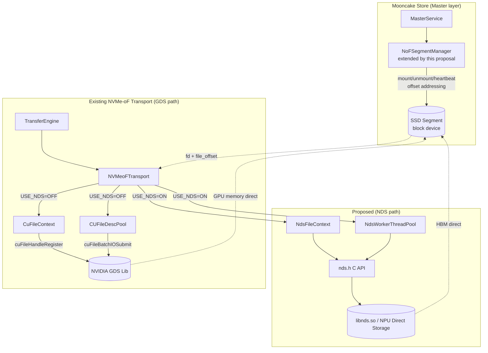

This proposal covers two layers: the NDS branch at the transport layer (replacing GDS APIs to perform data transfer) and SSD segment management at the master layer (extending the existing `NoFSegmentManager` with sharing/heartbeat/fault isolation). SSD segments use ordinary block-device offset addressing (`base + offset`). The master dispatches tasks to the transport layer via fd + offset.

### 3.2 Compile-time Branching

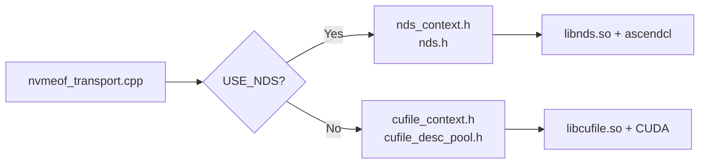

`CMakeLists.txt` controls the switch via the `USE_NDS` option:

- `USE_NDS=ON`: compile only `nvmeof_transport.cpp`; link `libnds.so` and `ascendcl`.
- `USE_NDS=OFF` (default): additionally compile `cufile_context.cpp` and `cufile_desc_pool.cpp`; link GDS.

## 4. Class Diagrams

### 4.1 NVMeoFTransport and the Two Backend Branches

### 4.2 NDS C API Abstraction (`nds.h`)

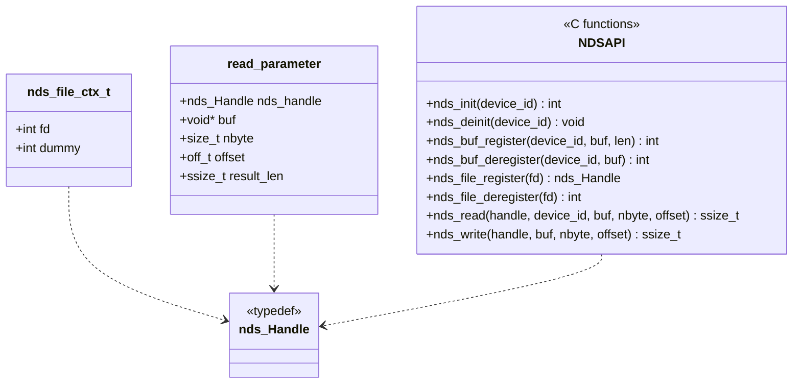

## 5. Key Flow Diagrams

### 5.1 Initialization and Memory Registration

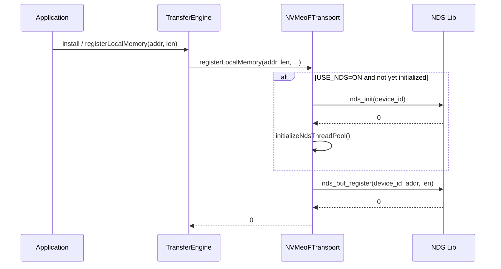

### 5.2 Batch Submission and Slice Execution (NDS path)

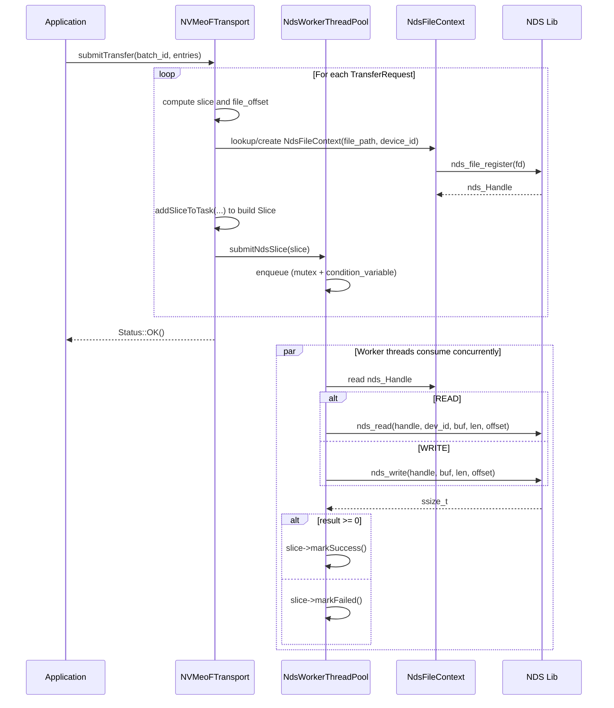

### 5.3 Status Query Flow

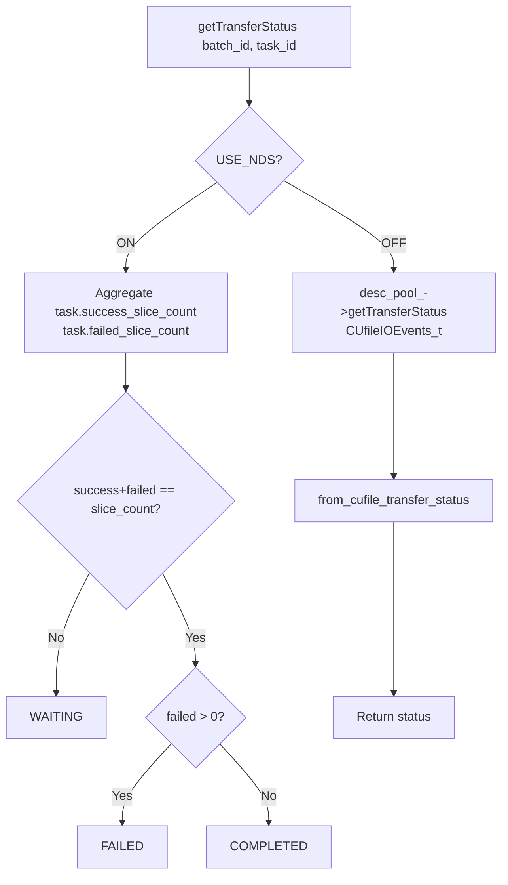

### 5.4 End-to-End Data Flow (NDS path)

This subsection describes the end-to-end data flow of a single read/write request on the NDS path, in order to clarify the responsibility boundaries of each component and the "direct access" semantics.

**Participants**

- **NPU (Ascend)**: the physical NPU card; its HBM is where KV Cache data actually resides. The HBM buffer is registered with the NDS library via `nds_buf_register` during initialization, after which NDS can issue DMA directly against that address.
- **Host Process**: the user-space process running `mooncake-transfer-engine`, containing three components:
  - `NVMeoFTransport`: decomposes upper-layer `TransferRequest`s into a number of `Slice`s, each describing a (HBM address, file offset, length) mapping;
  - `NdsWorkerThreadPool`: an asynchronous executor that maintains a task queue and a set of worker threads, converting Slices into `nds_read / nds_write` calls;
  - `NdsFileContext`: holds the target file `fd` and the NDS handle `nds_Handle`, the context required by workers when invoking the NDS API.
- **Storage Backend**: the remote NVMe-oF target / SSD Pool, exposed to the host as a block-device file path.

**Key points of the data flow**

1. **Control flow goes through the host; data flow does not.** `NVMeoFTransport` and `NdsWorkerThreadPool` both run on the host CPU, but they only perform "task decomposition" and "NDS API invocation". The actual data-carrying DMA is performed by the NDS library directly between NPU HBM and the NVMe-oF target, **bypassing host memory**, achieving zero-copy semantics symmetric with GDS.
2. **File handles are opened by the host.** `NdsFileContext` obtains a host-side `fd` via `open(filename, O_RDWR)`, then converts it to an NDS handle via `nds_file_register(fd)`. This is a control-plane operation and involves no data copy.
3. **Who executes the NDS API.** Once a worker thread holds the `nds_Handle` and the registered HBM address, it calls `nds_read / nds_write`. The returned `ssize_t` indicates the number of bytes actually transferred; the worker uses it to update the Slice state.
4. **Symmetry with the GDS path.** In the GDS path, `cuFileBatchIOSubmit` performs DMA directly between GPU memory and the NVMe-oF target; in the NDS path, `nds_read / nds_write` performs DMA directly between HBM and the NVMe-oF target. Both bypass host DRAM; the only differences are the underlying library and the target device.

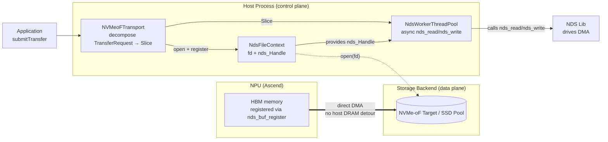

**Comparison with the GDS path**

| Stage                 | GDS path                                   | NDS path                            |
| --------------------- | ------------------------------------------ | ----------------------------------- |
| Memory registration   | `cuFileBufRegister` registers GPU memory | `nds_buf_register` registers HBM  |
| File handle           | `cuFileHandleRegister` registers fd      | `nds_file_register` registers fd  |
| Data transfer         | `cuFileBatchIOSubmit` batched DMA        | `nds_read / nds_write` single DMA |
| Control flow location | host CPU                                   | host CPU                            |
| Data flow path        | GPU memory ↔ NVMe-oF target               | NPU HBM ↔ NVMe-oF target           |

## 6. Master-Layer SSD Segment Management

This section describes the master-layer segment management design for ordinary block-device offset-addressed SSDs. The core capabilities include multi-client shared segments, heartbeat health checks, and fault isolation. In-segment space is managed by the existing `OffsetBufferAllocator`, consistent with the addressing model of the existing `NoFSegmentManager`.

### 6.1 Design Points

| Point                       | Description                                                                                                                                                                                       |
| --------------------------- | ------------------------------------------------------------------------------------------------------------------------------------------------------------------------------------------------- |
| Segment addressing model    | Ordinary block-device offset addressing (`base + offset`), reusing the existing `OffsetBufferAllocator`                                                                                          |
| Multi-client shared segment | A physical SSD can be mounted and used by multiple clients concurrently; lifecycle is managed via `client_refs` reference counting. Re-mounting the same `device_name` only increments the ref   |
| Unmount semantics           | `Unmount(device_name, client_id)`: decrement the reference; the segment is destroyed only when the reference drops to zero. Differs from the existing 1:1 mount semantics of `NoFSegmentManager` |
| Heartbeat health check      | A background thread periodically probes every OK-state SSD segment. Consecutive failures beyond the threshold (`interval × threshold`) trigger a forced unmount, redirecting new writes to healthy segments |
| Fault handling              | When the device is unreachable, `ForceUnmountSegment` directly forces unmount (bypassing `client_refs`). **No Drain path** — a faulty device cannot be read, so data cannot be migrated          |
| Client transparency         | The client requests a descriptor from the master on every operation; descriptors of faulty segments are cleaned up by `ClearInvalidHandles`. The client does not need to explicitly perceive unmount  |

### 6.2 Class Diagram

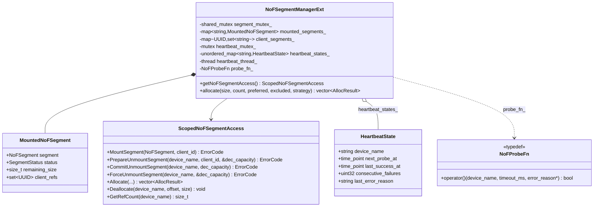

### 6.3 Mount and Unmount Flow

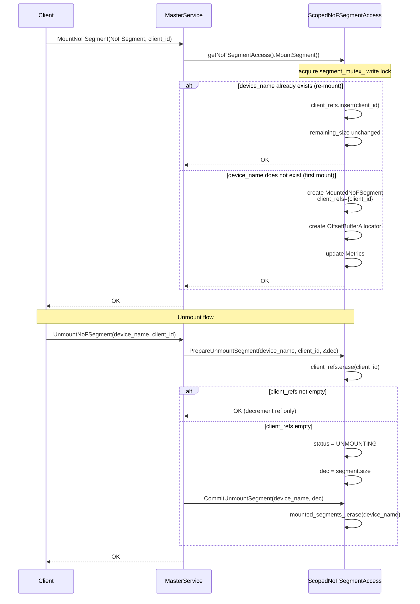

### 6.4 Heartbeat and Health Check

The background heartbeat thread wakes up every 100ms and polls all OK-state SSD segments. `NoFProbeFn` is injected as a function (the master does not depend on any specific driver implementation); the probe implementation is provided by the transport layer — on the NDS path it can be implemented via a lightweight `nds_read`.

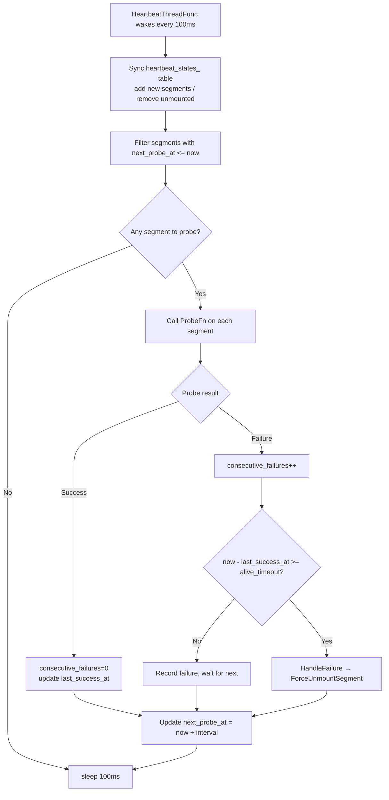

`alive_timeout = interval × threshold` (e.g., default 10s × 3 = 30s).

### 6.5 Fault Handling and Forced Unmount

A faulty device is unreachable, so **the Drain path is not taken** (Drain requires the source segment to be readable to migrate data). Instead, `ForceUnmountSegment` directly forces unmount: bypass the `client_refs` check, clear the reference set, remove all references in `client_segments_`, set the state to `UNMOUNTING`. Then `ClearInvalidHandles` scans `ObjectMetadata` and removes replicas whose `device_name` matches (if the object still has other healthy replicas, it degrades and survives; otherwise the key is deleted). Finally, `CommitUnmountSegment` removes the segment and decrements the capacity metric.

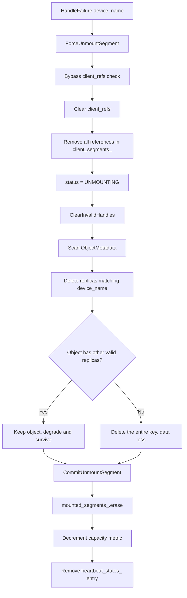

Data loss is an inevitable consequence of hardware failure. What the system can do is: new writes are automatically allocated to healthy segments (`Allocate()` skips non-OK segments); objects with redundancy degrade and survive; objects without redundancy return `OBJECT_NOT_FOUND`. The client does not need to explicitly perceive the unmount and naturally switches to healthy replicas via the existing `GetReplicaList` mechanism.

### 6.6 Relationship with #1940 / #2084

The design in this section shares **the same goals** as the NoF heartbeat, multi-replica cleanup, and monitoring metrics in #2084 (sharing physical devices, heartbeat isolation, automatic failover), but the implementation path differs:

- **No SPDK wrapper introduced**: the probe is based on a lightweight `nds_read` on the NDS path, with no new SPDK dependency.
- **No LMCache pinned-memory rework**: data is DMA'd directly between NPU HBM and the NVMe-oF target; host memory is not on the data path.
- **Reuses the existing `NoFSegmentManager` framework**: extends the original 1:1 mount semantics with `client_refs` reference counting and `ForceUnmountSegment`, avoiding a new parallel manager.

## 7. Core API Comparison: GDS vs. NDS

This section compares the key APIs used by the two paths at the transport layer, explaining their functional correspondences and differences, so that reviewers can quickly grasp what "parallel" means for the NDS branch.

### 7.1 API Mapping Table

| Stage                    | GDS API (NVIDIA)                               | NDS API (Ascend)                                  | Notes                                                                 |
| ------------------------ | ---------------------------------------------- | ------------------------------------------------- | --------------------------------------------------------------------- |
| Driver init              | `cuFileDriverOpen()`                         | `nds_init(device_id)`                           | NDS takes an explicit`device_id`, aligned with multi-card scenarios |
| Driver deinit            | `cuFileDriverClose()`                        | `nds_deinit(device_id)`                         | —                                                                    |
| Device memory register   | `cuFileBufRegister(addr, len, flags)`        | `nds_buf_register(device_id, buf, len)`         | NDS also takes the HBM address as input                               |
| Device memory deregister | `cuFileBufDeregister(addr)`                  | `nds_buf_deregister(device_id, buf)`            | —                                                                    |
| File handle register     | `cuFileHandleRegister(&handle, &desc)`       | `nds_file_register(fd)`                         | NDS takes fd directly and returns`nds_Handle`                       |
| File handle deregister   | `cuFileHandleDeregister(handle)`             | `nds_file_deregister(fd)`                       | NDS uses fd as the key                                                |
| Single read              | `cuFileRead(handle, buf, len, offset, ...)`  | `nds_read(handle, device_id, buf, len, offset)` | NDS requires explicit`device_id`                                    |
| Single write             | `cuFileWrite(handle, buf, len, offset, ...)` | `nds_write(handle, buf, len, offset)`           | —                                                                    |
| Batch submit             | `cuFileBatchIOSetUp / cuFileBatchIOSubmit`   | (not yet provided)                                | NDS currently has no batch API; replaced by thread pool + task queue  |
| Batch status query       | `cuFileBatchIOGetStatus`                     | (not yet provided)                                | NDS path aggregates via`task.success/failed_slice_count`            |

### 7.2 Correspondence Diagram

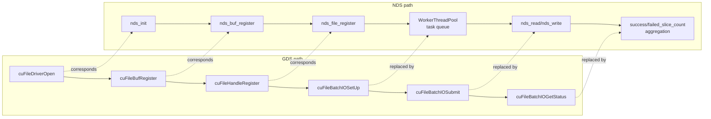

### 7.3 Design Differences

- **Device identification**: GDS determines the device implicitly via the CUDA context; NDS takes an explicit `device_id` on every API, which is convenient for precise routing in multi-NPU configurations.
- **Batch capability**: GDS provides a full batch submit/query API, allowing multiple IO segments to be completed in a single syscall. NDS currently provides only single-shot read/write; this proposal compensates with a thread-pool concurrency model. Once NDS exposes a batch API, the switch can be made smoothly (see Section 10, Future Work).
- **Handle semantics**: GDS's `CUfileHandle_t` is an opaque pointer; NDS's `nds_Handle` is also opaque, but its lifetime is bound to the fd, and deregistration is keyed by fd.

## 8. Configuration and Observability

Runtime configuration via environment variables (no code changes required):

| Variable                    | Meaning                      | Default                    |
| --------------------------- | ---------------------------- | -------------------------- |
| `USE_NDS` (compile-time)  | Enable the NDS branch        | `OFF`                    |
| `MC_NDS_DEVICE_ID`        | NPU device id                | `-1` (do not initialize) |
| `MC_NDS_THREAD_POOL_SIZE` | Number of NDS worker threads | `8` (range 1–64)        |

Heartbeat parameters for master-layer SSD segments (probe interval, timeout, failure threshold) are injected via `MasterServiceConfig`; see 6.4 for defaults.

On the NDS path, status queries directly aggregate `task.success_slice_count / failed_slice_count`, which is semantically consistent with the GDS path's `CUfileIOEvents_t`-based queries (see 5.3).

## 9. Coordination with Community Roadmap

- Complementary to #1940 / #2084: this proposal introduces the NPU direct branch at the transport layer (Sections 4, 5) and extends NoF segment sharing/heartbeat/fault isolation at the master layer (Section 6). SSD registration scripts and ops tooling can still be provided by #2084 and stacked with this work.
- No changes to the existing GDS branch: `CuFileContext` and `CUFileDescPool` remain as-is; existing users see no behavioral or compilation changes.
- No replacement of LMCache pinned memory: to meet SPDK's huge-page requirement, #1940 reworks LMCache's `cudaHostAlloc()` into "SPDK allocates huge pages + `cudaHostRegister()`". On the NDS path, data is DMA'd directly between NPU HBM and the NVMe-oF target without touching host CPU memory, so LMCache's existing allocation logic does not need to be modified, reducing cross-component coupling.

## 10. Future Work

1. Once NDS exposes a batch API, replace `NdsWorkerThreadPool` with a batch submission model symmetric to `CUFileDescPool`.
2. Evaluate extracting a common `NvmeOfFileContext` abstract base class to unify the handle-management interface across GDS / NDS.
3. Evaluate whether to extract a common base class for `ScopedNoFSegmentAccess` and the existing `ScopedSegmentAccess` to unify the reference-counting and heartbeat interfaces.

## 11. References

- [#1940 SSD pool over NVMe-oF (SPDK)](https://github.com/kvcache-ai/Mooncake/issues/1940)
- [#2084 NVMe-oF SSD cache support (SPDK supplement)](https://github.com/kvcache-ai/Mooncake/pull/2084)
- NVIDIA GDS: https://docs.nvidia.com/gpudirect-storage/
