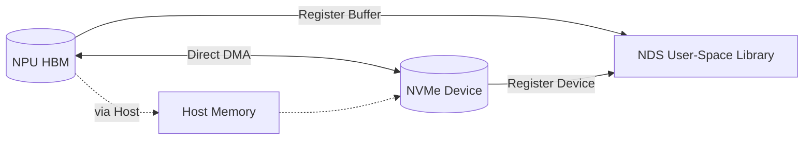
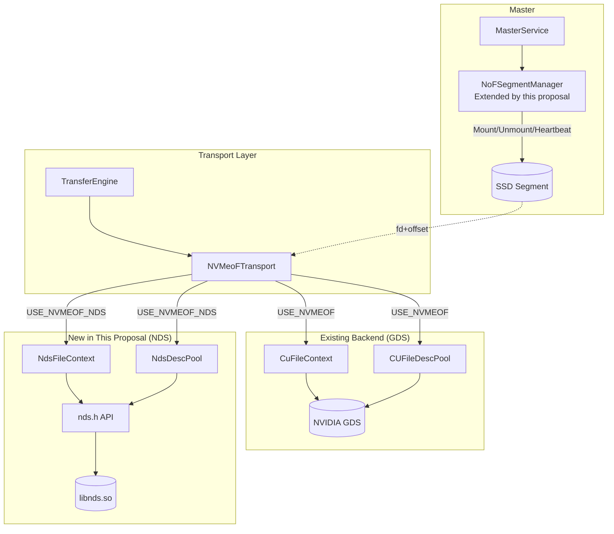
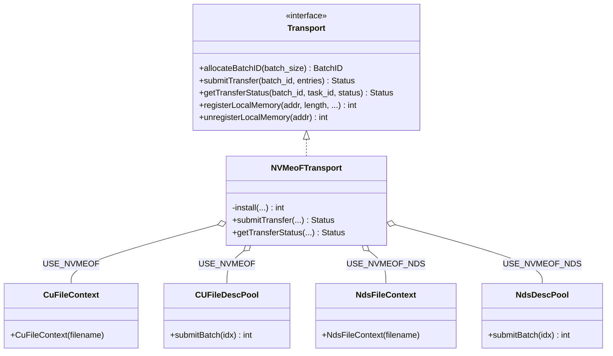
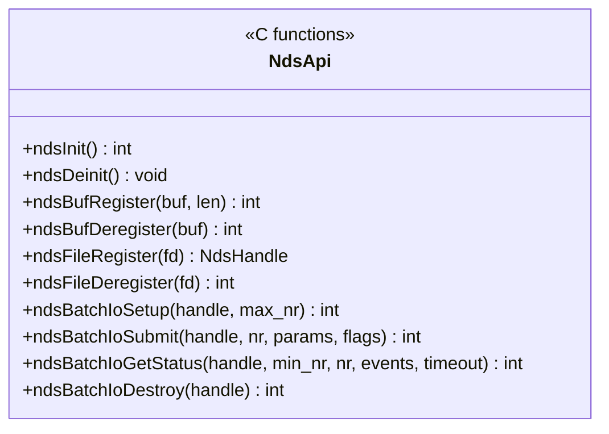
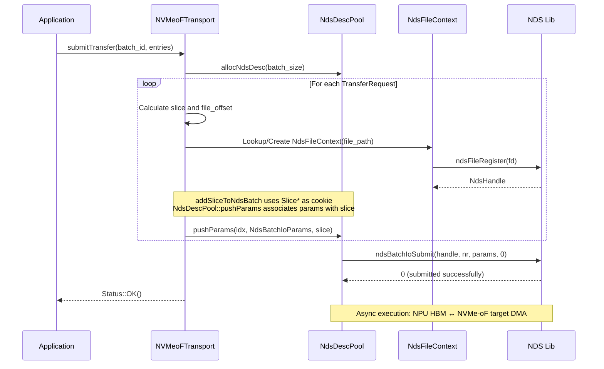
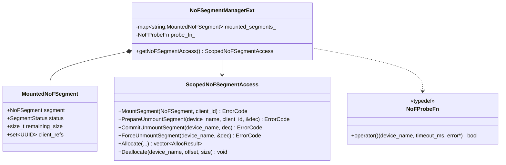
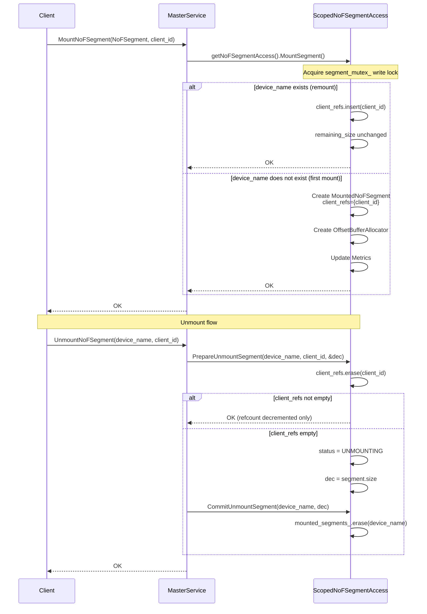
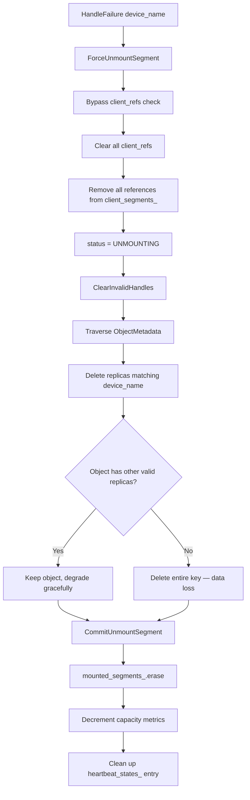
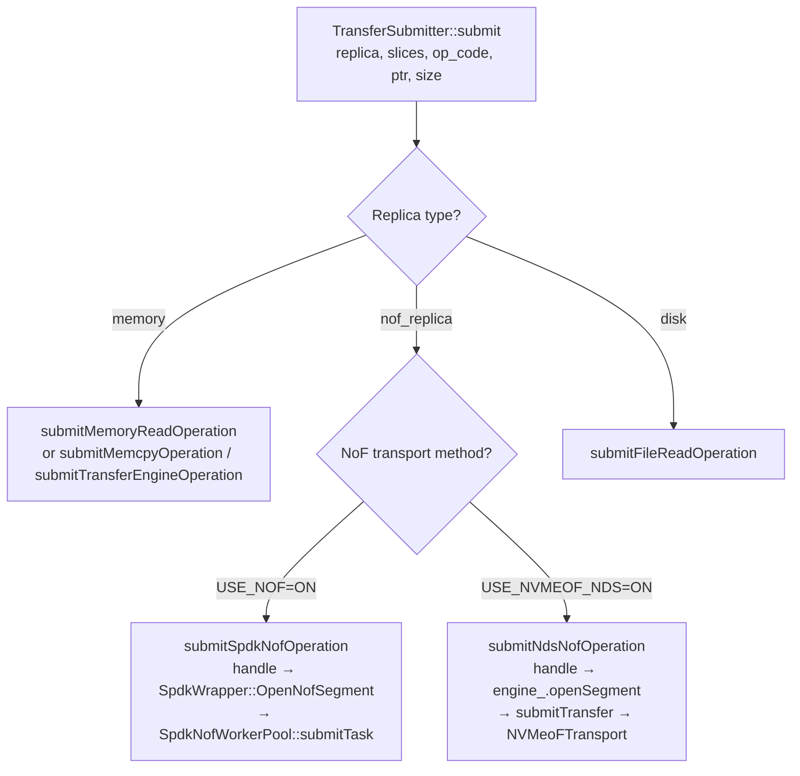
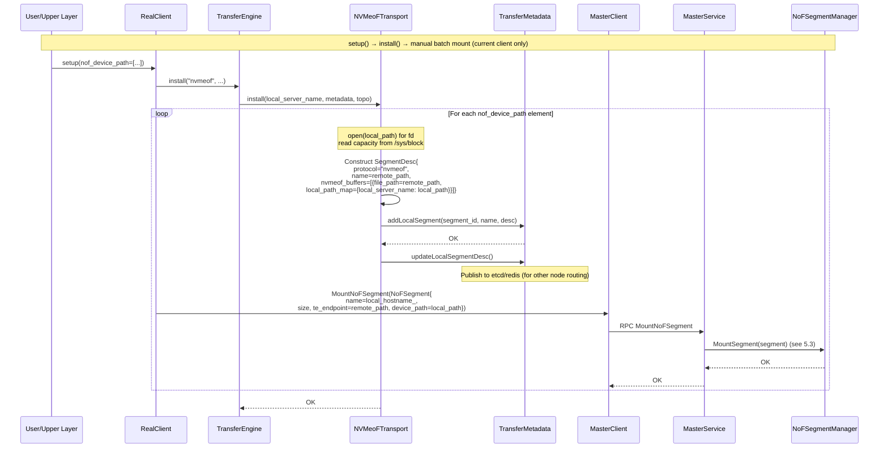

# RFC: Introduce NDS Branch for Ascend NPU Direct-Attached NVMe-oF Storage and Extend Master SSD Segment Management Framework

## 1. Introduction

This RFC extends NVMe-oF direct-attached storage for Ascend NPU scenarios with two coordinated changes:

1. **Transport-layer NDS Branch**: Add an **NDS (NPU Direct Storage)** branch parallel to GDS in `nvmeof_transport`, enabling Ascend NPU inference/training to directly access remote SSD pools via NVMe-oF, expanding KV Cache capacity.
2. **Master SSD Segment Management Extension**: Extend the existing `NoFSegmentManager` with multi-client sharing (`client_refs` reference counting) and probe injection (`NoFProbeFn`), reusing the existing fault force-unmount and replica cleanup chain. Both NDS and SPDK paths share the same segment lifecycle management framework.

This proposal complements the existing SPDK NoF path ([#1940](https://github.com/kvcache-ai/Mooncake/issues/1940), [#2084](https://github.com/kvcache-ai/Mooncake/pull/2084)) without overlap, and is enabled via the compile-time macro `USE_NVMEOF_NDS`. NPU HBM performs DMA directly between NDS and the NVMe-oF target, eliminating the need for host-side DMA buffers required by the SPDK path.

## 2. Background and Motivation

### 2.1 NDS Overview

NDS (NPU Direct Storage, CCDK/nds) is a user-space library for the Huawei Ascend platform, equivalent to NVIDIA GDS: it offloads data movement between NPU HBM and NVMe devices directly to hardware DMA, bypassing host memory.



NDS provides five functional domains: **Lifecycle Management** (`ndsInit`/`ndsDeinit`), **HBM Buffer Registration and Export** (`ndsBufRegister`/`ndsBufDeregister`), **File/Block Device Registration** (`ndsFileRegister`/`ndsFileDeregister`), **Synchronous Read/Write**, and **Asynchronous Batch I/O** (`ndsBatchIoSetup`/`ndsBatchIoSubmit`/`ndsBatchIoGetStatus`).

### 2.2 Technical Feasibility Analysis

The following key prerequisites must be confirmed before introducing the NDS branch:

- **NDS block device I/O compatibility**: NDS support status and limitations for block devices (`/dev/nvmeXnY`). If NDS does not support block devices directly, evaluate indirect support via the filesystem layer.
- **NVMe-oF command submission and completion**: Whether the I/O model between NDS and the NVMe-oF target is compatible, particularly the adaptability of NDS batch I/O interfaces to NVMe queues on the target side.
- **Multi-path and concurrent I/O**: Concurrency safety and locking model when multiple clients issue I/O to the same physical SSD via NDS simultaneously.
- **Remote storage semantics**: Whether NDS interfaces behave identically for remote storage (e.g., block devices exposed by an NVMe-oF target) and local block devices.
- **NDS lifecycle and fault tolerance**: NDS initialization, deinitialization, and behavior under device hot-plug scenarios.

### 2.3 Missing NPU Direct-Attached Storage Path

Two existing NVMe-oF paths both target NVIDIA GPUs:

- **GDS Reference Implementation** (transport layer): depends on `cufile.h`, provides `CuFileContext` handle registration and `CUFileDescPool` batch submission. Users must mount remote targets manually; no automated segment management.
- **SPDK Path** (store layer, #1940/#2084): accesses remote targets via SPDK user-space driver, providing full NoF segment management, heartbeat, fault isolation, and multi-replica support.

Common issue: both require CUDA, unavailable in Ascend environments. The Ascend platform provides the equivalent NDS library, enabling a direct-attached path. This proposal introduces an NDS branch parallel to GDS at the transport layer.

### 2.4 Master SSD Lifecycle Management

The transport layer only handles "initiate a DMA on a given fd + offset." It does not track mount ownership, health status, or capacity. The `NoFSegmentManager` at the master handles these responsibilities. Two mismatches exist:

1. **1:1 mount semantics vs. multi-client sharing**: A physical SSD is often mounted by multiple clients simultaneously. **This proposal extends `client_refs` reference counting**: remounting the same `device_name` only increments the reference count without creating a new segment.
2. **Heartbeat probe tied to SPDK**: The existing heartbeat calls `SpdkWrapper::ProbeNofSegment`, unavailable under NDS. **This proposal abstracts the probe as `NoFProbeFn` function injection**, with transport-layer implementations per path.

The fault force-unmount chain (`ForceUnmountSegment` + `ClearInvalidHandles`) is already implemented and reused directly.

### 2.5 Positioning vs. SPDK Path

Three paths are enabled by independent compile-time macros:

| Dimension | SPDK Path (#1940/#2084) | This Proposal (NDS Path) |
|---|---|---|
| Target Hardware | NVIDIA GPU (requires CUDA) | Ascend NPU (NDS library) |
| Storage Backend | SPDK user-space driver | NDS C API |
| Host Memory | Allocates host-side DMA buffers | Not involved; HBM directly to disk via NDS |
| Segment Management | Independent `NoFSegmentManager` + heartbeat | Extends existing `NoFSegmentManager` (sharing/probe/fault isolation) |
| Transport Changes | New store-layer module | Transport-layer parallel branch + master extension |
| Cluster Coexistence | GPU nodes compile `USE_NOF`, NPU nodes compile `USE_NVMEOF_NDS`, sharing master and segment pool |

## 3. Overall Architecture

### 3.1 Module Structure



The NDS path covers two layers: the transport-layer NDS branch (replacing GDS for data transfer) and master segment management (extending sharing/heartbeat/fault isolation). SSDs use block-device address-offset addressing (`base + offset`), with the master dispatching via fd + offset.

### 3.2 Compile-Time Branches

| Macro | Purpose |
|---|---|
| `USE_NVMEOF` (existing) | Enable transport-layer GDS branch (`CuFileContext`/`CUFileDescPool`) |
| `USE_NOF` (existing) | Enable store-layer SPDK NoF path (`SpdkWrapper` + `SpdkNofWorkerPool`) |
| `USE_NVMEOF_NDS` (new) | Enable NDS branch: master NoF segment management + transport-layer NDS transport |

`USE_NVMEOF_NDS=ON` compiles the NDS branch of `nvmeof_transport.cpp` + `nds_desc_pool.cpp`, linking against `libnds.so` and `CANN`.

## 4. Transport Layer Design

### 4.1 Class Diagram



NDS C API abstraction (`nds.h`):



### 4.2 Key Flows

**Initialization and Memory Registration**: `registerLocalMemory` triggers `ndsInit` + `ndsBufRegister`.

**Batch Submission** (NDS path):



**Status Query**: `getTransferStatus` routes to `ndsBatchIoGetStatus` (returns `NdsBatchIoEvents`) or `CUFileDescPool::getTransferStatus` (returns `CUfileIOEvents_t`) based on `USE_NVMEOF_NDS`.

### 4.3 GDS vs. NDS API Comparison

| Phase | GDS API | NDS API | Description |
|---|---|---|---|
| Init | `cuFileDriverOpen()` | `ndsInit()` | Both determine device context implicitly |
| Mem Register | `cuFileBufRegister(addr, len, flags)` | `ndsBufRegister(buf, len)` | Both take HBM address as input |
| File Register | `cuFileHandleRegister(&handle, &desc)` | `ndsFileRegister(fd)` | NDS takes fd directly |
| Batch Submit | `cuFileBatchIOSetUp / cuFileBatchIOSubmit` | `ndsBatchIoSetup / ndsBatchIoSubmit` | Both support batch async IO |
| Status Query | `cuFileBatchIOGetStatus` | `ndsBatchIoGetStatus` | NDS returns `NdsBatchIoEvents` |
| Batch Destroy | `cuFileBatchIODestroy` | `ndsBatchIoDestroy` | — |

## 5. Master SSD Segment Management

### 5.1 Design Points

| Aspect | Description |
|---|---|
| Addressing | Block-device address-offset (`base + offset`), reuses `OffsetBufferAllocator` |
| Multi-Client Sharing | `client_refs` reference counting; remounting only increments refcount, no new segment |
| Unmount Semantics | `Unmount(device_name, client_id)`: actual destruction only when refcount reaches zero |
| Heartbeat | Background thread probes OK segments every 100ms; consecutive failures past threshold triggers force unmount |
| Fault Handling | `ForceUnmountSegment` bypasses `client_refs`, **no Drain path** (unreadable source) |
| Client Transparency | Failed segment descriptors cleaned by `ClearInvalidHandles`; client unaware of unmount |

### 5.2 Class Diagram



### 5.3 Mount and Unmount



### 5.4 Probe Function Design

`NoFProbeFn` is injected as a function to decouple the master from the specific driver. The master only uses this abstraction to determine device health, without knowledge of the underlying implementation.

```cpp
// Function signature
using NoFProbeFn = std::function<bool(
    const std::string& device_name,  // Device identifier
    int timeout_ms,                   // Single probe timeout
    std::string* error                // Error message output
)>;
```

**Return value semantics**:
- `true`: Device reachable, segment healthy
- `false`: Device unreachable, reason provided via `error`

**NDS path implementation** (default binding):
1. Open the local block device fd corresponding to `device_name`
2. Issue a lightweight `nds_read` (read 1 byte, data content ignored)
3. Timeout control: failure if no response within `timeout_ms`
4. If `nds_read` returns an error code, populate `error` and return `false`

**SPDK path implementation**: Direct call to `SpdkWrapper::ProbeNofSegment(device_name, timeout_ms, error)`.

**Heartbeat thread** (existing master logic, unmodified by this proposal): Polls every 100ms, invokes `ProbeFn` for OK-status segments, triggers `ForceUnmountSegment` when consecutive failures exceed the threshold (default `10s × 3`).

### 5.5 Fault Handling

When a device is unreachable, force unmount directly (no Drain path — source segment is unreadable):



New writes are automatically allocated to healthy segments (`Allocate()` skips non-OK segments). Clients switch via `GetReplicaList`.

### 5.6 Store-Layer Routing Extension

The NoF replica branch in `TransferSubmitter::submit()` adds the NDS path:



`submitNdsNofOperation` logic:

1. `engine_.openSegment(handle.transport_endpoint_)` — open segment for `SegmentHandle`
2. Construct `TransferRequest{target_id=seg, target_offset=buffer_address_, source=ptr, length=size}`
3. `submitTransfer({request})` — executed via `NVMeoFTransport` (NDS branch)

Reuses the existing `submitTransfer` path; no new worker thread pool needed at the store layer.

### 5.7 Segment Metadata Registration and Mounting

**NoFSegment struct** (`mooncake-store/include/types.h`) adds `device_path`:

```cpp
struct NoFSegment {
    UUID id{0, 0};
    std::string name{};        // Logical segment name
    uintptr_t base{0};         // NVMe namespace offset
    size_t size{0};            // Segment capacity (bytes)
    std::string te_endpoint{}; // SPDK: transport string; NDS: remote address (remote_path)
    std::string device_path{}; // New: local NVMe block device path
};
```

| Field | NDS Usage | SPDK Usage |
|---|---|---|
| `te_endpoint` | Remote identifier `remote_ip:device_path`, used as `SegmentDesc.name` for routing | NVMe-oF transport string |
| `device_path` (new) | Local block device path, opened by `NdsFileContext` to register NDS handle | Not needed |

**Configuration and Mounting**: Passed via `store.setup(nof_device_path=[...])`, element format `"remote_ip:device_path:local_path"`, split by last colon. Mounting is per-client only:



## 6. Configuration and Observability

| Config Item | Meaning | Default |
|---|---|---|
| `USE_NVMEOF` (compile-time, existing) | Enable transport-layer GDS branch | `OFF` |
| `USE_NOF` (compile-time, existing) | Enable store-layer SPDK NoF path | `OFF` |
| `USE_NVMEOF_NDS` (compile-time) | Enable NDS branch (master + transport) | `OFF` |
| `nof_device_path` (setup param) | Remote+local path list `["remote_ip:dev_path:local_path", ...]` | Empty |

Heartbeat parameters (interval, timeout, threshold) are injected via `MasterServiceConfig`. NDS status queries use `ndsBatchIoGetStatus` returning `NdsBatchIoEvents` (`status`/`ret`/`error`), consistent with GDS `CUfileIOEvents_t`.

## 7. Coordination with Community Roadmap

- **SPDK Path** (#1940/#2084): Positioning differences in Section 2.5.
- **GDS Branch**: Unmodified — `CuFileContext`/`CUFileDescPool` remain unchanged.
- **Roadmap Alignment** ([#1883](https://github.com/kvcache-ai/Mooncake/issues/1883)): NVMe-oF proposals concentrate in Milestone 13 (SSD Offload Support), including [#1940](https://github.com/kvcache-ai/Mooncake/issues/1940), [#2084](https://github.com/kvcache-ai/Mooncake/pull/2084), [#2172](https://github.com/kvcache-ai/Mooncake/pull/2172). Milestone 6 Ascend adaptation entries provide the roadmap basis for this proposal.

## 8. Future Work

Split by PR granularity, 5 items:

1. **Merge transport-layer NDS branch**: `NdsFileContext`, `NdsDescPool`, NDS compile branch of `NVMeoFTransport` — standalone PR into `mooncake-transfer-engine`.
2. **Extend master NoF segment management**: Multi-client sharing (`client_refs`), probe abstraction (`NoFProbeFn`), bind NDS default probe.
3. **Client-side integration**: Implement `submitNdsNofOperation` and `TransferSubmitter` routing branch; add `device_path` to `NoFSegment`; add `nof_device_path` list param to `store.setup()`; `NVMeoFTransport::install()` handles device validation and SegmentDesc registration; `setup_internal()` calls `MountNoFSegment()`.
4. **Complete transport-layer QoS flow control**: Parity with `SpdkNofQos`.
5. **Evaluate common abstract base classes**: Unify GDS/NDS handle management (`NvmeOfFileContext`) and master reference counting/heartbeat interfaces.

## 9. References

- Mooncake Official Roadmap: https://github.com/kvcache-ai/Mooncake/issues/1883
- [#1940 SSD pool over NVMe-oF](https://github.com/kvcache-ai/Mooncake/issues/1940)
- [#2084 NVMe-oF SSD cache support](https://github.com/kvcache-ai/Mooncake/pull/2084)
- [#2172 feat(store): add SPDK NoF worker pool](https://github.com/kvcache-ai/Mooncake/pull/2172)
- [#2176 Store L2→L1 promotion-on-hit](https://github.com/kvcache-ai/Mooncake/pull/2176)
- [#1058 Mooncake Transfer Engine NEXT](https://github.com/kvcache-ai/Mooncake/issues/1058)
- NVIDIA GDS: https://docs.nvidia.com/gpudirect-storage/