# 3FS NPU Direct Storage (NDS) 适配设计方案

## 1. 需求概述

### 1.1 背景

3FS 新增了 NPU 到 SSD 的直通能力（NDS, NPU Direct Storage），可以跳过 DDR 直接将数据从 HBM（High Bandwidth Memory）传输到 SSD。原有的读写接口使用 `hf3fs_prep_io`，需要将数据拷贝到临时 DDR 内存；新接口 `hf3fs_prep_npu` 可直接传入 HBM 地址，实现零拷贝直通。

### 1.2 目标

- 将 3FS 的 `hf3fs_prep_io` 替换为 `hf3fs_prep_npu`，支持 HBM 地址直接传输
- 向下透传 HBM 地址，不拷贝到临时 DDR 内存
- 通过 `USE_NDS` 编译变量控制是否启用 NDS 路径
- 仅对 3FS 后端生效，不影响其他存储后端
- 提供独立的 HBM 内存注册接口，避免 I/O 路径中的重复注册开销

### 1.3 约束

| 约束项 | 说明 |
|--------|------|
| 编译控制 | `USE_NDS` 宏控制，未定义时完全不编译 NDS 代码 |
| 后端限制 | 仅 3FS 后端生效，通过 `IsStorage3fs()` / `Is3fsDir()` 判断 |
| NPU 直通 Size | 无上限 |
| 地址检测 | 运行时通过 `gpu_staging::IsDevicePointer()` 自动检测 HBM 地址 |
| 注册模式 | 整段内存注册一次，后续任意偏移位置直接使用 |

## 2. 功能设计

### 2.1 整体架构

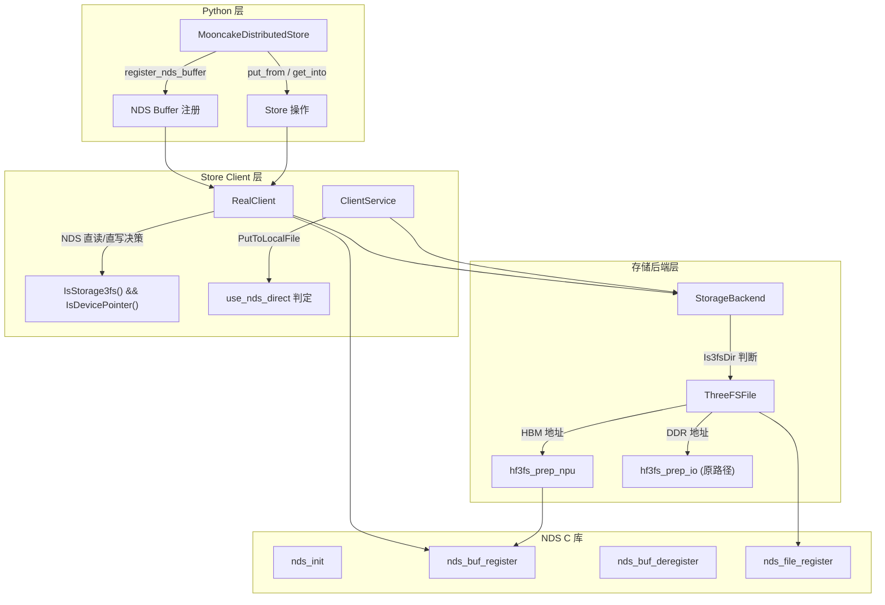
```mermaid
graph TB
    subgraph "Python 层"
        PY["MooncakeDistributedStore"]
        PY -->|register_nds_buffer| NDS_REG["NDS Buffer 注册"]
        PY -->|put_from / get_into| STORE_OPS["Store 操作"]
    end

    subgraph "Store Client 层"
        RC["RealClient"]
        RC -->|NDS 直读/直写决策| NDS_CHECK["IsStorage3fs() && IsDevicePointer()"]
        CS["ClientService"]
        CS -->|PutToLocalFile| NDS_CHECK2["use_nds_direct 判定"]
    end

    subgraph "存储后端层"
        SB["StorageBackend"]
        SB -->|Is3fsDir 判断| TFF["ThreeFSFile"]
        TFF -->|HBM 地址| PREP_NPU["hf3fs_prep_npu"]
        TFF -->|DDR 地址| PREP_IO["hf3fs_prep_io (原路径)"]
    end

    subgraph "NDS C 库"
        NDS_INIT["nds_init"]
        NDS_BUF_REG["nds_buf_register"]
        NDS_BUF_DEREG["nds_buf_deregister"]
        NDS_FILE_REG["nds_file_register"]
    end

    NDS_REG --> RC
    RC --> NDS_BUF_REG
    STORE_OPS --> RC
    RC --> SB
    CS --> SB
    TFF --> NDS_FILE_REG
    PREP_NPU --> NDS_BUF_REG
```

### 2.2 NDS 数据流路径

以下展示启用 NDS 后，读/写操作的数据流对比：

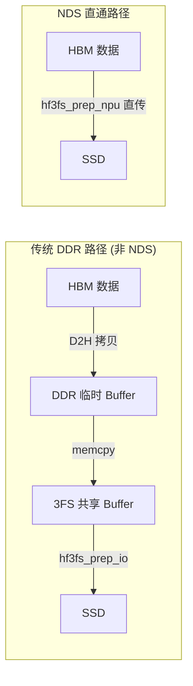
```mermaid
graph LR
    subgraph "传统 DDR 路径 (非 NDS)"
        HBM_W1["HBM 数据"] -->|D2H 拷贝| DDR1["DDR 临时 Buffer"]
        DDR1 -->|memcpy| SHM1["3FS 共享 Buffer"]
        SHM1 -->|hf3fs_prep_io| SSD1["SSD"]
    end

    subgraph "NDS 直通路径"
        HBM_W2["HBM 数据"] -->|hf3fs_prep_npu 直传| SSD2["SSD"]
    end
```

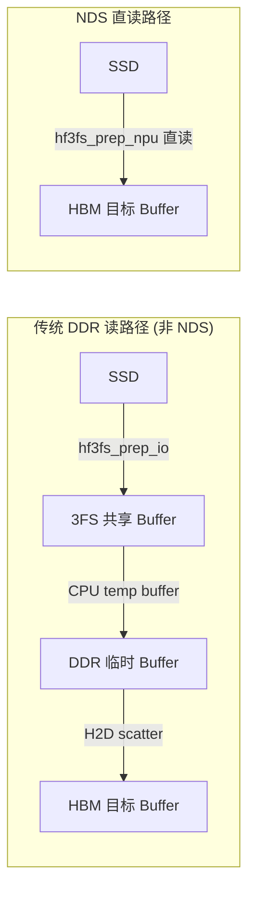
```mermaid
graph LR
    subgraph "传统 DDR 读路径 (非 NDS)"
        SSD_R1["SSD"] -->|hf3fs_prep_io| SHM_R1["3FS 共享 Buffer"]
        SHM_R1 -->|CPU temp buffer| DDR_R1["DDR 临时 Buffer"]
        DDR_R1 -->|H2D scatter| HBM_R1["HBM 目标 Buffer"]
    end

    subgraph "NDS 直读路径"
        SSD_R2["SSD"] -->|hf3fs_prep_npu 直读| HBM_R2["HBM 目标 Buffer"]
    end
```

### 2.3 NDS 启用条件判定流程

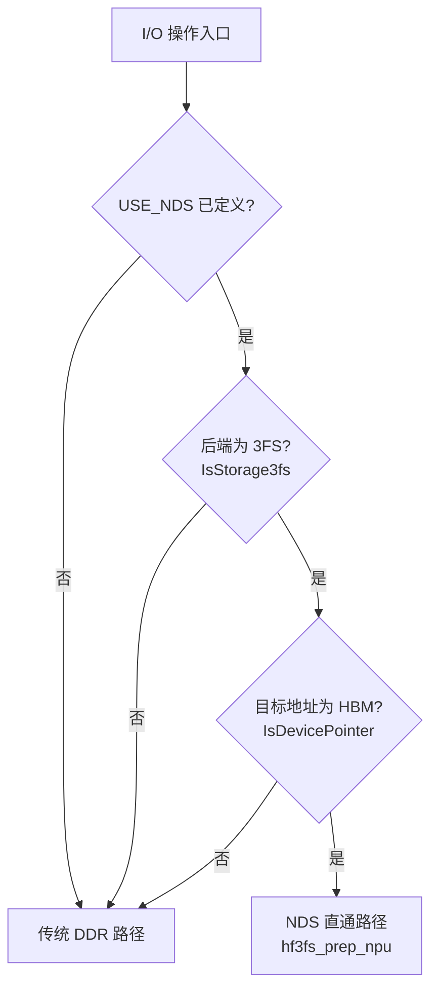
```mermaid
flowchart TD
    START["I/O 操作入口"] --> CHECK_NDS_COMPILE{USE_NDS 已定义?}
    CHECK_NDS_COMPILE -->|否| DDR_PATH["传统 DDR 路径"]
    CHECK_NDS_COMPILE -->|是| CHECK_3FS{后端为 3FS?<br/>IsStorage3fs}
    CHECK_3FS -->|否| DDR_PATH
    CHECK_3FS -->|是| CHECK_HBM{目标地址为 HBM?<br/>IsDevicePointer}
    CHECK_HBM -->|否| DDR_PATH
    CHECK_HBM -->|是| NDS_PATH["NDS 直通路径<br/>hf3fs_prep_npu"]
```

### 2.4 HBM Buffer 注册设计

采用独立注册接口（方案 D），与 RDMA `register_buffer` 模式一致：

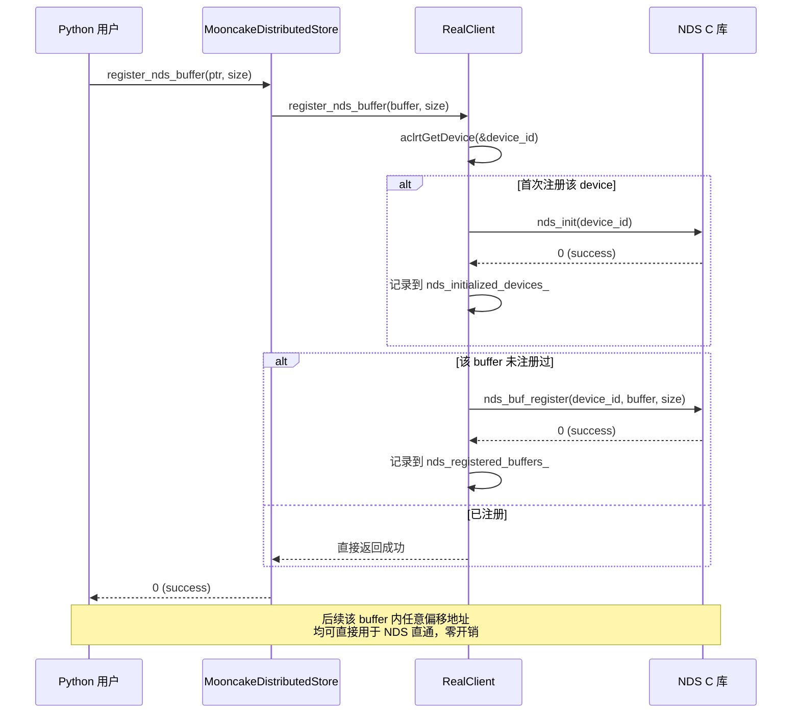
```mermaid
sequenceDiagram
    participant PY as Python 用户
    participant Store as MooncakeDistributedStore
    participant RC as RealClient
    participant NDS as NDS C 库

    PY->>Store: register_nds_buffer(ptr, size)
    Store->>RC: register_nds_buffer(buffer, size)
    RC->>RC: aclrtGetDevice(&device_id)
    
    alt 首次注册该 device
        RC->>NDS: nds_init(device_id)
        NDS-->>RC: 0 (success)
        RC->>RC: 记录到 nds_initialized_devices_
    end
    
    alt 该 buffer 未注册过
        RC->>NDS: nds_buf_register(device_id, buffer, size)
        NDS-->>RC: 0 (success)
        RC->>RC: 记录到 nds_registered_buffers_
    else 已注册
        RC-->>Store: 直接返回成功
    end
    
    Store-->>PY: 0 (success)
    
    Note over PY,NDS: 后续该 buffer 内任意偏移地址<br/>均可直接用于 NDS 直通，零开销
```

### 2.5 核心数据结构

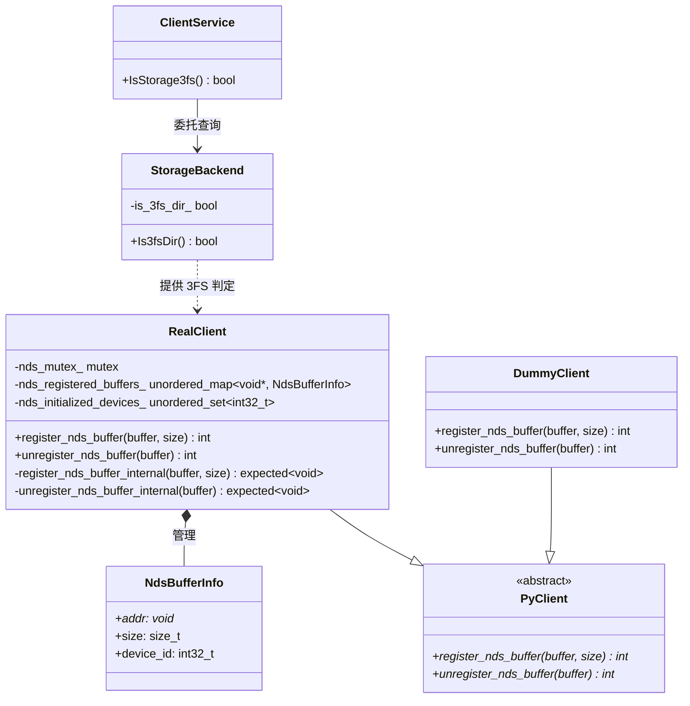
```mermaid
classDiagram
    class RealClient {
        +register_nds_buffer(buffer, size) int
        +unregister_nds_buffer(buffer) int
        -register_nds_buffer_internal(buffer, size) expected~void~
        -unregister_nds_buffer_internal(buffer) expected~void~
        -nds_mutex_ mutex
        -nds_registered_buffers_ unordered_map~void*, NdsBufferInfo~
        -nds_initialized_devices_ unordered_set~int32_t~
    }

    class NdsBufferInfo {
        +addr: void*
        +size: size_t
        +device_id: int32_t
    }

    class PyClient {
        <<abstract>>
        +register_nds_buffer(buffer, size) int*
        +unregister_nds_buffer(buffer) int*
    }

    class DummyClient {
        +register_nds_buffer(buffer, size) int
        +unregister_nds_buffer(buffer) int
    }

    class StorageBackend {
        +Is3fsDir() bool
        -is_3fs_dir_ bool
    }

    class ClientService {
        +IsStorage3fs() bool
    }

    RealClient --|> PyClient
    DummyClient --|> PyClient
    RealClient *-- NdsBufferInfo : 管理
    ClientService --> StorageBackend : 委托查询
    StorageBackend ..> RealClient : 提供 3FS 判定
```

### 2.6 修改文件清单

| 层级 | 文件 | 改动说明 |
|------|------|----------|
| **C 接口** | `include/hf3fs/nds.h` | NDS 用户态库 C 头文件（全新增） |
| **GPU 抽象** | `include/gpu_staging_utils.h` | `IsDevicePointer` 跨平台检测函数 |
| **3FS 文件层** | `src/hf3fs/hf3fs_file.cpp` | write / pwritev / vector_read 中嵌入 NDS 直通分支 |
| **Store Client** | `include/real_client.h` | NDS 接口声明 + `NdsBufferInfo` + 注册管理成员 |
| **Store Client** | `src/real_client.cpp` | NDS 注册/注销实现 + DISK 读路径 NDS 直读决策 |
| **Store Client** | `include/pyclient.h` | NDS 虚接口声明 |
| **Store Client** | `include/dummy_client.h` | NDS 空实现 |
| **服务层** | `include/storage_backend.h` | `Is3fsDir()` 访问器 |
| **服务层** | `include/client_service.h` | `IsStorage3fs()` 访问器 |
| **服务层** | `src/client_service.cpp` | PutToLocalFile 中 `use_nds_direct` 判定 |
| **Python 绑定** | `mooncake-integration/store/store_py.cpp` | `register_nds_buffer` / `unregister_nds_buffer` 绑定 |

## 3. 功能实现

### 3.1 3FS 文件层 NDS 直通

在 `ThreeFSFile` 的三个 I/O 方法中，运行时检测数据指针是否为 HBM 地址，若是则使用 `hf3fs_prep_npu` 直传：

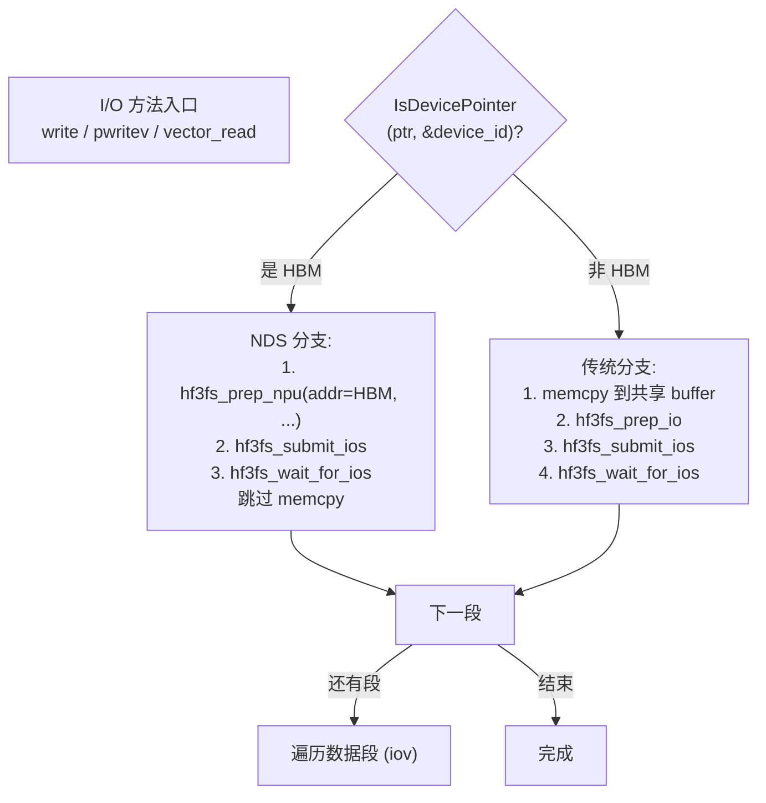
```mermaid
flowchart TD
    IO_ENTRY["I/O 方法入口<br/>write / pwritev / vector_read"]
    LOOP["遍历数据段 (iov)"]
    CHECK_HBM{"IsDevicePointer<br/>(ptr, &device_id)?"}
    
    CHECK_HBM -->|是 HBM| NDS_BRANCH["NDS 分支:<br/>1. hf3fs_prep_npu(addr=HBM, ...)<br/>2. hf3fs_submit_ios<br/>3. hf3fs_wait_for_ios<br/>跳过 memcpy"]
    CHECK_HBM -->|非 HBM| DDR_BRANCH["传统分支:<br/>1. memcpy 到共享 buffer<br/>2. hf3fs_prep_io<br/>3. hf3fs_submit_ios<br/>4. hf3fs_wait_for_ios"]
    
    NDS_BRANCH --> NEXT["下一段"]
    DDR_BRANCH --> NEXT
    NEXT -->|还有段| LOOP
    NEXT -->|结束| DONE["完成"]
```

| 方法 | NDS 触发条件 | 替换接口 |
|------|-------------|---------|
| `write(span)` | data_ptr 为 HBM | `hf3fs_prep_npu` |
| `pwritev(iov)` | iov_base 为 HBM | `hf3fs_prep_npu` |
| `vector_read(iov)` | iov_base 为 HBM | `hf3fs_prep_npu` |

### 3.2 Store Client 写路径 NDS

写路径涉及 `real_client.cpp` 的 put 操作和 `client_service.cpp` 的 PutToLocalFile：

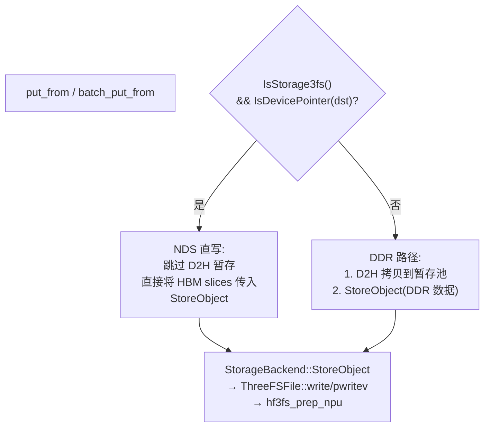
```mermaid
flowchart TD
    PUT["put_from / batch_put_from"]
    CHECK_3FS{"IsStorage3fs()<br/>&& IsDevicePointer(dst)?"}
    
    CHECK_3FS -->|是| NDS_PUT["NDS 直写:<br/>跳过 D2H 暂存<br/>直接将 HBM slices 传入<br/>StoreObject"]
    CHECK_3FS -->|否| DDR_PUT["DDR 路径:<br/>1. D2H 拷贝到暂存池<br/>2. StoreObject(DDR 数据)"]
    
    NDS_PUT --> STORE["StorageBackend::StoreObject<br/>→ ThreeFSFile::write/pwritev<br/>→ hf3fs_prep_npu"]
    DDR_PUT --> STORE
```

PutToLocalFile 中的判定逻辑：

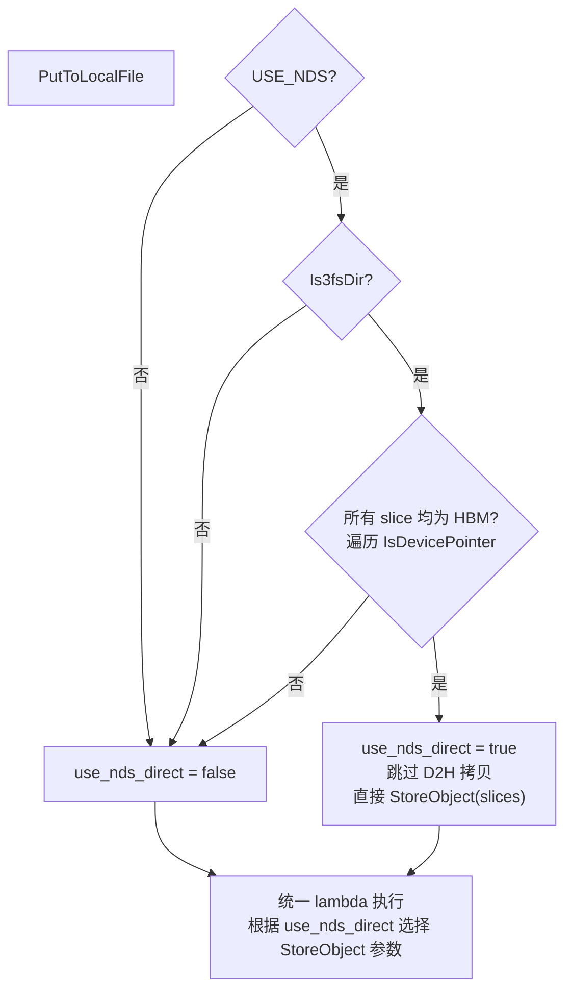
```mermaid
flowchart TD
    START["PutToLocalFile"]
    CHECK_COMPILE{USE_NDS?}
    CHECK_COMPILE -->|否| DDR["use_nds_direct = false"]
    CHECK_COMPILE -->|是| CHECK_3FS{Is3fsDir?}
    CHECK_3FS -->|否| DDR
    CHECK_3FS -->|是| CHECK_ALL_HBM{"所有 slice 均为 HBM?<br/>遍历 IsDevicePointer"}
    CHECK_ALL_HBM -->|否| DDR
    CHECK_ALL_HBM -->|是| NDS["use_nds_direct = true<br/>跳过 D2H 拷贝<br/>直接 StoreObject(slices)"]
    DDR --> LAMBDA["统一 lambda 执行<br/>根据 use_nds_direct 选择 StoreObject 参数"]
    NDS --> LAMBDA
```

### 3.3 Store Client 读路径 NDS

读路径涉及 `real_client.cpp` 中三个 DISK 读函数：

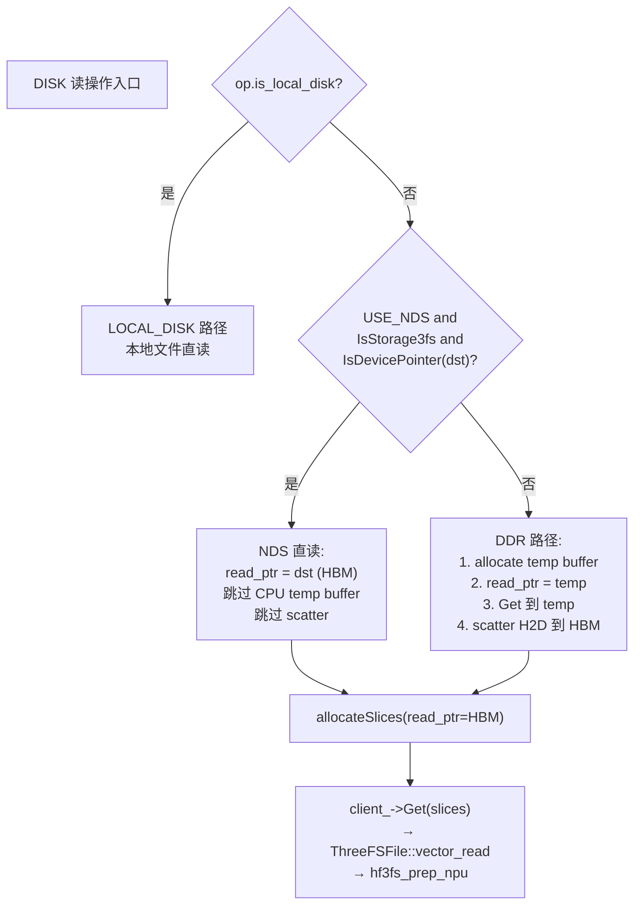
```mermaid
flowchart TD
    READ["DISK 读操作入口"]
    CHECK_LOCAL{"op.is_local_disk?"}
    
    CHECK_LOCAL -->|是| LOCAL_DISK["LOCAL_DISK 路径<br/>本地文件直读"]
    CHECK_LOCAL -->|否| CHECK_NDS{"USE_NDS and<br/>IsStorage3fs and<br/>IsDevicePointer(dst)?"}
    
    CHECK_NDS -->|是| NDS_READ["NDS 直读:<br/>read_ptr = dst (HBM)<br/>跳过 CPU temp buffer<br/>跳过 scatter"]
    CHECK_NDS -->|否| DDR_READ["DDR 路径:<br/>1. allocate temp buffer<br/>2. read_ptr = temp<br/>3. Get 到 temp<br/>4. scatter H2D 到 HBM"]
    
    NDS_READ --> ALLOC["allocateSlices(read_ptr=HBM)"]
    DDR_READ --> ALLOC
    ALLOC --> GET["client_->Get(slices)<br/>→ ThreeFSFile::vector_read<br/>→ hf3fs_prep_npu"]
```

三个读函数的 NDS 处理对比：

| 函数 | NDS 判定对象 | NDS 路径 read_ptr | NDS 路径后续 |
|------|-------------|-------------------|-------------|
| `execute_ranged_read` | `buffer + dst_offset` | 直接使用 `dst` (HBM) | 无 scatter |
| `batch_get_into_internal` | `op.dst_buffer` | 直接使用 `op.dst_buffer` (HBM) | 不插入 temp_handles |
| `batch_get_into_multi_buffers_internal` | 所有 `op.buffers[j]` 均为 HBM | 直接构建 `Slice{buffer, size}` | 不插入 temp_handles |

### 3.4 NDS Buffer 注册/注销

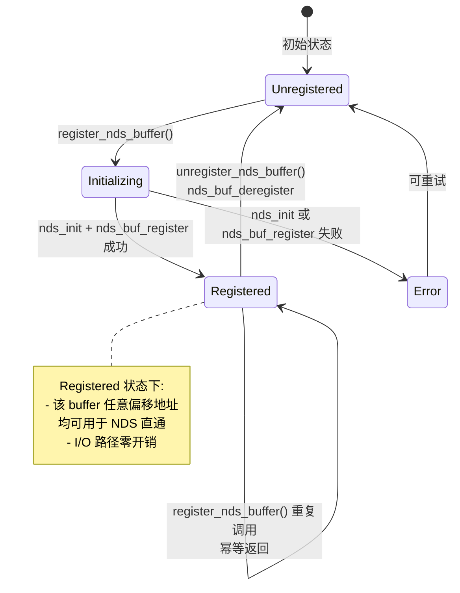
```mermaid
stateDiagram-v2
    [*] --> Unregistered: 初始状态
    
    Unregistered --> Initializing: register_nds_buffer()
    Initializing --> Registered: nds_init + nds_buf_register 成功
    Initializing --> Error: nds_init 或 nds_buf_register 失败
    Error --> Unregistered: 可重试
    
    Registered --> Unregistered: unregister_nds_buffer()<br/>nds_buf_deregister
    Registered --> Registered: register_nds_buffer() 重复调用<br/>幂等返回
    
    note right of Registered
        Registered 状态下:
        - 该 buffer 任意偏移地址
          均可用于 NDS 直通
        - I/O 路径零开销
    end note
```

注册管理内部状态：

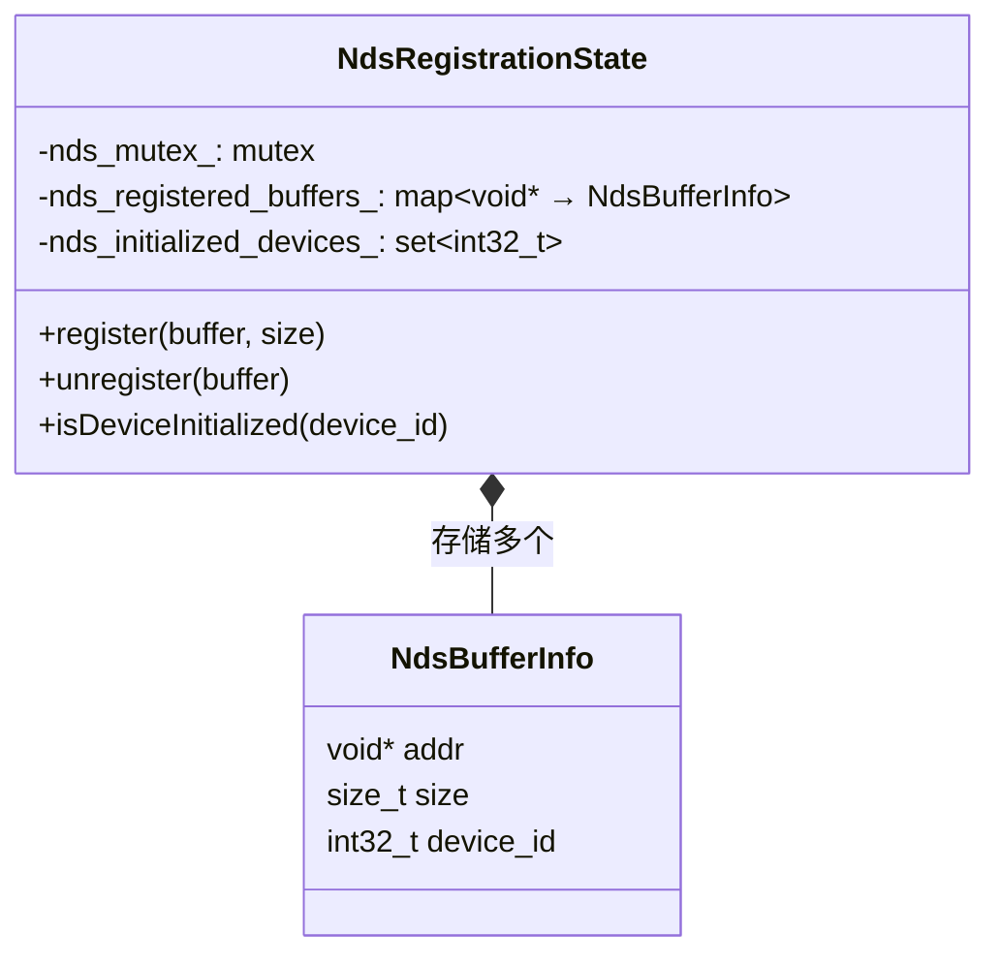
```mermaid
classDiagram
    class NdsBufferInfo {
        void* addr
        size_t size
        int32_t device_id
    }

    class NdsRegistrationState {
        -nds_mutex_: mutex
        -nds_registered_buffers_: map~void* → NdsBufferInfo~
        -nds_initialized_devices_: set~int32_t~
    }

    NdsRegistrationState *-- NdsBufferInfo : 存储多个
    NdsRegistrationState : +register(buffer, size)
    NdsRegistrationState : +unregister(buffer)
    NdsRegistrationState : +isDeviceInitialized(device_id)
```

### 3.5 编译控制

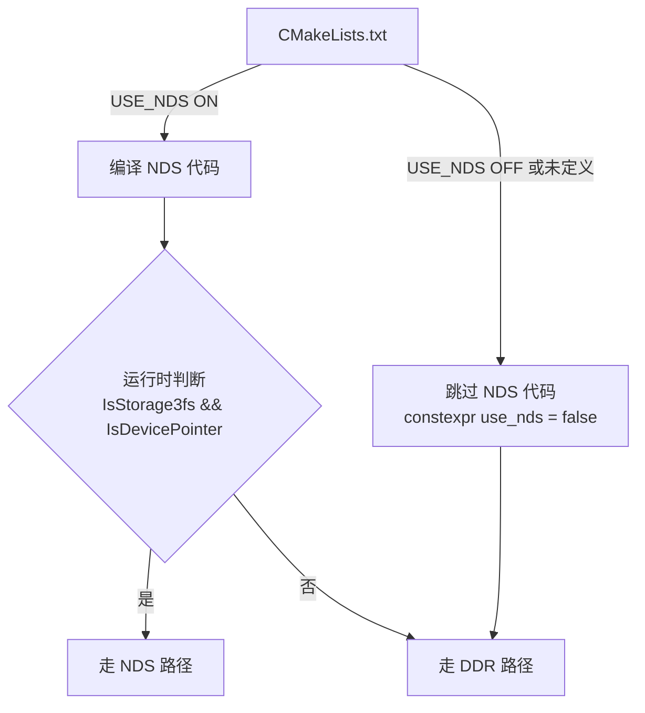
```mermaid
graph TD
    CMAKE["CMakeLists.txt"] -->|USE_NDS ON| COMPILE_NDS["编译 NDS 代码"]
    CMAKE -->|USE_NDS OFF 或未定义| SKIP_NDS["跳过 NDS 代码<br/>constexpr use_nds = false"]

    COMPILE_NDS --> CHECK_RUNTIME{"运行时判断<br/>IsStorage3fs && IsDevicePointer"}
    CHECK_RUNTIME -->|是| RUN_NDS["走 NDS 路径"]
    CHECK_RUNTIME -->|否| RUN_DDR["走 DDR 路径"]

    SKIP_NDS --> RUN_DDR
```

## 4. 测试用例

### 4.1 现有测试资产分析

| 测试文件 | 类型 | 与 NDS 的关系 | 可复用性 |
|----------|------|--------------|---------|
| `mooncake-transfer-engine/tests/nvmeof_nds_transport_test.cpp` | C++ 单元测试 | NDS Transport 层直接测试 | 可参考测试夹具 |
| `mooncake-transfer-engine/tests/nvmeof_gds_transport_test.cpp` | C++ 单元测试 | GPU Direct Storage 对标实现 | 结构模板 |
| `mooncake-wheel/tests/test_distributed_object_store.py` | Python 集成测试 | `test_zero_copy_operations` 测试 register_buffer 流程 | 可扩展为 NDS 测试 |
| `mooncake-store/tests/storage_backend_test.cpp` | C++ 单元测试 | 存储后端通用测试 | 可扩展 3FS 后端用例 |
| `mooncake-store/tests/e2e/storage_backend_e2e_test.cpp` | C++ E2E 测试 | Put → Eviction → Get 流程 | 可扩展 NDS E2E |

### 4.2 建议新增测试用例

#### 4.2.1 Python 层 NDS 注册测试

复用 `test_distributed_object_store.py` 中的 `test_zero_copy_operations` 模板：

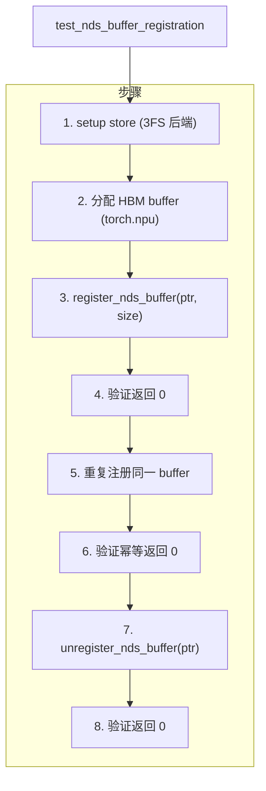
```mermaid
flowchart TD
    TEST_NDS_REG["test_nds_buffer_registration"]
    
    subgraph 步骤
        S1["1. setup store (3FS 后端)"]
        S2["2. 分配 HBM buffer (torch.npu)"]
        S3["3. register_nds_buffer(ptr, size)"]
        S4["4. 验证返回 0"]
        S5["5. 重复注册同一 buffer"]
        S6["6. 验证幂等返回 0"]
        S7["7. unregister_nds_buffer(ptr)"]
        S8["8. 验证返回 0"]
    end
    
    TEST_NDS_REG --> S1 --> S2 --> S3 --> S4 --> S5 --> S6 --> S7 --> S8
```

| 用例 ID | 名称 | 描述 | 预期结果 |
|---------|------|------|---------|
| NDS-REG-01 | test_nds_buffer_registration | 注册 → 重复注册 → 注销 | 全部返回 0 |
| NDS-REG-02 | test_nds_buffer_unregister_not_registered | 注销未注册的 buffer | 返回 0（幂等） |
| NDS-REG-03 | test_nds_buffer_multiple_buffers | 注册多个不同 device 的 buffer | 每个独立成功 |
| NDS-REG-04 | test_nds_buffer_non_hbm_address | 传入 CPU 地址注册 | 返回错误码 |

#### 4.2.2 Python 层 NDS 端到端读写测试

复用 `test_distributed_object_store.py` 的 `test_zero_copy_operations` 模板，替换为 HBM buffer：

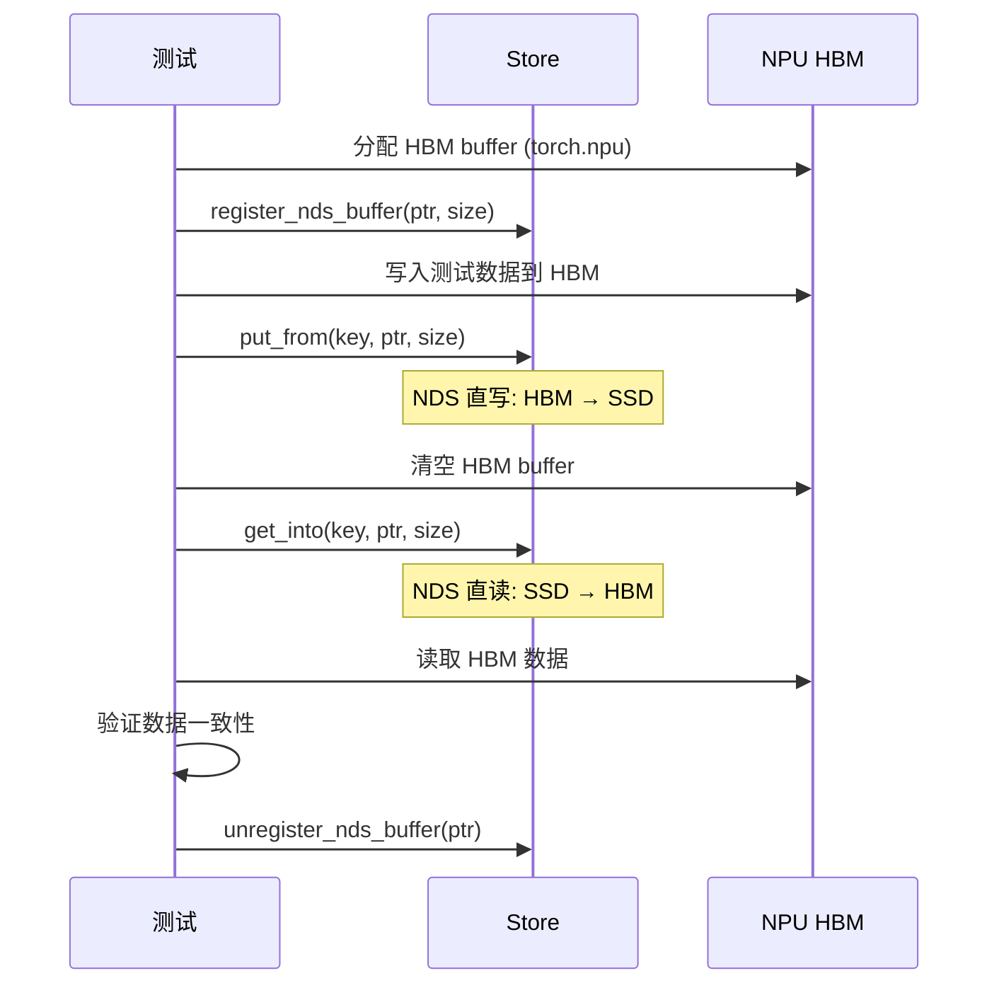
```mermaid
sequenceDiagram
    participant T as 测试
    participant S as Store
    participant NPU as NPU HBM

    T->>NPU: 分配 HBM buffer (torch.npu)
    T->>S: register_nds_buffer(ptr, size)
    T->>NPU: 写入测试数据到 HBM
    T->>S: put_from(key, ptr, size)
    Note over S: NDS 直写: HBM → SSD
    T->>NPU: 清空 HBM buffer
    T->>S: get_into(key, ptr, size)
    Note over S: NDS 直读: SSD → HBM
    T->>NPU: 读取 HBM 数据
    T->>T: 验证数据一致性
    T->>S: unregister_nds_buffer(ptr)
```

| 用例 ID | 名称 | 描述 | 预期结果 |
|---------|------|------|---------|
| NDS-E2E-01 | test_nds_put_from_hbm | HBM buffer 通过 NDS 写入 | 数据正确写入 SSD |
| NDS-E2E-02 | test_nds_get_into_hbm | 从 SSD 通过 NDS 读到 HBM | 数据与写入一致 |
| NDS-E2E-03 | test_nds_batch_put_from_hbm | 批量 HBM put | 所有 key 正确写入 |
| NDS-E2E-04 | test_nds_batch_get_into_hbm | 批量 HBM get | 所有数据正确读取 |
| NDS-E2E-05 | test_nds_mixed_hbm_ddr | 混合 HBM 和 DDR buffer 操作 | 各自走正确路径 |
| NDS-E2E-06 | test_nds_large_buffer | 大于 chunk_size 的 HBM buffer 读写 | 正确分块传输 |

#### 4.2.3 C++ 层 ThreeFSFile 单元测试

参考 `nvmeof_nds_transport_test.cpp` 的测试夹具：

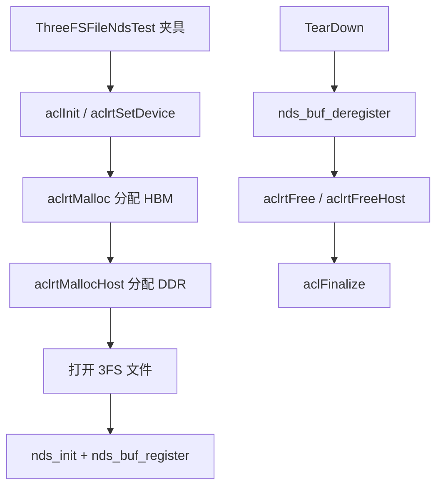
```mermaid
flowchart TD
    FIXTURE["ThreeFSFileNdsTest 夹具"]
    F1["aclInit / aclrtSetDevice"]
    F2["aclrtMalloc 分配 HBM"]
    F3["aclrtMallocHost 分配 DDR"]
    F4["打开 3FS 文件"]
    F5["nds_init + nds_buf_register"]
    
    FIXTURE --> F1 --> F2 --> F3 --> F4 --> F5
    
    TEARDOWN["TearDown"]
    T1["nds_buf_deregister"]
    T2["aclrtFree / aclrtFreeHost"]
    T3["aclFinalize"]
    
    TEARDOWN --> T1 --> T2 --> T3
```

| 用例 ID | 名称 | 描述 | 预期结果 |
|---------|------|------|---------|
| NDS-FILE-01 | test_write_hbm | HBM 地址写入 3FS 文件 | 返回写入字节数，数据正确 |
| NDS-FILE-02 | test_pwritev_hbm | iovec 指向 HBM 写入 | 返回写入字节数 |
| NDS-FILE-03 | test_vector_read_hbm | 读入 HBM buffer | 数据与写入一致 |
| NDS-FILE-04 | test_write_ddr_fallback | DDR 地址走传统路径 | 正常工作不受影响 |
| NDS-FILE-05 | test_write_mixed_iov | 同一 iov 中混合 HBM 和 DDR | 各段走对应路径 |
| NDS-FILE-06 | test_write_large_hbm | 超过 chunk_size 的 HBM 写入 | 正确分块，数据完整 |

#### 4.2.4 编译条件测试

| 用例 ID | 名称 | 描述 | 预期结果 |
|---------|------|------|---------|
| NDS-COMP-01 | test_without_use_nds | 不定义 USE_NDS 编译 | NDS 代码不编译，功能不受影响 |
| NDS-COMP-02 | test_with_use_nds_no_3fs | 启用 USE_NDS 但非 3FS 后端 | 走 DDR 路径，不影响功能 |
| NDS-COMP-03 | test_with_use_nds_no_hbm | 启用 USE_NDS，3FS 后端，但传入 DDR 地址 | 走 DDR 路径 |

### 4.3 测试执行方式

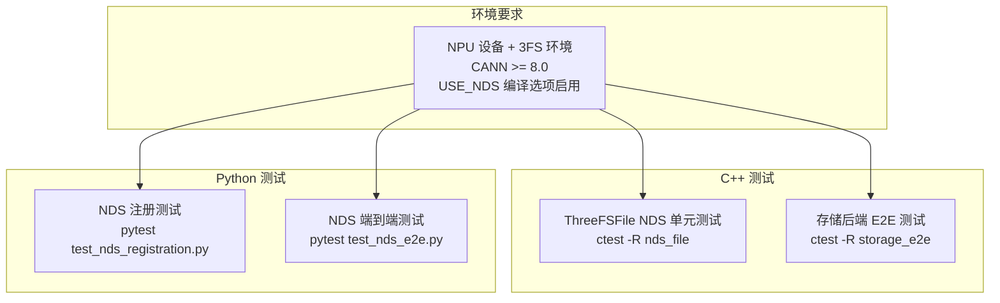
```mermaid
graph TD
    subgraph "C++ 测试"
        CPP_UNIT["ThreeFSFile NDS 单元测试<br/>ctest -R nds_file"]
        CPP_E2E["存储后端 E2E 测试<br/>ctest -R storage_e2e"]
    end

    subgraph "Python 测试"
        PY_REG["NDS 注册测试<br/>pytest test_nds_registration.py"]
        PY_E2E["NDS 端到端测试<br/>pytest test_nds_e2e.py"]
    end

    subgraph "环境要求"
        ENV["NPU 设备 + 3FS 环境<br/>CANN >= 8.0<br/>USE_NDS 编译选项启用"]
    end

    ENV --> CPP_UNIT
    ENV --> CPP_E2E
    ENV --> PY_REG
    ENV --> PY_E2E
```

### 4.4 现有测试的扩展建议

| 现有测试文件 | 扩展方式 |
|-------------|---------|
| `test_distributed_object_store.py::test_zero_copy_operations` | 复制并修改为 `test_nds_zero_copy_operations`，buffer 改为 `torch.npu` 分配，增加 `register_nds_buffer` / `unregister_nds_buffer` 调用 |
| `nvmeof_nds_transport_test.cpp` | 取消 `CMakeLists.txt` 中 `add_test` 注释，修复硬编码 CANN 路径 |
| `storage_backend_e2e_test.cpp` | 新增 NDS 后端参数化测试，使用 HBM buffer 替代 DDR buffer |
