# KVSegment 设计方案

## 一、整体架构概览

KVSegment 是为 KVTransferEngine 设计的新型 Segment，特点是硬件自行管理地址空间，只需传入 key/value 即可完成存取，无需基于内存地址的空间管理。

KVSegment 有独立的 `KVSegmentManager`，与 `SegmentManager`、`NoFSegmentManager` 平级。分配策略沿用现有的 `AllocationStrategyType` 配置（RANDOM / FREE\_RATIO\_FIRST），但逻辑内聚在 Manager 中直接操作 `remaining_size`，不经过 `BufferAllocator`。

### 1.1 与现有 Segment 的架构关系

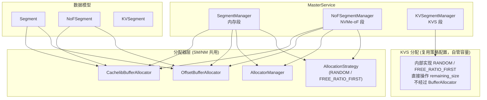
```mermaid
graph TB
    subgraph MasterService
        SM[SegmentManager<br/>内存段]
        NM[NoFSegmentManager<br/>NVMe-oF 段]
        KM[KVSegmentManager<br/>KVS 段]
    end

    subgraph "分配器层 (SM/NM 共用)"
        CA[CachelibBufferAllocator]
        OA[OffsetBufferAllocator]
        AM[AllocatorManager]
        AS["AllocationStrategy<br/>(RANDOM / FREE_RATIO_FIRST)"]
    end

    subgraph "KVS 分配 (复用策略配置，自管容量)"
        KVS_ALLOC["内部实现 RANDOM / FREE_RATIO_FIRST<br/>直接操作 remaining_size<br/>不经过 BufferAllocator"]
    end

    subgraph 数据模型
        Seg[Segment]
        NFS[NoFSegment]
        KVS[KVSegment]
    end

    SM --> CA
    SM --> OA
    SM --> AM
    SM --> AS
    NM --> CA
    NM --> OA
    NM --> AM
    NM --> AS
    KM --> KVS_ALLOC
    Seg --> CA
    Seg --> OA
    NFS --> CA
    NFS --> OA
```

### 1.2 新增/修改文件清单

| 文件                                | 操作 | 说明                                                                                            |
| ----------------------------------- | ---- | ----------------------------------------------------------------------------------------------- |
| `include/types.h`                 | 修改 | 新增`KVSegment`、`ReplicaType::KVS`、KVS 心跳默认常量                                       |
| `include/segment.h`               | 修改 | 新增`MountedKVSegment`、`KVSegmentManager`、`ScopedKVSegmentAccess`                       |
| `src/segment.cpp`                 | 修改 | 实现 KVSegment 管理逻辑                                                                         |
| `include/replica.h`               | 修改 | 新增`KVReplicaData`、`KVDescriptor`                                                         |
| `include/rpc_types.h`             | 修改 | 新增 KVSegment 相关 RPC 消息                                                                    |
| `include/master_config.h`         | 修改 | 新增 KVS 心跳配置字段                                                                           |
| `include/master_service.h`        | 修改 | 新增`kvs_segment_manager_`、RPC 处理方法、心跳线程成员、`KVSProbeFn`、`KVSHeartbeatState` |
| `src/master_service.cpp`          | 修改 | 实现 KVS RPC、PutStart 分配分支、客户端过期清理、KVS 心跳线程与故障处理                         |
| `include/client_service.h`        | 修改 | 新增客户端挂载方法                                                                              |
| `src/client_service.cpp`          | 修改 | 实现客户端 KVS 段挂载                                                                           |
| `include/master_metric_manager.h` | 修改 | 新增 KVS 容量与心跳指标                                                                         |
| `include/serialize/serializer.hpp` | 修改 | `Serializer<Replica>` 新增 KVS 分支声明（快照路径持久化，见 8.2 节）                          |
| `src/serialize/serializer.cpp`    | 修改 | 实现 `Serializer<Replica>` KVS 分支的 serialize/deserialize                                  |

**不修改：** `allocator.h`、`allocator.cpp`、`allocation_strategy.h`、`allocation_strategy.cpp`

### 1.3 整体类图

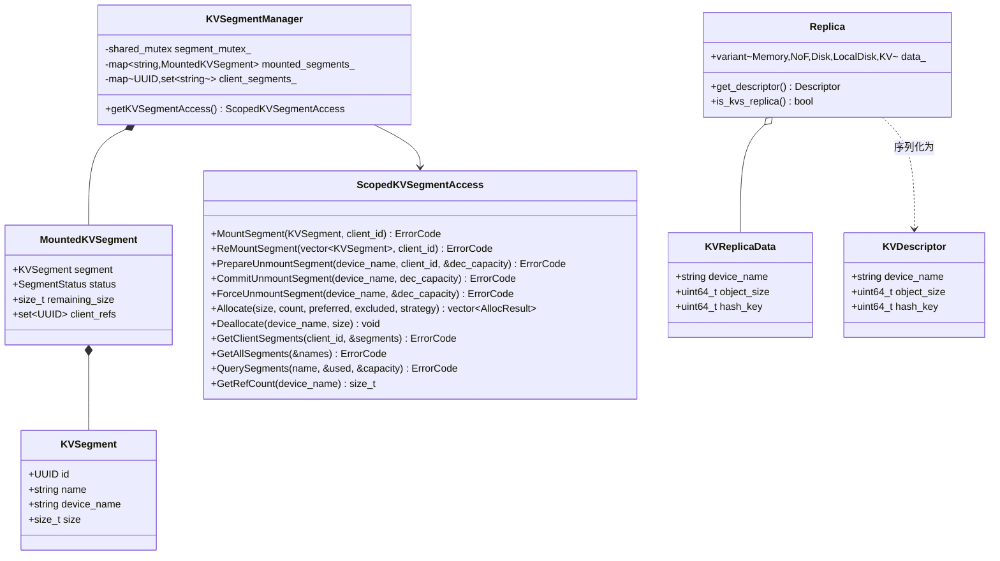
```mermaid
classDiagram
    direction TB

    class KVSegment {
        +UUID id
        +string name
        +string device_name
        +size_t size
    }

    class MountedKVSegment {
        +KVSegment segment
        +SegmentStatus status
        +size_t remaining_size
        +set~UUID~ client_refs
    }

    class KVSegmentManager {
        -shared_mutex segment_mutex_
        -map~string,MountedKVSegment~ mounted_segments_
        -map~UUID,set~string~~ client_segments_
        +getKVSegmentAccess() ScopedKVSegmentAccess
    }

    class ScopedKVSegmentAccess {
        +MountSegment(KVSegment, client_id) ErrorCode
        +ReMountSegment(vector~KVSegment~, client_id) ErrorCode
        +PrepareUnmountSegment(device_name, client_id, &dec_capacity) ErrorCode
        +CommitUnmountSegment(device_name, dec_capacity) ErrorCode
        +ForceUnmountSegment(device_name, &dec_capacity) ErrorCode
        +Allocate(size, count, preferred, excluded, strategy) vector~AllocResult~
        +Deallocate(device_name, size) void
        +GetClientSegments(client_id, &segments) ErrorCode
        +GetAllSegments(&names) ErrorCode
        +QuerySegments(name, &used, &capacity) ErrorCode
        +GetRefCount(device_name) size_t
    }

    class KVReplicaData {
        +string device_name
        +uint64_t object_size
        +uint64_t hash_key
    }

    class KVDescriptor {
        +string device_name
        +uint64_t object_size
        +uint64_t hash_key
    }

    class Replica {
        +variant~Memory,NoF,Disk,LocalDisk,KV~ data_
        +get_descriptor() Descriptor
        +is_kvs_replica() bool
    }

    KVSegmentManager *-- MountedKVSegment
    MountedKVSegment *-- KVSegment
    KVSegmentManager --> ScopedKVSegmentAccess
    Replica o-- KVReplicaData
    Replica ..> KVDescriptor : 序列化为
```

ScopedKVSegmentAccess 中方法入参的 `client_id` 用于 `client_refs` 元素增删。`ForceUnmountSegment` 为心跳故障专用，绕过 `client_refs` 检查直接强制卸载。

---

## 二、数据结构定义

### 2.1 KVSegment（types.h）

| 字段            | 类型            | 说明                                                                    |
| --------------- | --------------- | ----------------------------------------------------------------------- |
| `id`          | `UUID`        | 辅助标识，每次挂载时随机生成，仅用于日志/追踪，不参与去重和索引         |
| `name`        | `std::string` | 逻辑段名，用于 preferred allocation 路由                                |
| `device_name` | `std::string` | 远端设备标识，格式为`"eid:设备路径"`（如 `"eid-xxxx:/dev/kvu0"`），**用于确认远端设备唯一性，作为主索引** |
| `size`        | `size_t`      | KVS 设备总容量（字节）                                                  |

对比普通 `Segment`：**不需要** `base`（无地址概念）、`protocol`（使用专用协议）。

`id` 字段说明：Client 端在挂载时调用 `generate_uuid()` 生成随机 v4 UUID。由于每次挂载生成不同的 UUID，`id` 不适合做去重或索引。KVSegment 的去重和索引统一以 `device_name` 为准。

`device_name` 字段说明：格式为 `"eid:设备路径"`，其中 `eid` 为 NDS 段的远端标识（`nds_segment_info_t.eid`），设备路径为该设备在本地的访问路径（如 `/dev/kvu0`）。其作用是确认远端设备的唯一性：同一块远端 KVS 设备在不同节点挂载时必须使用相同的 `device_name`（含相同的 eid 前缀），保证在 Master 侧合并为同一个 segment。

### 2.2 枚举扩展（types.h）

`ReplicaType` 新增 `KVS`，用于在分配和传输路径中区分 KVS 副本。

> ⚠️ 现有枚举为 `MEMORY=0, DISK=1, LOCAL_DISK=2, NOF_SSD=3, ALL=4`，**`KVS` 必须追加在 `ALL` 之后（取 5）**，不能插在中间或复用 4。原因：`Serializer<Replica>` 将 `replica_type` 以 `int8` 数值落盘到快照/OpLog，改变已有枚举值会破坏旧数据的向后兼容（详见 8.2 节）。

`BufferAllocatorType` 不需要新增值——KVSegmentManager 不创建任何 BufferAllocator。

### 2.3 MountedKVSegment（segment.h）

| 字段               | 类型               | 说明                                     |
| ------------------ | ------------------ | ---------------------------------------- |
| `segment`        | `KVSegment`      | 段元数据                                 |
| `status`         | `SegmentStatus`  | 复用现有状态机                           |
| `remaining_size` | `size_t`         | 剩余容量，直接跟踪，替代 BufferAllocator |
| `client_refs`    | `std::set<UUID>` | 当前正在使用该 segment 的 client 集合    |

`client_refs` 的核心作用：

- 挂载时：若 `device_name` 已存在，仅将 `client_id` 加入 `client_refs`，`remaining_size` 不变
- 卸载时：从 `client_refs` 移除 `client_id`，仅当集合为空时才真正销毁 segment
- 过期清理时：从 `client_refs` 移除过期 client，归零才销毁
- 心跳故障时：`ForceUnmountSegment` 绕过 `client_refs`，直接强制销毁

### 2.4 KVSegmentManager（segment.h）

内部数据结构：

| 成员                  | 类型                              | 说明                                                                     |
| --------------------- | --------------------------------- | ------------------------------------------------------------------------ |
| `segment_mutex_`    | `shared_mutex`                  | 读写锁                                                                   |
| `mounted_segments_` | `map<string, MountedKVSegment>` | **`device_name` → 已挂载段**（key 从 `UUID` 改为 `string`） |
| `client_segments_`  | `map<UUID, set<string>>`        | `client_id` → 其引用过的 device_name 集合（天然去重）                 |

相比 SegmentManager 移除的成员：

- ~~`client_by_name_`~~ — 一个 segment 可被多个 client 共享，1:1 映射不成立
- ~~`segment_id_by_name_`~~ — `id` 随机生成不具确定性，不适合做索引
- ~~`AllocatorManager`~~ — KVS 无 BufferAllocator
- ~~`memory_allocator_`~~ — 同上

分配策略通过 `Allocate()` 方法的 `strategy` 参数控制，逻辑内聚在 `ScopedKVSegmentAccess` 中直接操作 `remaining_size`。

### 2.5 Replica 扩展（replica.h）

| 结构体            | 字段                                           | 说明                                                                    |
| ----------------- | ---------------------------------------------- | ----------------------------------------------------------------------- |
| `KVReplicaData` | `device_name`, `object_size`, `hash_key` | 运行时数据，Master 侧持有；`get_descriptor()` 拷贝到 `KVDescriptor` |
| `KVDescriptor`  | `device_name`, `object_size`, `hash_key` | 序列化描述符，通过 RPC 发给 Client                                      |

`Replica` 类需新增：`KVReplicaData` variant 分支、`KVDescriptor` variant 分支、对应构造函数、`is_kvs_replica()` 判断方法、`get_descriptor()` 中的 KVS 分支。

其中 `device_name` 与 `KVSegment.device_name` 一致（含 eid 前缀，格式 `eid:设备路径`），`hash_key` 为 `uint64_t`（8 字节），由随机哈希计算得出，碰撞时重新生成。

### 2.6 key 到 hash_key 的映射

KVS 硬件要求 key 长度为固定 8 字节（64-bit），而 Mooncake Store 中的原始 key 最长可达 64 字节。因此需要将原始 key 映射为 8 字节的 `hash_key`。

由于 64 字节空间压缩到 8 字节空间必然发生碰撞，采用**随机哈希 + 全局去重表**方案。详见第三章 Hash 冲突处理机制。

**传递链路**：

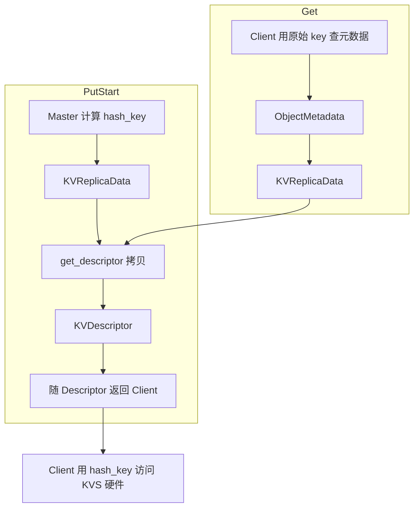
```mermaid
flowchart TD
    subgraph PutStart
        A1[Master 计算 hash_key] --> A2[KVReplicaData]
        A2 --> A3[get_descriptor 拷贝]
        A3 --> A4[KVDescriptor]
        A4 --> A5[随 Descriptor 返回 Client]
    end

    subgraph Get
        B1[Client 用原始 key 查元数据] --> B2[ObjectMetadata]
        B2 --> B3[KVReplicaData]
        B3 --> A3
    end

    A5 --> C[Client 用 hash_key 访问 KVS 硬件]
```

- **Put 路径**：Client 从 `PutStart` 返回的 `KVDescriptor` 中获取 `hash_key`，将其传入 KV 硬件驱动替代原始 key。
- **Get 路径**：Client 用原始 key 调用 `GetReplicaList` 查询元数据，从返回的 `KVDescriptor` 中取出 `hash_key`，再用 `hash_key` 从 KV 硬件读取数据。

`hash_key` 随 `KVDescriptor` 一起存入 `ObjectMetadata`，通过现有的 key→ObjectMetadata 索引自然完成映射关系，无需额外存储 key→hash_key 映射表。

**持久化**：`hash_key` 作为 KVS 副本字段随 `ObjectMetadata` 落盘（快照 + OpLog），需要扩展 `Serializer<Replica>` 与 `Replica::Descriptor` 两个序列化点，详见第八章 8.2 节。`global_hash_set_` 不直接持久化，恢复时从元数据全量重建，详见第八章 8.3 节。

### 2.7 ReplicateConfig 扩展

新增 `kvs_replica_num` 字段（默认 0），控制 KVS 副本数量。

---

## 三、Hash 冲突处理机制

### 3.1 问题背景

KVS 硬件要求 key 为固定 **8 字节（64-bit）**，而 Mooncake Store 中原始 key 最长可达 **64 字节**。从 64 字节空间映射到 8 字节空间，无论在数学上选择何种哈希算法，碰撞都**不可避免**。

若使用确定性哈希（如 SHA-256 截断），两个不同的原始 key 可能产生相同的 `hash_key`，导致后写入的数据覆盖先写入的数据，且 Get 时无法区分——这是不可接受的。

### 3.2 方案：随机哈希 + 轻量级全局去重集

采用**随机哈希 + 全局 hash 集**方案：

1. 对原始 key 计算随机哈希得到 `hash_key`
2. 查全局 `unordered_set<uint64_t>` 检测是否与已有 key 冲突
3. 若冲突，**重新随机生成** `hash_key`（不依赖外部 salt），直到无冲突
4. **同 key 覆写**场景：先查 `ObjectMetadata`，若该 key 已有 KVS 副本，直接复用已有 `hash_key`——避免在全局集中产生不必要的冲突

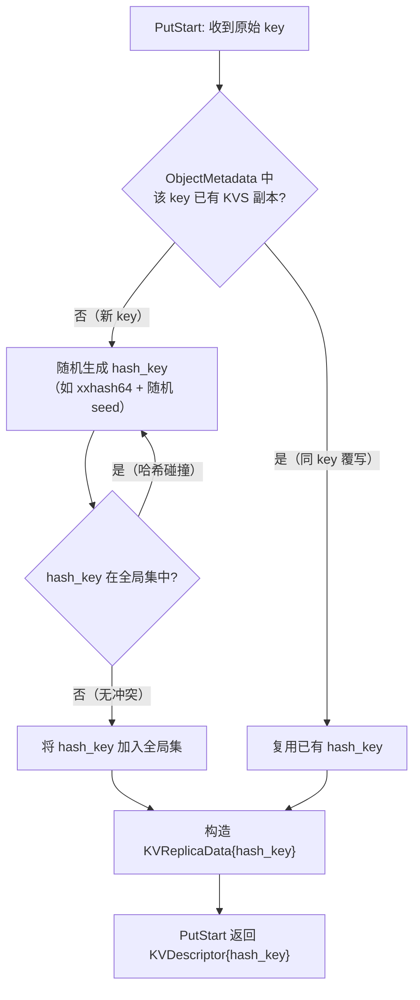
```mermaid
flowchart TD
    A["PutStart: 收到原始 key"] --> A1{"ObjectMetadata 中<br/>该 key 已有 KVS 副本?"}

    A1 -->|是（同 key 覆写）| G["复用已有 hash_key"]
    A1 -->|否（新 key）| B["随机生成 hash_key<br/>（如 xxhash64 + 随机 seed）"]

    B --> C{"hash_key 在全局集中?"}
    C -->|否（无冲突）| D["将 hash_key 加入全局集"]
    C -->|是（哈希碰撞）| B

    D --> E["构造 KVReplicaData{hash_key}"]
    G --> E
    E --> F["PutStart 返回 KVDescriptor{hash_key}"]
```

### 3.3 全局 hash 集

Master 中新增轻量级数据结构：

```cpp
// 全局 hash_key 集合，用于碰撞检测
std::unordered_set<uint64_t> global_hash_set_;
std::shared_mutex global_hash_set_mutex_;
```

**持久化策略**：`global_hash_set_` 不直接持久化（快照/OpLog 均不包含它）。它是可从 `ObjectMetadata` 全量推导的派生数据，主节点接管时遍历所有 KVS 副本重建即可，运行期随增删操作增量维护，详见第八章 8.3 节。

### 3.4 设计要点

**无需 salt：** 随机哈希直接在内部使用随机 seed 生成不同的 `hash_key`。碰撞时重新随机生成即可，seed 是临时变量，无需持久化。`hash_key` 一旦确认无冲突并存入 `ObjectMetadata`，就是该 key 的权威映射。

**无需存储原始 key：** 全局集的唯一作用是回答"这个 `hash_key` 是否已被占用"。同 key 覆写由 `ObjectMetadata` 处理，不属于全局集的职责。

### 3.5 碰撞重哈希的开销

碰撞概率 = 已用 hash_key 数 / 总空间，即 N / 2^64。对于 64-bit 空间：

| 场景                | 碰撞概率         | 说明   |
| ------------------- | ---------------- | ------ |
| N = 10^6（百万级）  | ≈ 5.4×10⁻¹⁴ | 可忽略 |
| N = 10^9（十亿级）  | ≈ 5.4×10⁻¹¹ | 可忽略 |
| N = 10^12（万亿级） | ≈ 5.4×10⁻⁸   | 极低   |

在可预见的部署规模下（百万~十亿级），碰撞概率远低于硬件故障率。即使碰撞，重新生成一次即可解决，开销可忽略不计。

### 3.6 KVDescriptor 字段

```cpp
struct KVDescriptor {
    std::string device_name;
    uint64_t object_size;
    uint64_t hash_key;  // 8 字节 hash_key，由随机哈希生成
};
YLT_REFL(KVDescriptor, device_name, object_size, hash_key);
```

`hash_key` 类型为 `uint64_t`，与 KVS 硬件的 8 字节 key 直接对应。`KVReplicaData` 同步。

---

## 四、MasterService 初始化

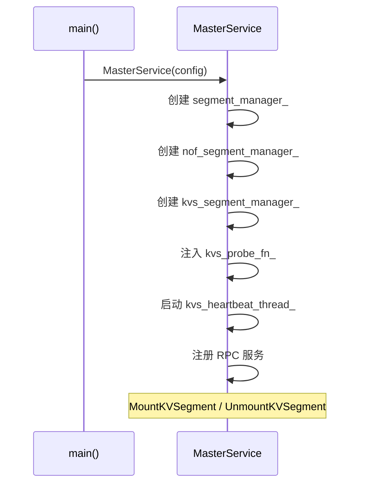
```mermaid
sequenceDiagram
    participant Main as main()
    participant MS as MasterService

    Main->>MS: MasterService(config)
    MS->>MS: 创建 segment_manager_
    MS->>MS: 创建 nof_segment_manager_
    MS->>MS: 创建 kvs_segment_manager_
    MS->>MS: 注入 kvs_probe_fn_
    MS->>MS: 启动 kvs_heartbeat_thread_
    MS->>MS: 注册 RPC 服务
    Note over MS: MountKVSegment / UnmountKVSegment
```

---

## 五、Segment 挂载流程

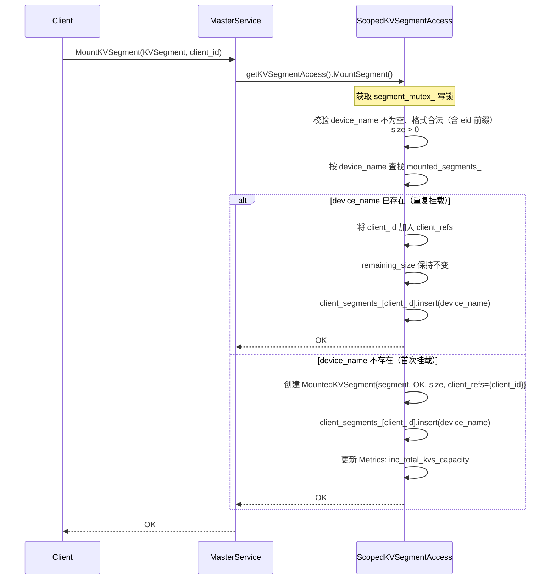
```mermaid
sequenceDiagram
    participant Client
    participant MS as MasterService
    participant SA as ScopedKVSegmentAccess

    Client->>MS: MountKVSegment(KVSegment, client_id)
    MS->>SA: getKVSegmentAccess().MountSegment()
    Note over SA: 获取 segment_mutex_ 写锁

    SA->>SA: 校验 device_name 不为空、格式合法（含 eid 前缀）<br/>size > 0
    SA->>SA: 按 device_name 查找 mounted_segments_

    alt device_name 已存在（重复挂载）
        SA->>SA: 将 client_id 加入 client_refs
        SA->>SA: remaining_size 保持不变
        SA->>SA: client_segments_[client_id].insert(device_name)
        SA-->>MS: OK
    else device_name 不存在（首次挂载）
        SA->>SA: 创建 MountedKVSegment{segment, OK, size, client_refs={client_id}}
        SA->>SA: client_segments_[client_id].insert(device_name)
        SA->>SA: 更新 Metrics: inc_total_kvs_capacity
        SA-->>MS: OK
    end

    MS-->>Client: OK
```

与普通 Segment 挂载的核心差异：

| 步骤                  | 普通 Segment                                                 | KVSegment                                                         |
| --------------------- | ------------------------------------------------------------ | ----------------------------------------------------------------- |
| 地址校验              | `base != 0`、对齐校验                                      | 无（无地址概念）                                                  |
| 标识校验              | 无                                                            | `device_name` 格式校验（`eid:设备路径`，含 eid 前缀） |
| 创建分配器            | 创建`CachelibBufferAllocator` 或 `OffsetBufferAllocator` | 不创建，直接记录`remaining_size`                                |
| 加入 AllocatorManager | `addAllocator()`                                           | 无此步骤                                                          |
| 去重检查              | 按`segment.id`                                             | **按 `device_name`**（`segment.id` 随机生成，不做去重） |
| 重复挂载              | 返回`SEGMENT_ALREADY_EXISTS`                               | **增加引用计数，返回 OK**                                   |

---

## 六、PutStart 分配流程

### 6.1 整体流程

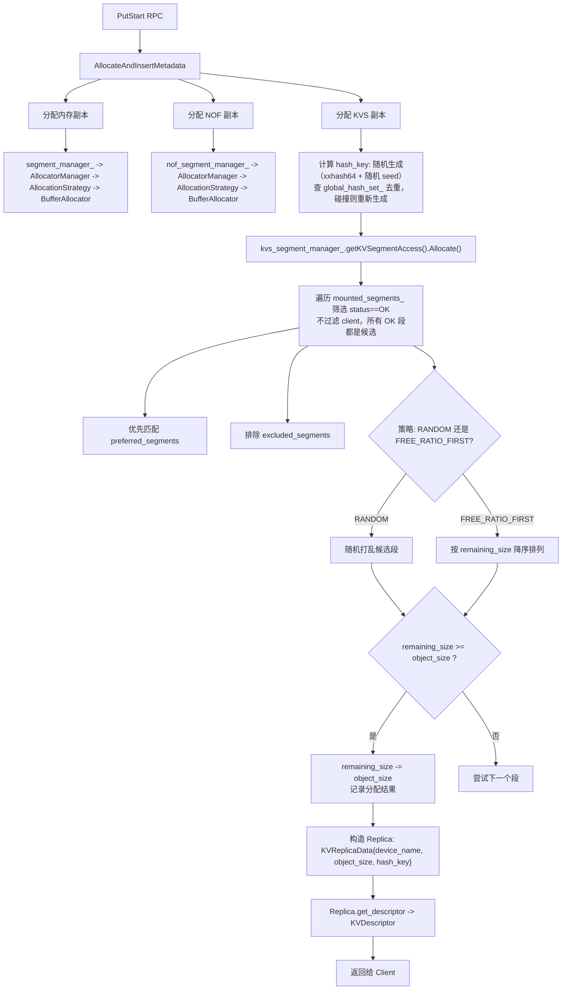
```mermaid
flowchart TD
    A[PutStart RPC] --> B[AllocateAndInsertMetadata]

    B --> C[分配内存副本]
    C --> D["segment_manager_ -> AllocatorManager -> AllocationStrategy -> BufferAllocator"]

    B --> F[分配 NOF 副本]
    F --> G["nof_segment_manager_ -> AllocatorManager -> AllocationStrategy -> BufferAllocator"]

    B --> I[分配 KVS 副本]
    I --> H["计算 hash_key: 随机生成（xxhash64 + 随机 seed）<br/>查 global_hash_set_ 去重，碰撞则重新生成"]
    H --> J["kvs_segment_manager_.getKVSegmentAccess().Allocate()"]

    J --> K["遍历 mounted_segments_ 筛选 status==OK<br/>不过滤 client，所有 OK 段都是候选"]
    K --> L[优先匹配 preferred_segments]
    K --> M[排除 excluded_segments]
    K --> N{策略: RANDOM 还是 FREE_RATIO_FIRST?}
    N -->|RANDOM| O[随机打乱候选段]
    N -->|FREE_RATIO_FIRST| P[按 remaining_size 降序排列]

    O --> Q{"remaining_size >= object_size ?"}
    P --> Q

    Q -->|是| R["remaining_size -= object_size<br/>记录分配结果"]
    Q -->|否| S[尝试下一个段]

    R --> T["构造 Replica: KVReplicaData{device_name, object_size, hash_key}"]
    T --> U["Replica.get_descriptor -> KVDescriptor"]
    U --> X[返回给 Client]
```

### 6.2 分配策略

`ScopedKVSegmentAccess::Allocate()` 接收 `AllocationStrategyType` 参数，策略逻辑直接在 Manager 中实现，不经过 `BufferAllocatorBase`。

分配时**不区分** segment 由哪个 client 挂载，所有状态为 `OK` 的 segment 都是候选。这是因为 KVSegment 对应物理 SSD 设备，所有 client 共享同一设备。

**分两轮分配**，每轮内部根据策略类型选择：

**第一轮——Preferred Segments：**
按 `preferred_segments` 列表顺序尝试，容量足够即分配。

**第二轮——从剩余段中分配：**
收集所有 OK 状态、不在排除列表中的段，过滤出容量足够的候选：

- **RANDOM：** 将候选段随机打乱，依次分配
- **FREE\_RATIO\_FIRST：** 按 `remaining_size` 降序排列，优先选择空闲最多的段

每次分配成功后，直接在对应的 `MountedKVSegment.remaining_size` 上扣减（在 `segment_mutex_` 写锁保护下）。

---

## 七、读写流程（Master 侧）

> 本设计只覆盖 **Master 的管理职责**以及 **Master→Client 的接口契约**。Client 收到 descriptor 之后如何通过 te（TransferEngine）构造具体的读写请求、如何访问 KVS 硬件，属于 Client 侧实现细节，不在本设计范围内，本章不做展开。

### 7.1 Put 路径（Master 侧）

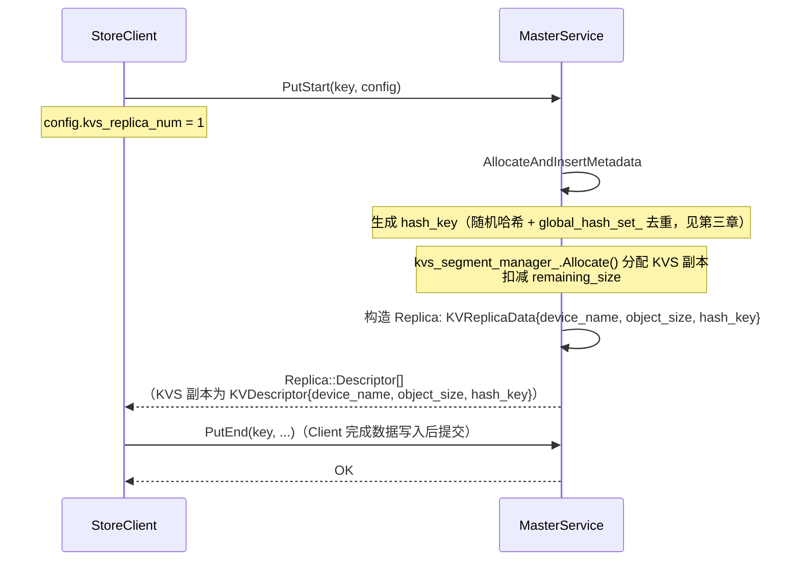
```mermaid
sequenceDiagram
    participant Client as StoreClient
    participant MS as MasterService

    Client->>MS: PutStart(key, config)
    Note over Client: config.kvs_replica_num = 1

    MS->>MS: AllocateAndInsertMetadata
    Note over MS: 生成 hash_key（随机哈希 + global_hash_set_ 去重，见第三章）
    Note over MS: kvs_segment_manager_.Allocate() 分配 KVS 副本<br/>扣减 remaining_size
    MS->>MS: 构造 Replica: KVReplicaData{device_name, object_size, hash_key}
    MS-->>Client: Replica::Descriptor[]<br/>（KVS 副本为 KVDescriptor{device_name, object_size, hash_key}）

    Client->>MS: PutEnd(key, ...)（Client 完成数据写入后提交）
    MS-->>Client: OK
```

Master 侧职责：

1. `PutStart` 中分配 KVS 副本：生成 `hash_key`、选择 OK 状态的段、构造 `KVReplicaData`
2. `get_descriptor()` 将 `KVReplicaData` 拷贝为 `KVDescriptor` 返回 Client
3. `PutEnd` 提交对象：将包含 KVS 副本的 `ObjectMetadata` 持久化（见第八章）

### 7.2 Get 路径（Master 侧）

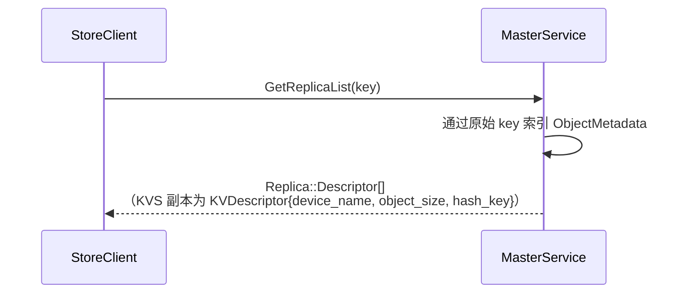
```mermaid
sequenceDiagram
    participant Client as StoreClient
    participant MS as MasterService

    Client->>MS: GetReplicaList(key)
    MS->>MS: 通过原始 key 索引 ObjectMetadata
    MS-->>Client: Replica::Descriptor[]<br/>（KVS 副本为 KVDescriptor{device_name, object_size, hash_key}）
```

Master 侧职责：通过 key 索引 `ObjectMetadata`，将每个副本经 `get_descriptor()` 返回；KVS 副本的 `hash_key` 随 `KVDescriptor` 一并下发。

### 7.3 Master→Client 接口契约

`KVDescriptor` 是 Master 下发给 Client 的 KVS 副本唯一契约：

| 字段          | 类型       | 说明                                                                 |
| ------------- | ---------- | -------------------------------------------------------------------- |
| `device_name` | `string` | 含 eid 前缀的远端设备标识（`eid:设备路径`），Client 据此定位 KVS 设备 |
| `object_size` | `uint64_t` | 对象大小                                                             |
| `hash_key`    | `uint64_t` | 8 字节 key，Client 访问 KVS 硬件时替代原始 key                        |

Client 侧拿到 `KVDescriptor` 后即可独立完成 KVS 硬件读写，无需向 Master 再发起任何请求；Master 也不关心 Client 内部的数据面实现。

**key→hash_key 的映射无需额外存储**：Master 在 PutStart 时已将 `hash_key` 存入 `KVDescriptor`，并随 `ObjectMetadata` 一起持久化（见第八章）。Get 时通过原始 key 查元数据即可获得，无需额外的 key→hash_key 映射表。

---

## 八、元数据持久化与恢复

### 8.1 现有持久化机制

Master 元数据通过 **快照（Snapshot）+ OpLog（操作日志）** 两套机制持久化，用于故障切换 / Standby 恢复：

| 机制   | 内容                                                                                                                    | 存储后端             |
| ------ | ----------------------------------------------------------------------------------------------------------------------- | -------------------- |
| 快照   | 全量 `ObjectMetadata`（每个副本经 `Serializer<Replica>` 序列化，msgpack 格式），携带 `snapshot_sequence_id`           | S3 / 本地文件        |
| OpLog  | `PUT_END`（payload 为完整 `MetadataPayload{client_id, size, replicas: Replica::Descriptor[]}`）、`PUT_REVOKE`、`REMOVE` | etcd / 本地文件      |

恢复流程：加载最近快照 → 将 OpLog 应用位置定位到 `snapshot_sequence_id` → 顺序重放 `sequence_id > snapshot_sequence_id` 的日志。

### 8.2 KVS 副本（含 hash_key）的持久化

`hash_key` 作为 KVS 副本的普通字段随 `ObjectMetadata` 一起持久化。KVS 副本的持久化覆盖两条既有序列化路径：

1. **快照路径**：`Serializer<Replica>::serialize/deserialize`（`serialize/serializer.cpp`）新增 KVS 分支。副本序列化格式为 `[id, status, replica_type(int8), payload]`，KVS 分支的 payload 格式为 `[device_name, object_size, hash_key]`。
2. **OpLog / RPC 路径**：`Replica::Descriptor` 的 `descriptor_variant` 新增 `KVDescriptor` 分支（`YLT_REFL` 反射自动序列化）。`MetadataPayload`（OpLog 持久化）与 `PutStart`/`GetReplicaList` 返回值共用该结构。

实现约束：现有 `Serializer<Replica>` 仅实现了 `MEMORY` / `DISK` / `LOCAL_DISK` 三个分支，未覆盖的副本类型（`NOF_SSD`、新增的 `KVS`）会落入 default 分支——序列化时 pack 255 + nil，反序列化时直接失败。KVS 分支必须显式实现，否则快照/OpLog 恢复将丢失或拒绝 KVS 副本。

### 8.3 global_hash_set_ 的持久化策略

`global_hash_set_` 不随快照/OpLog 持久化。它是当前所有活跃 KVS 副本 hash_key 的集合，可从 `ObjectMetadata` 全量推导（遍历所有对象的 KVS 副本即可重建），属于派生数据。若将其直接写入持久化存储，会形成"集合"与"元数据"两个独立真相源：两处写入、崩溃窗口不一致，恢复后无法判定一致性。

持久化策略为**恢复时全量重建 + 运行期增量维护**：

1. **全量重建**：主节点接管（快照加载 + OpLog 重放完成）后，遍历所有 `ObjectMetadata`，将每个 KVS 副本的 `hash_key` 插入 `global_hash_set_`，复杂度 O(N)。
2. **运行期增量维护**（与既有增删操作挂钩，不引入新的持久化写入）：
   - `PutStart` 分配新 `hash_key` → 插入集合
   - 对象删除 / 驱逐（KVS 副本 delete）→ 移除对应 `hash_key`
   - `PUT_REVOKE`（PutStart 后未 PutEnd 即撤销）→ 移除
   - 心跳故障 `ForceUnmountSegment` 清理 KVS 副本 → 移除
3. **恢复后的副本有效性校验**：KVS 副本反序列化后校验 `device_name` 对应段仍处于挂载状态（`status == OK`）；已卸载段的副本视为无效并清理（与现有 `has_invalid_mem_handle` 校验一致），避免 `GetReplicaList` 返回失效设备的 descriptor。

### 8.4 崩溃时序的边界情况

`PutStart` 分配 `hash_key`（插入 `global_hash_set_` 并构造临时 `ObjectMetadata`）之后、`PutEnd` 提交之前主节点崩溃的场景：

- 该 `hash_key` 对应的对象从未提交，快照/OpLog 中不存在；恢复后集合中自然缺失该 `hash_key`，可被后续新 key 复用
- 若 Client 已将数据写入 KVS 硬件，则残留无元数据索引的孤儿数据，不可见、不会被 Get 命中

该行为与现有 memory/NOF 副本在 `PutEnd` 前崩溃的语义一致；孤儿 hash_key 被复用导致的碰撞概率为 N/2^64（见 3.5 节），可忽略。

### 8.5 快照与 OpLog 的启用与触发

快照与 OpLog 均为 Master 现有能力，KVS 元数据（含 hash_key）随 `ObjectMetadata` 一起由两者承载，无需新增开关。两者相互独立、均可选配。

**快照（Snapshot）**

通过 Master 启动参数启用：

| 参数                                  | 默认值 | 说明                                                           |
| ------------------------------------- | ------ | -------------------------------------------------------------- |
| `--enable_snapshot`                   | false  | 周期快照总开关                                                 |
| `--snapshot_object_store_type`        | ""     | 快照对象存储：`local`（本地文件）或 `s3`；启用快照/恢复时必填 |
| `--snapshot_catalog_store_type`       | ""     | 快照目录存储：`embedded` 或 `redis`（空则用 embedded）       |
| `--snapshot_catalog_store_connstring` | ""     | redis 连接串                                              |
| `--snapshot_interval_seconds`         | 600    | 周期快照间隔（秒）                                             |
| `--snapshot_retention_count`          | 2      | 保留最近 N 份快照（必须 > 0）                                  |
| `--enable_snapshot_restore`           | false  | 启动时从最新快照恢复                                           |

触发机制：

1. **周期生成**：Master 启动时若 `enable_snapshot` 且内存分配器为 OFFSET 类型，启动 `SnapshotThreadFunc` 后台线程；每 `snapshot_interval_seconds` 秒醒来一次，fork 子进程调用 `PersistState()`，将全量状态（各 shard 的 `ObjectMetadata`、segment 信息、discarded replicas）序列化写入快照对象存储，随后按 `snapshot_retention_count` 清理过期快照。
2. **启动恢复**：`enable_snapshot_restore` 时，MasterService 构造阶段调用 `RestoreState()` 加载最新快照，重建各 shard 的 `ObjectMetadata`。

限制：周期快照线程仅在 OFFSET 内存分配器配置下启动；使用其他分配器（如 CACHELIB）时周期生成不生效，但启动恢复不受此限制。

**OpLog（HA 热备）**

通过 Master 启动参数启用：

| 参数                     | 默认值 | 说明                                                         |
| ------------------------ | ------ | ------------------------------------------------------------ |
| `--enable_ha`            | false  | HA 总开关，开启后走 `MasterServiceSupervisor` 监督流程     |
| `--ha_backend_type`      | etcd   | OpLog 后端：`etcd` 或本地文件系统                          |
| `--ha_backend_connstring` | ""    | etcd endpoints 或本地目录路径                              |

触发机制：

1. **主节点写入**：`PUT_END` / `PUT_REVOKE` / `REMOVE` 等对象变更经 `OpLogManager` 追加到 OpLog（`PUT_END` 携带完整 `MetadataPayload`，`REMOVE`/`PUT_REVOKE` 仅记录 key）。
2. **Standby 跟随**：Standby 启动时先加载快照基线（若 `enable_snapshot_restore`），将 `OpLogApplier` 定位到 `snapshot_sequence_id`，再由 `OpLogReplicator` 通过后端通知（etcd watch / 轮询）持续拉取并应用后续日志，保持与主节点一致。
3. **提升**：Standby 被提升（`PromoteStandby`）后成为新主节点，恢复自主服务并继续写 OpLog。

**对 KVS 的意义**：KVS 副本（含 hash_key）随上述机制自动持久化；新主节点接管后需执行 8.3 节的全量重建，并按 8.3 第 3 点校验 KVS 副本对应段的存活状态。

---

## 九、Segment 卸载流程

### 9.1 正常卸载（Client 主动调用）

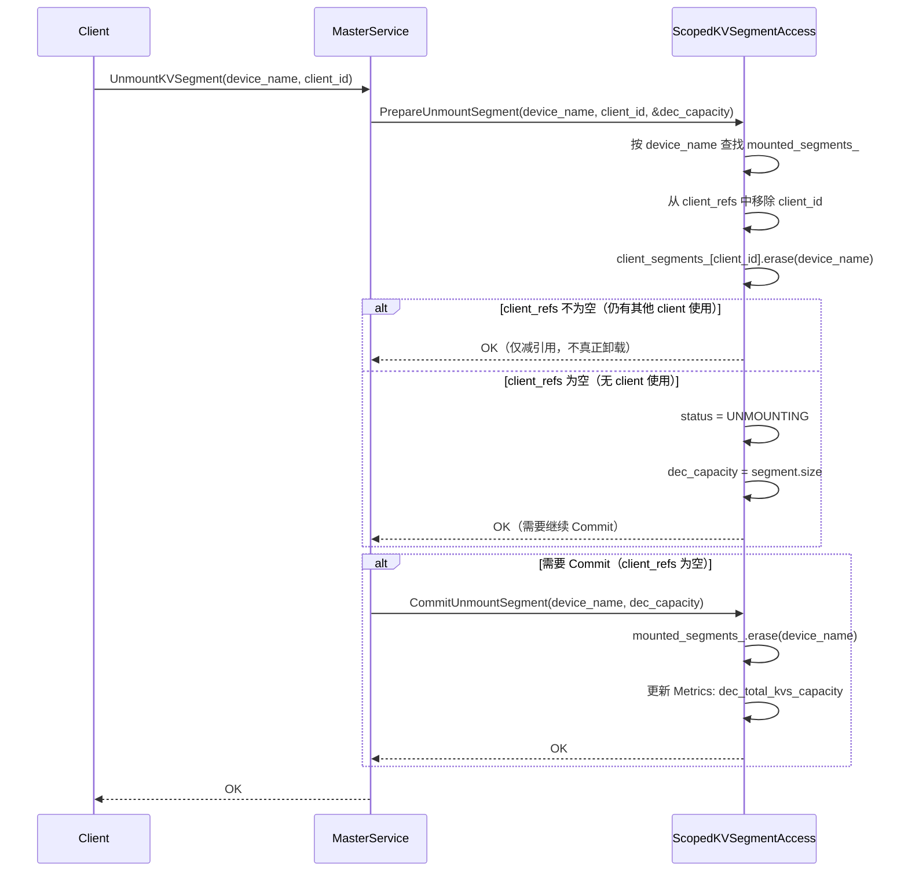
```mermaid
sequenceDiagram
    participant Client
    participant MS as MasterService
    participant SA as ScopedKVSegmentAccess

    Client->>MS: UnmountKVSegment(device_name, client_id)

    MS->>SA: PrepareUnmountSegment(device_name, client_id, &dec_capacity)
    SA->>SA: 按 device_name 查找 mounted_segments_
    SA->>SA: 从 client_refs 中移除 client_id
    SA->>SA: client_segments_[client_id].erase(device_name)

    alt client_refs 不为空（仍有其他 client 使用）
        SA-->>MS: OK（仅减引用，不真正卸载）
    else client_refs 为空（无 client 使用）
        SA->>SA: status = UNMOUNTING
        SA->>SA: dec_capacity = segment.size
        SA-->>MS: OK（需要继续 Commit）
    end

    alt 需要 Commit（client_refs 为空）
        MS->>SA: CommitUnmountSegment(device_name, dec_capacity)
        SA->>SA: mounted_segments_.erase(device_name)
        SA->>SA: 更新 Metrics: dec_total_kvs_capacity
        SA-->>MS: OK
    end

    MS-->>Client: OK
```

### 9.2 强制卸载（心跳故障触发）

心跳连续失败超阈值后，设备已不可达，无法读取数据迁移，直接强制卸载：

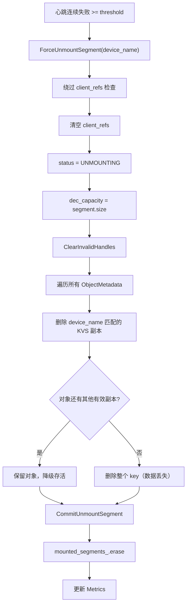
```mermaid
flowchart TD
    A["心跳连续失败 >= threshold"] --> B["ForceUnmountSegment(device_name)"]
    B --> C["绕过 client_refs 检查"]
    C --> D["清空 client_refs"]
    D --> E["status = UNMOUNTING"]
    E --> F["dec_capacity = segment.size"]
    F --> G["ClearInvalidHandles"]
    G --> H["遍历所有 ObjectMetadata"]
    H --> I["删除 device_name 匹配的 KVS 副本"]
    I --> J{"对象还有其他有效副本?"}
    J -->|是| K["保留对象，降级存活"]
    J -->|否| L["删除整个 key（数据丢失）"]
    K --> M["CommitUnmountSegment"]
    L --> M
    M --> N["mounted_segments_.erase"]
    N --> O["更新 Metrics"]
```

**为何不 Drain？** Drain 机制的前提是源段仍可读（DRAINING = 可读不可写）。KVS 硬件故障后设备不可达，读操作直接失败，数据无法迁移。强制卸载是硬件故障场景下的唯一正确选择。

### 9.3 卸载对 Client 的影响

| 影响项                | 正常卸载             | 强制卸载                            |
| --------------------- | -------------------- | ----------------------------------- |
| Client OK 状态        | 不影响               | 不影响                              |
| Client 其他段         | 不影响               | 不影响                              |
| Client 需重新 Mount？ | 不需要               | 不需要                              |
| 新 PutStart           | 自动分配到其他健康段 | 自动分配到其他健康段                |
| 已有 GetReplicaList   | 返回剩余健康副本     | 返回剩余健康副本或 OBJECT_NOT_FOUND |
| 在途读操作            | DRAINING 段仍可读    | 设备不可达，返回传输错误            |

Client **不需要**感知 KVSegment 的卸载。原因：

1. Client 每次操作都向 Master 请求 descriptor，Master 返回什么就用什么
2. Client 侧 KV 访问路径只认 `device_name`（含 eid 前缀），死设备的 descriptor 会被 `ClearInvalidHandles` 清理掉
3. 与内存段不同，Client 不需要为 KVSegment 做 `registerLocalMemory`，无本地映射需清理

---

## 十、Client 过期清理流程

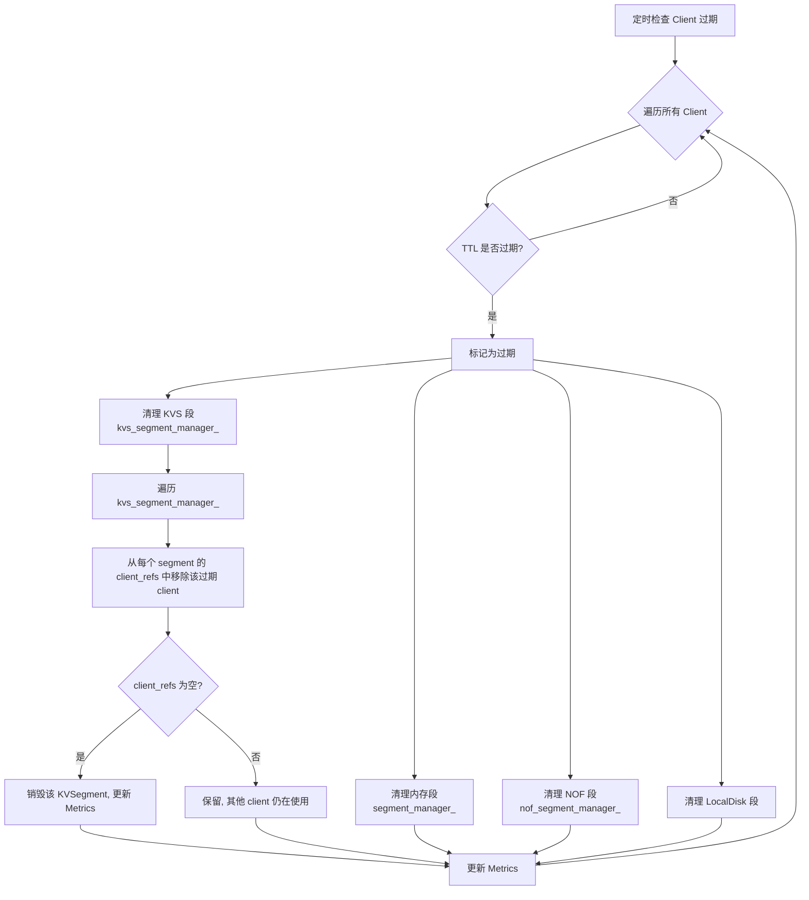
```mermaid
flowchart TD
    A[定时检查 Client 过期] --> B{遍历所有 Client}
    B --> C{TTL 是否过期?}
    C -->|否| B
    C -->|是| D[标记为过期]

    D --> E[清理内存段<br/>segment_manager_]
    D --> G[清理 NOF 段<br/>nof_segment_manager_]

    D --> I[清理 KVS 段<br/>kvs_segment_manager_]
    I --> I1[遍历 kvs_segment_manager_]
    I1 --> I2[从每个 segment 的 client_refs 中移除该过期 client]
    I2 --> I3{client_refs 为空?}
    I3 -->|是| I4[销毁该 KVSegment, 更新 Metrics]
    I3 -->|否| I5[保留, 其他 client 仍在使用]
    I4 --> L
    I5 --> L

    D --> K[清理 LocalDisk 段]

    E --> L[更新 Metrics]
    G --> L
    K --> L
    L --> B
```

KVS 段清理的关键差异：**不是直接销毁过期 client 的所有段，而是从 `client_refs` 中移除该 client。只有 `client_refs` 归零的段才真正销毁。**

---

## 十一、生命周期状态机

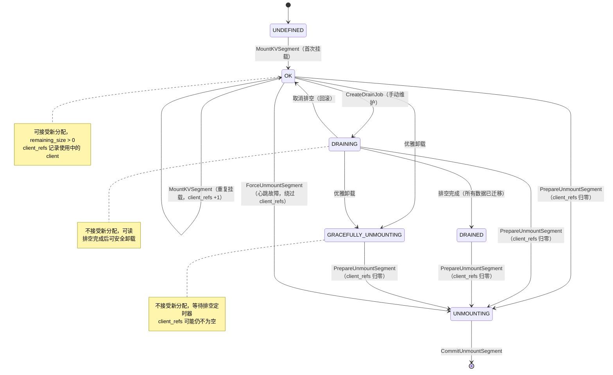
```mermaid
stateDiagram-v2
    [*] --> UNDEFINED
    UNDEFINED --> OK: MountKVSegment（首次挂载）
    OK --> OK: MountKVSegment（重复挂载，client_refs +1）

    OK --> DRAINING: CreateDrainJob（手动维护）
    DRAINING --> DRAINED: 排空完成（所有数据已迁移）
    DRAINING --> OK: 取消排空（回滚）

    OK --> GRACEFULLY_UNMOUNTING: 优雅卸载
    DRAINING --> GRACEFULLY_UNMOUNTING: 优雅卸载

    OK --> UNMOUNTING: PrepareUnmountSegment（client_refs 归零）
    DRAINING --> UNMOUNTING: PrepareUnmountSegment（client_refs 归零）
    DRAINED --> UNMOUNTING: PrepareUnmountSegment（client_refs 归零）
    GRACEFULLY_UNMOUNTING --> UNMOUNTING: PrepareUnmountSegment（client_refs 归零）

    OK --> UNMOUNTING: ForceUnmountSegment（心跳故障，绕过 client_refs）

    UNMOUNTING --> [*]: CommitUnmountSegment

    note right of OK: 可接受新分配，remaining_size > 0<br/>client_refs 记录使用中的 client
    note right of DRAINING: 不接受新分配，可读<br/>排空完成后可安全卸载
    note right of GRACEFULLY_UNMOUNTING: 不接受新分配，等待排空定时器<br/>client_refs 可能仍不为空
```

状态机关键说明：

- `PrepareUnmountSegment` 仅在 `client_refs` 归零后才推进状态到 `UNMOUNTING`
- `client_refs > 0` 时，`PrepareUnmountSegment` 仅移除调用者的 client_id，不改变状态
- `ForceUnmountSegment` 为心跳故障专用，绕过 `client_refs` 检查直接进入 `UNMOUNTING`
- 完全复用现有 `SegmentStatus` 枚举，无需新增状态

### DRAINING / DRAINED 状态说明

**DRAINING** 用于**手动安全下线**场景（设备维护、负载均衡、优雅关闭）：

| 行为     | 说明                                                            |
| -------- | --------------------------------------------------------------- |
| 新分配   | **拒绝** — `Allocate()` 中跳过非 `OK` 状态的 segment |
| 已有对象 | **可读** — 已分配的对象不受影响                          |
| 触发方式 | Master 收到`CreateDrainJob` RPC 后将段状态设为 `DRAINING`   |
| 回滚     | 排空取消时回退到`OK`                                          |

**DRAINED** 表示排空完成，所有数据已迁移到其他 segment，等待最终卸载。

**注意**：DRAINING 路径不适用于心跳故障场景。心跳故障意味着设备不可达，数据无法读取也就无法迁移，必须走 `ForceUnmountSegment` 直接强制卸载。

### 与普通 Segment 的差异

| 维度                   | 普通 Segment                                                          | KVSegment                                                          |
| ---------------------- | --------------------------------------------------------------------- | ------------------------------------------------------------------ |
| **分配控制**     | `SetSegmentStatusByName` 中通过 `HasAllocator` 的 add/remove 控制 | `Allocate()` 中检查 `status == OK` 时跳过非 OK 段              |
| **排空完成判定** | 通过`BufferAllocator::size() == 0` 判断是否还有活跃对象             | 扫描所有`ObjectMetadata`，确认无 KVS 副本的 `device_name` 匹配 |
| **故障处理**     | 无独立心跳机制                                                        | 心跳连续失败超阈值后`ForceUnmountSegment` 强制卸载               |

---

## 十二、心跳与健康检查机制

### 12.1 设计思路

KVSegment 对应物理 KVS 设备，设备故障会导致所有读写操作失败。需要后台心跳线程定期探测设备健康状态，故障后快速隔离异常段，使新写入自动流向健康段。

设计参考现有 `NofHeartbeatThreadFunc` 模式：后台线程 + 探测函数注入 + 连续失败计数 + 阈值触发强制卸载。

### 12.2 配置项（types.h）

```cpp
static constexpr int64_t DEFAULT_KVS_HEARTBEAT_INTERVAL_SEC = 10;
static constexpr uint32_t DEFAULT_KVS_HEARTBEAT_PROBE_TIMEOUT_MS = 2000;
static constexpr uint32_t DEFAULT_KVS_HEARTBEAT_FAILURES_THRESHOLD = 3;
```

通过 `MasterServiceConfig`（`master_config.h`）注入，支持运行时配置。

### 12.3 数据结构（master_service.h）

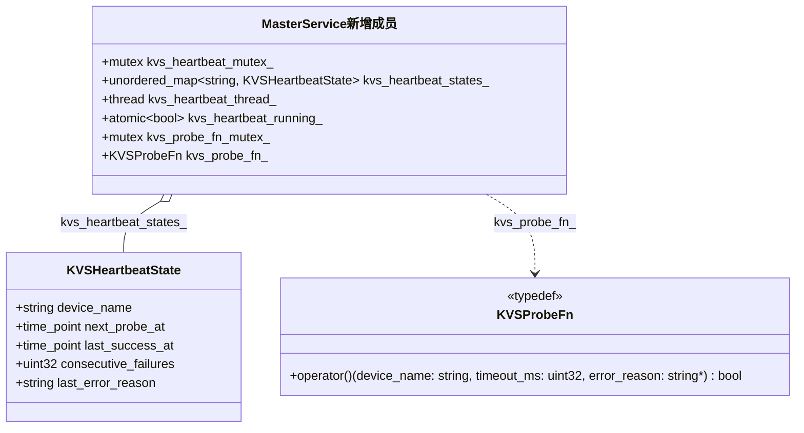
```mermaid
classDiagram
    direction TB

    class KVSProbeFn {
        <<typedef>>
        +operator()(device_name: string, timeout_ms: uint32, error_reason: string*) bool
    }

    class KVSHeartbeatState {
        +string device_name
        +time_point next_probe_at
        +time_point last_success_at
        +uint32 consecutive_failures
        +string last_error_reason
    }

    class MasterService新增成员 {
        +mutex kvs_heartbeat_mutex_
        +unordered_map~string, KVSHeartbeatState~ kvs_heartbeat_states_
        +thread kvs_heartbeat_thread_
        +atomic~bool~ kvs_heartbeat_running_
        +mutex kvs_probe_fn_mutex_
        +KVSProbeFn kvs_probe_fn_
    }

    MasterService新增成员 o-- KVSHeartbeatState : kvs_heartbeat_states_
    MasterService新增成员 ..> KVSProbeFn : kvs_probe_fn_
```

`KVSProbeFn` 为探针函数类型，签名为 `bool(const string& device_name, uint32_t timeout_ms, string* error_reason)`，其中 `device_name` 为含 eid 前缀的设备标识（格式 `eid:设备路径`）。`kvs_heartbeat_states_` 以 `device_name` 为 key，`kvs_heartbeat_mutex_` 保护其访问，`kvs_probe_fn_mutex_` 保护 `kvs_probe_fn_` 的读写。

### 12.4 心跳线程主循环

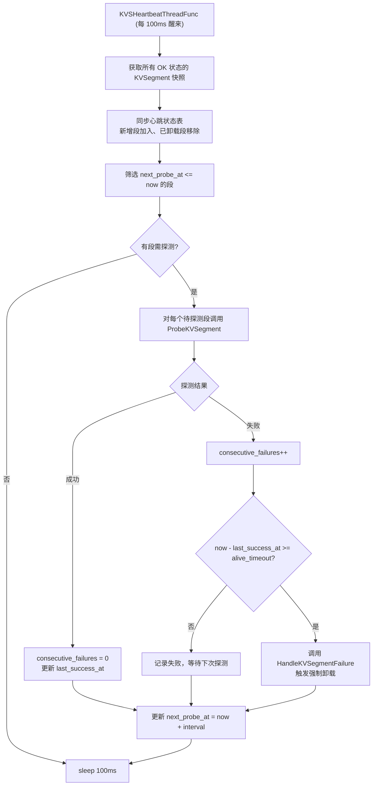
```mermaid
flowchart TD
    A["KVSHeartbeatThreadFunc (每 100ms 醒来)"] --> B[获取所有 OK 状态的 KVSegment 快照]
    B --> C[同步心跳状态表<br/>新增段加入、已卸载段移除]
    C --> D[筛选 next_probe_at <= now 的段]
    D --> E{有段需探测?}
    E -->|否| F["sleep 100ms"]
    E -->|是| G[对每个待探测段调用 ProbeKVSegment]
    G --> H{探测结果}
    H -->|成功| I["consecutive_failures = 0<br/>更新 last_success_at"]
    H -->|失败| J["consecutive_failures++"]
    J --> K{"now - last_success_at >= alive_timeout?"}
    K -->|否| L[记录失败，等待下次探测]
    K -->|是| M["调用 HandleKVSegmentFailure<br/>触发强制卸载"]
    I --> N[更新 next_probe_at = now + interval]
    L --> N
    M --> N
    N --> F
```

其中 `alive_timeout = interval * threshold`（默认 10s × 3 = 30s）。

### 12.5 探针函数

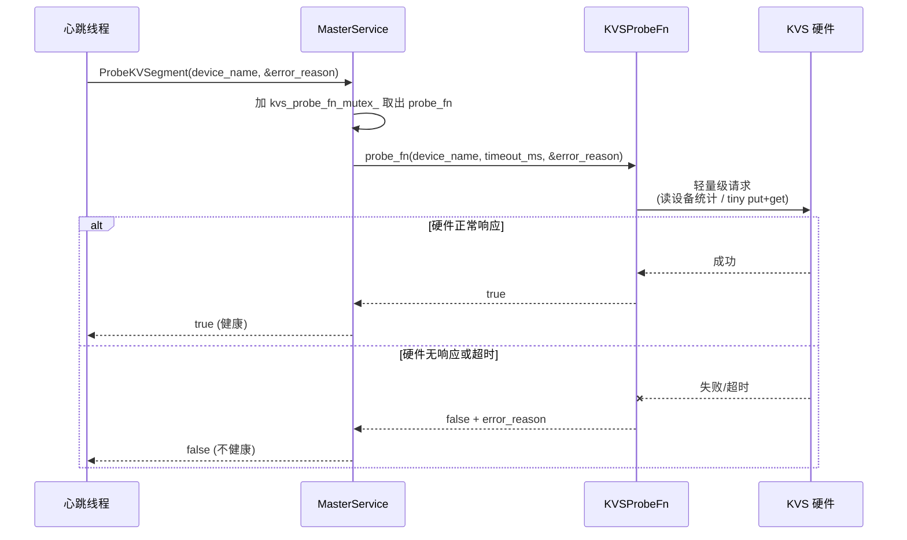
```mermaid
sequenceDiagram
    participant T as 心跳线程
    participant M as MasterService
    participant P as KVSProbeFn
    participant KVS as KVS 硬件

    T->>M: ProbeKVSegment(device_name, &error_reason)
    M->>M: 加 kvs_probe_fn_mutex_ 取出 probe_fn
    M->>P: probe_fn(device_name, timeout_ms, &error_reason)
    P->>KVS: 轻量级请求<br/>(读设备统计 / tiny put+get)

    alt 硬件正常响应
        KVS-->>P: 成功
        P-->>M: true
        M-->>T: true (健康)
    else 硬件无响应或超时
        KVS--xP: 失败/超时
        P-->>M: false + error_reason
        M-->>T: false (不健康)
    end
```

探针函数通过 `KVSProbeFn` 注入，Master 不依赖具体驱动实现。超时控制由 `kvs_heartbeat_probe_timeout_ms_` 保证，探针实现由 KV 传输层提供。

### 12.6 故障处理

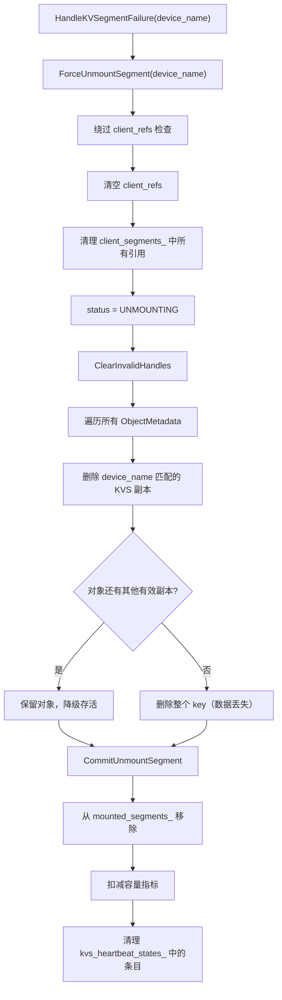
```mermaid
flowchart TD
    A["HandleKVSegmentFailure(device_name)"] --> B["ForceUnmountSegment(device_name)"]
    B --> B1["绕过 client_refs 检查"]
    B1 --> B2["清空 client_refs"]
    B2 --> B3["清理 client_segments_ 中所有引用"]
    B3 --> B4["status = UNMOUNTING"]

    B4 --> C["ClearInvalidHandles"]
    C --> C1["遍历所有 ObjectMetadata"]
    C1 --> C2["删除 device_name 匹配的 KVS 副本"]
    C2 --> C3{"对象还有其他有效副本?"}
    C3 -->|是| C4["保留对象，降级存活"]
    C3 -->|否| C5["删除整个 key（数据丢失）"]

    C4 --> D["CommitUnmountSegment"]
    C5 --> D
    D --> D1["从 mounted_segments_ 移除"]
    D1 --> D2["扣减容量指标"]
    D2 --> E["清理 kvs_heartbeat_states_ 中的条目"]
```

**为何不 Drain？** 故障设备不可达，读操作直接失败，数据无法迁移。强制卸载是硬件故障场景下的唯一正确选择。数据丢失是硬件故障的必然结果，系统能做的是：

- 新写入不受影响（Master 自动分配到其他健康 KVS 段）
- 有冗余的对象自动降级（清理失效副本，保留健康副本）
- 无冗余的对象返回 `OBJECT_NOT_FOUND`

### 12.7 故障后的自动恢复

Client **不需要**显式处理 KVSegment 故障，通过现有机制自然切换：

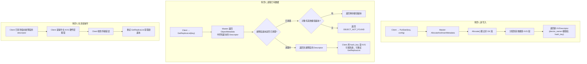
```mermaid
flowchart TD
    subgraph 场景1_新写入
        A1["Client → PutStart(key, config)"] --> A2["Master: AllocateAndInsertMetadata"]
        A2 --> A3["Allocate() 跳过非 OK 段"]
        A3 --> A4["分配到其他健康 KVS 段"]
        A4 --> A5["返回新 KVDescriptor<br/>{device_name=健康段, hash_key}"]
    end

    subgraph 场景2_读取已有数据
        B1["Client → GetReplicaList(key)"] --> B2["Master 返回 ObjectMetadata<br/>中所有副本的 Descriptor"]
        B2 --> B3{"故障段副本是否已清理?"}
        B3 -->|已清理| B4{"对象有其他健康副本?"}
        B3 -->|清理中| B5["返回含故障段的 Descriptor"]
        B4 -->|有| B6["返回剩余健康副本"]
        B4 -->|无| B7["返回 OBJECT_NOT_FOUND"]
        B5 --> B8["Client 用 hash_key 读 KVS<br/>可能失败，可重试 GetReplicaList"]
    end

    subgraph 场景3_在途读操作
        C1["Client 已拿到指向故障段的 descriptor"] --> C2["Client 读操作在 KVS 硬件层报错"]
        C2 --> C3["Client 收到传输错误"]
        C3 --> C4["重试 GetReplicaList 获取新副本"]
    end
```

---

## 十三、KVS 驱逐机制

### 13.1 与普通 Segment 驱逐的差异

RAM / NOF / Disk 等普通 Segment 的空间管理基于**地址分配器（BufferAllocator）**，驱逐时通过**覆盖写**释放空间：将新数据写入被驱逐对象占用的地址，原有数据被直接覆写。

KVSegment 的底层 KVS 硬件是 **key-value 语义**，没有地址概念，无法通过覆盖写完成驱逐。驱逐必须通过 KVS 硬件的 **delete 语义**：由 Master 决策驱逐哪些 key，将 `hash_key` 透传到 TE（TransferEngine）侧，由 TE 调用 NDS（KV 硬件驱动）的 delete 接口完成物理删除。


```mermaid
flowchart TD
    subgraph "普通 Segment 驱逐（RAM / NOF / Disk）"
        A1["Master: BufferAllocator 分配失败"] --> A2["设置 need_mem_eviction_ 标志"]
        A2 --> A3["后台驱逐线程: BatchEvict"]
        A3 --> A4["选择到期对象，释放 BufferAllocator 地址"]
        A4 --> A5["新写入覆盖该地址 → 驱逐完成"]
    end

    subgraph "KVSegment 驱逐"
        B1["Master: KVSegmentManager.Allocate 失败"] --> B2["设置 need_kvs_eviction_ 标志"]
        B2 --> B3["KVS 驱逐线程: 选择到期 KVS 副本"]
        B3 --> B4["Master 将 hash_key 透传到 TE 侧"]
        B4 --> B5["TE 调用 NDS delete 语义"]
        B5 --> B6["KVS 硬件物理删除 key"]
        B6 --> B7["Master: Deallocate 归还 remaining_size"]
        B7 --> B8["驱逐完成，新 Put 可分配空间"]
    end
```

### 13.2 驱逐触发条件

KVSegment 的驱逐触发条件与普通 Segment 一致，复用现有驱逐框架：

| 触发条件               | 说明                                                                                                                                               |
| ---------------------- | -------------------------------------------------------------------------------------------------------------------------------------------------- |
| **高水位触发**   | `kvs_used_ratio > eviction_high_watermark_ratio_`（默认 0.95）                                                                                   |
| **分配失败触发** | `KVSegmentManager::Allocate()` 中所有候选段 `remaining_size < object_size`，返回 `NO_AVAILABLE_HANDLE`，并设置 `need_kvs_eviction_ = true` |

分配失败时的流程（在 `AllocateAndInsertMetadata` 中）：

```cpp
// 伪代码：KVS 分配失败时触发驱逐
auto results = kvs_segment_manager_.getKVSegmentAccess().Allocate(...);
if (results.size() < kvs_replica_num) {
    // 回滚已分配的空间
    for (auto& r : results) {
        kvs_segment_manager_.getKVSegmentAccess().Deallocate(r.device_name, r.allocated_size);
    }
    need_kvs_eviction_ = true;  // 触发后台驱逐
    return NO_AVAILABLE_HANDLE;
}
```

### 13.3 驱逐执行流程

驱逐在专用的 KVS 驱逐线程中执行，与现有 `EvictionThreadFunc` 并行但独立：

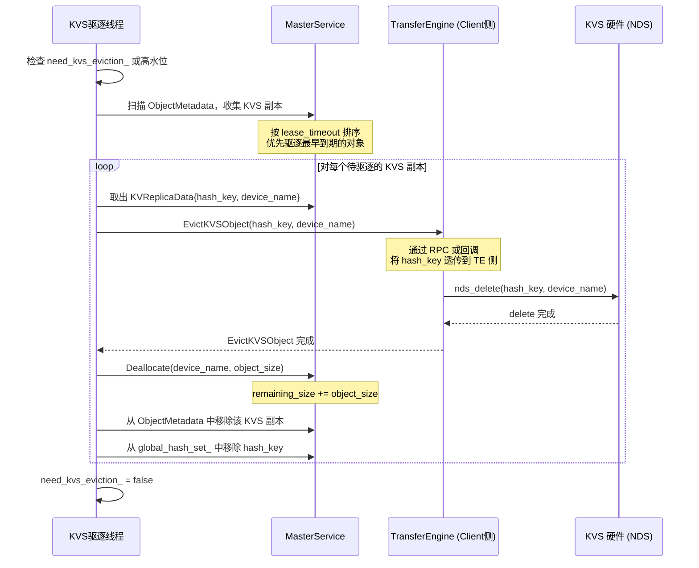
```mermaid
sequenceDiagram
    participant ET as KVS驱逐线程
    participant MS as MasterService
    participant TE as TransferEngine (Client侧)
    participant NDS as KVS 硬件 (NDS)

    ET->>ET: 检查 need_kvs_eviction_ 或高水位
  
    ET->>MS: 扫描 ObjectMetadata，收集 KVS 副本
    Note over MS: 按 lease_timeout 排序<br/>优先驱逐最早到期的对象
  
    loop 对每个待驱逐的 KVS 副本
        ET->>MS: 取出 KVReplicaData{hash_key, device_name}
        ET->>TE: EvictKVSObject(hash_key, device_name)
        Note over TE: 通过 RPC 或回调<br/>将 hash_key 透传到 TE 侧
        TE->>NDS: nds_delete(hash_key, device_name)
        NDS-->>TE: delete 完成
        TE-->>ET: EvictKVSObject 完成
  
        ET->>MS: Deallocate(device_name, object_size)
        Note over MS: remaining_size += object_size
  
        ET->>MS: 从 ObjectMetadata 中移除该 KVS 副本
        ET->>MS: 从 global_hash_set_ 中移除 hash_key
    end
  
    ET->>ET: need_kvs_eviction_ = false
```

### 13.4 驱逐对象选择策略

与普通 Segment 驱逐一致，按 **租约到期时间（lease_timeout）升序**选择驱逐对象——租约最早到期的对象优先驱逐。

对于 KVS 副本，驱逐决策在 Master 侧完成：

1. 扫描 `ObjectMetadata`，筛选出包含 KVS 副本的对象
2. 按 `lease_timeout` 排序，选择租约最早到期的一批
3. 对于每个选中的对象，驱逐其 KVS 副本而非整个对象（其他类型副本保留）

### 13.5 RPC 与接口扩展

为支持 KVS 驱逐，需新增以下 RPC 和接口：

| 接口                                  | 方向                  | 说明                                                    |
| ------------------------------------- | --------------------- | ------------------------------------------------------- |
| `EvictKVSObject` RPC                | Master → Client (TE) | 透传`hash_key` + `device_name`（含 eid 前缀），通知 TE 执行 delete |
| `nds_delete(hash_key, device_name)` | TE → NDS             | KV 硬件 delete 语义，物理删除 key                       |

**新增 RPC 消息：**

```cpp
// rpc_types.h
struct EvictKVSObjectRequest {
    uint64_t hash_key;
    std::string device_name;
};
YLT_REFL(EvictKVSObjectRequest, hash_key, device_name);

struct EvictKVSObjectResponse {
    int32_t error_code;
};
YLT_REFL(EvictKVSObjectResponse, error_code);
```

### 13.6 Master 侧新增数据结构

```cpp
// master_service.h
std::atomic<bool> need_kvs_eviction_{false};  // KVS 驱逐标志
std::thread kvs_eviction_thread_;              // KVS 驱逐线程
std::atomic<bool> kvs_eviction_running_{false};
```

驱逐线程与现有 `EvictionThreadFunc` 独立运行，理由：

- KVS 驱逐的 IO 路径不同（走 NDS delete，不走 BufferAllocator）
- 驱逐频率和节奏可能不同（KVS 硬件 delete 延迟可能较高）
- 故障隔离：TE 侧 NDS 故障不影响 RAM/NOF 驱逐

### 13.7 驱逐失败处理

| 失败场景                          | 处理策略                                                                    |
| --------------------------------- | --------------------------------------------------------------------------- |
| NDS delete 超时/失败              | 重试 N 次，仍失败则标记该 KVS 段异常，走心跳故障路径（ForceUnmountSegment） |
| TE 不可达（Client 断开）          | 该 Client 的 KVS 段引用已在过期清理中移除，驱逐跳过该对象                   |
| hash_key 不在 global_hash_set_ 中 | 可能已被其他驱逐线程清理，跳过                                              |

驱逐失败不会阻塞系统——`need_kvs_eviction_` 保持为 true，下一轮驱逐继续尝试。若连续失败超过阈值，触发告警。

### 13.8 Metrics 扩展

| 指标                                    | 触发时机                            |
| --------------------------------------- | ----------------------------------- |
| `inc_kvs_eviction_success_total()`    | KVS 驱逐成功（NDS delete 返回成功） |
| `inc_kvs_eviction_failure_total()`    | KVS 驱逐失败（NDS delete 失败）     |
| `inc_kvs_eviction_objects_total()`    | 驱逐的 KVS 对象总数                 |
| `observe_kvs_eviction_latency_ms(ms)` | KVS 驱逐延迟直方图                  |

### 13.9 设计决策

| 决策                                       | 理由                                                                                             |
| ------------------------------------------ | ------------------------------------------------------------------------------------------------ |
| **Master 决策驱逐 + TE 执行 delete** | KVS 硬件无地址概念，无法覆盖写。Master 持有元数据和租约信息做驱逐决策，TE 持有硬件连接做物理删除 |
| **hash_key 透传到 TE**               | TE 只认 hash_key，不持有原始 key。Master 将 hash_key 随驱逐指令下发，TE 原样传给 NDS             |
| **独立 KVS 驱逐线程**                | IO 路径、延迟特征、故障模式均不同，独立线程避免相互拖累                                          |
| **驱逐后清理 global_hash_set_**      | 释放 hash_key 给后续新 key 使用，避免 hash 空间浪费                                              |
| **复用 lease_timeout 排序**          | 驱逐策略与现有框架一致，减少维护复杂度                                                           |

---

## 十四、RPC 消息定义

| RPC                  | Request                                   | Response               |
| -------------------- | ----------------------------------------- | ---------------------- |
| `MountKVSegment`   | `KVSegment segment`                     | `int32_t error_code` |
| `UnmountKVSegment` | `string device_name, UUID client_id`    | `int32_t error_code` |
| `EvictKVSObject`   | `uint64_t hash_key, string device_name` | `int32_t error_code` |

`UnmountKVSegment` 参数从 `UUID segment_id` 改为 `string device_name + UUID client_id`，对应引用计数语义。

---

## 十五、Metrics 扩展

| 指标                                                | 触发时机                                       |
| --------------------------------------------------- | ---------------------------------------------- |
| `inc_total_kvs_capacity(segment_name, capacity)`  | 首次挂载成功后                                 |
| `dec_total_kvs_capacity(segment_name, capacity)`  | CommitUnmount 后（client_refs 归零或强制卸载） |
| `inc_kvs_heartbeat_success_total()`               | 心跳探测成功                                   |
| `inc_kvs_heartbeat_failure_total()`               | 心跳探测失败                                   |
| `inc_kvs_heartbeat_timeout_total()`               | 心跳超阈值，触发强制卸载                       |
| `observe_kvs_heartbeat_probe_latency_ms(ms)`      | 每次探测的延迟直方图                           |
| `inc_kvs_segments_unmounted_by_heartbeat_total()` | 心跳故障导致强制卸载                           |
| `inc_kvs_eviction_success_total()`                | KVS 驱逐成功（NDS delete 返回成功）            |
| `inc_kvs_eviction_failure_total()`                | KVS 驱逐失败（NDS delete 失败）                |
| `inc_kvs_eviction_objects_total()`                | 驱逐的 KVS 对象总数                            |
| `observe_kvs_eviction_latency_ms(ms)`             | KVS 驱逐延迟直方图                             |

---

## 十六、关键设计决策

| 决策                                                                  | 理由                                                                                                                    |
| --------------------------------------------------------------------- | ----------------------------------------------------------------------------------------------------------------------- |
| **不引入 BufferAllocator**                                      | KVS 硬件自行管理空间，master 只需跟踪容量，无需 slab/offset 分配器                                                      |
| **复用 AllocationStrategyType 配置**                            | 策略语义一致（RANDOM / FREE\_RATIO\_FIRST），但逻辑直接操作 `remaining_size`，不经过 `BufferAllocatorBase`          |
| **Allocate() 内聚在 KVSegmentManager**                          | 分配逻辑简单，无需通过`AllocatorManager` 中转                                                                         |
| **KVReplicaData 直接持有 device_name + object_size + hash_key** | Master 分配时随机生成 hash_key，`get_descriptor()` 拷贝到 KVDescriptor。不需要 AllocatedBuffer 包装                   |
| **独立 KVSegmentManager**                                       | 与 SegmentManager/NoFSegmentManager 平级，架构一致                                                                      |
| **不修改 allocator.h / allocation_strategy.h**                  | KVS 不经过这些组件，改动范围最小                                                                                        |
| **随机哈希 + 全局 hash 集**                                     | 64 字节→8 字节必然碰撞。随机哈希生成 hash_key，Master 维护`unordered_set<uint64_t>` 去重，碰撞则重新生成             |
| **hash_key 存入 KVDescriptor**                                  | hash_key 持久化到 ObjectMetadata，Get 路径通过现有 key→元数据索引自然完成映射，无需额外映射表                          |
| **mounted_segments_ 以 device_name 为 key**                     | `device_name` 含 eid 前缀（格式 `eid:设备路径`），是远端设备的唯一标识；`segment.id` 随机生成不具确定性，不适合做索引 |
| **引入 client_refs 引用计数**                                   | 一个物理 SSD 设备可被多个 client 共享，使用引用计数管理生命周期                                                         |
| **分配不过滤 client**                                           | 所有 client 共享同一组物理设备，任何 OK 状态的段都可分配                                                                |
| **Unmount 参数改为 device_name + client_id**                    | 对应引用计数语义：卸载 = 减引用，而非直接销毁                                                                           |
| **心跳故障直接强制卸载，不 Drain**                              | 故障设备不可达，数据无法读取也就无法迁移。强制卸载是硬件故障的唯一正确选择                                              |
| **ForceUnmountSegment 绕过 client_refs**                        | 设备故障时所有 client 的在途操作都会失败，等待引用归零无意义。直接清空引用、卸载段、清理元数据，让新写入流向健康段      |
| **探针函数用注入而非硬编码**                                    | KVS 硬件探针方式取决于具体驱动实现，Master 不应依赖具体驱动。通过`KVSProbeFn` 注入，与 NoF 的 `NoFProbeFn` 模式一致 |
| **Client 不感知 KVSegment 卸载**                                | Client 每次操作向 Master 请求 descriptor，死设备的 descriptor 会被`ClearInvalidHandles` 清理。无需额外通知机制        |
| **Master 决策驱逐 + TE 执行 NDS delete**                        | KVS 无地址概念，无法覆盖写驱逐。Master 持有元数据决策驱逐对象，将 hash_key 透传到 TE，TE 调用 NDS delete 语义物理删除   |
| **独立 KVS 驱逐线程**                                           | KVS 驱逐走 NDS delete 而非 BufferAllocator，IO 路径和故障模式不同，独立线程避免相互拖累                                 |
| **hash_key 随 ObjectMetadata 持久化**                           | KVS 副本（含 hash_key）经 `Serializer<Replica>`（快照）与 `Replica::Descriptor`（OpLog/RPC）两个序列化点落盘，恢复后映射完整 |
| **global_hash_set_ 不持久化，恢复时全量重建**                   | 集合是 ObjectMetadata 的派生数据，直接持久化会产生双真相源；主节点接管后遍历全部 KVS 副本重建，运行期增量维护          |

---

## 十七、ScopedKVSegmentAccess 接口定义

### 17.1 方法总览

| 方法                      | 与`ScopedSegmentAccess` 的差异                                                                                                      |
| ------------------------- | ------------------------------------------------------------------------------------------------------------------------------------- |
| `MountSegment`          | 参数类型不同（`KVSegment` vs `Segment`）；去重 key 不同（`device_name` vs `segment.id`）；支持引用计数语义（重复挂载返回 OK） |
| `ReMountSegment`        | 同上，内部调用`MountSegment`                                                                                                        |
| `PrepareUnmountSegment` | 参数不同（`device_name + client_id` vs `segment_id`）；引用计数语义；无 allocator 清理                                            |
| `CommitUnmountSegment`  | 参数不同（`device_name` vs `segment_id + client_id`）；无 `client_by_name_`/`segment_id_by_name_` 清理                        |
| `ForceUnmountSegment`   | **新增**，心跳故障专用：绕过 `client_refs` 检查，清空引用集合，直接置 `UNMOUNTING`                                          |
| `Allocate`              | **新增**，普通 Segment 通过 `AllocatorManager` 分配                                                                           |
| `Deallocate`            | **新增**，归还容量到 `remaining_size`                                                                                         |
| `GetClientSegments`     | 返回类型不同（`vector<KVSegment>` vs `vector<Segment>`）                                                                          |
| `GetAllSegments`        | 功能合并：返回所有`device_name`（不区分状态），不再区分 `GetAllSegments`/`GetAllSegmentNames`                                   |
| `QuerySegments`         | 实现不同：通过`remaining_size` 计算，而非 `allocator_manager_`                                                                    |
| `GetRefCount`           | **新增**，查询 `client_refs` 大小                                                                                             |

### 17.2 方法详细说明

#### `MountSegment`

```cpp
ErrorCode MountSegment(const KVSegment& segment, const UUID& client_id);
```

挂载一个 KVSegment。以 `device_name` 为唯一键查找是否已存在：

- 已存在 → 将 `client_id` 加入 `client_refs`，`remaining_size` 不变，返回 OK
- 不存在 → 创建 `MountedKVSegment`，`client_refs = {client_id}`，`remaining_size = segment.size`，更新容量指标

#### `ReMountSegment`

```cpp
ErrorCode ReMountSegment(const std::vector<KVSegment>& segments, const UUID& client_id);
```

批量重新挂载 KVSegment，遍历 `segments` 逐个调用 `MountSegment`，忽略 `SEGMENT_ALREADY_EXISTS` 等非致命错误。

#### `PrepareUnmountSegment`

```cpp
ErrorCode PrepareUnmountSegment(const std::string& device_name, const UUID& client_id, size_t& metrics_dec_capacity);
```

准备卸载一个 KVSegment。从 `client_refs` 中移除 `client_id`，同时清理 `client_segments_[client_id]` 中的记录：

- `client_refs` 仍不为空 → 仅减引用，返回 OK（`metrics_dec_capacity = 0`）
- `client_refs` 为空 → 设置 `status = UNMOUNTING`，`metrics_dec_capacity = segment.size`，返回 OK

#### `CommitUnmountSegment`

```cpp
ErrorCode CommitUnmountSegment(const std::string& device_name, const size_t& metrics_dec_capacity);
```

提交卸载，完成清理。从 `mounted_segments_` 中删除该 entry，扣减容量指标。`client_segments_` 已在 `PrepareUnmountSegment` 中清理完毕。

#### `ForceUnmountSegment`

```cpp
ErrorCode ForceUnmountSegment(const std::string& device_name, size_t& metrics_dec_capacity);
```

强制卸载，心跳故障专用。绕过 `client_refs` 检查：

1. 清空 `client_refs` 中的所有 client_id
2. 清理 `client_segments_` 中所有引用该 `device_name` 的记录
3. 设置 `status = UNMOUNTING`，`metrics_dec_capacity = segment.size`

调用后需继续执行 `ClearInvalidHandles` + `CommitUnmountSegment` 完成清理。

#### `Allocate`

```cpp
struct AllocResult {
    std::string device_name;
    size_t allocated_size;
};

std::vector<AllocResult> Allocate(size_t size, size_t count,
    const std::vector<std::string>& preferred_segments,
    const std::vector<std::string>& excluded_segments,
    AllocationStrategyType strategy);
```

在 KVS 段上分配空间。遍历所有 `status == OK` 的 segment，按策略选择，扣减 `remaining_size`。分配不限 client，所有 OK 段都是候选。

#### `Deallocate`

```cpp
void Deallocate(const std::string& device_name, size_t size);
```

归还空间，增加对应 segment 的 `remaining_size`。

#### `GetClientSegments`

```cpp
ErrorCode GetClientSegments(const UUID& client_id, std::vector<KVSegment>& segments) const;
```

查询指定 client 引用了哪些 KVSegment，通过 `client_segments_` 找到 `device_name` 的 `set`，再在 `mounted_segments_` 中查找对应信息。

#### `GetAllSegments`

```cpp
ErrorCode GetAllSegments(std::vector<std::string>& all_segments) const;
```

返回所有已挂载 KVSegment 的 `device_name` 列表（不区分状态）。合并了原 `ScopedSegmentAccess` 中 `GetAllSegments`（过滤 OK）和 `GetAllSegmentNames`（不过滤）两个方法的功能。

#### `QuerySegments`

```cpp
ErrorCode QuerySegments(const std::string& segment_name, size_t& used, size_t& capacity) const;
```

通过 `segment_name` 查询 KVSegment 的已用空间和总容量。`capacity = segment.size`，`used = capacity - remaining_size`。

#### `GetRefCount`

```cpp
size_t GetRefCount(const std::string& device_name) const;
```

查询指定 KVSegment 当前的引用计数（`client_refs` 大小）。
