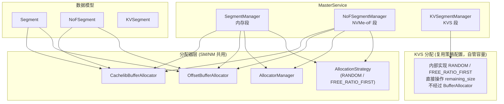
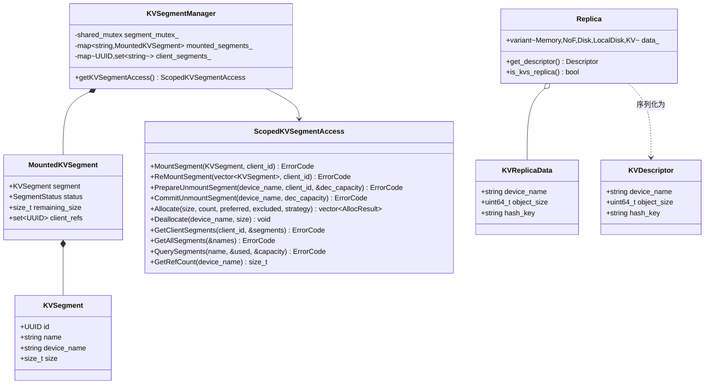
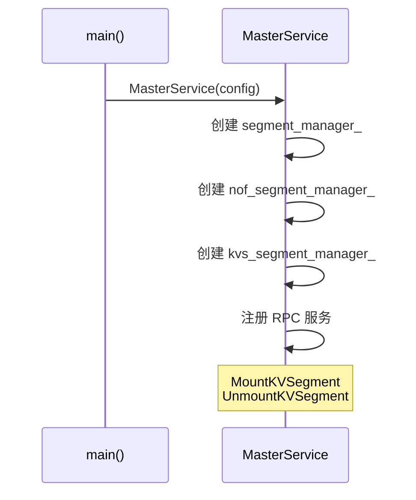
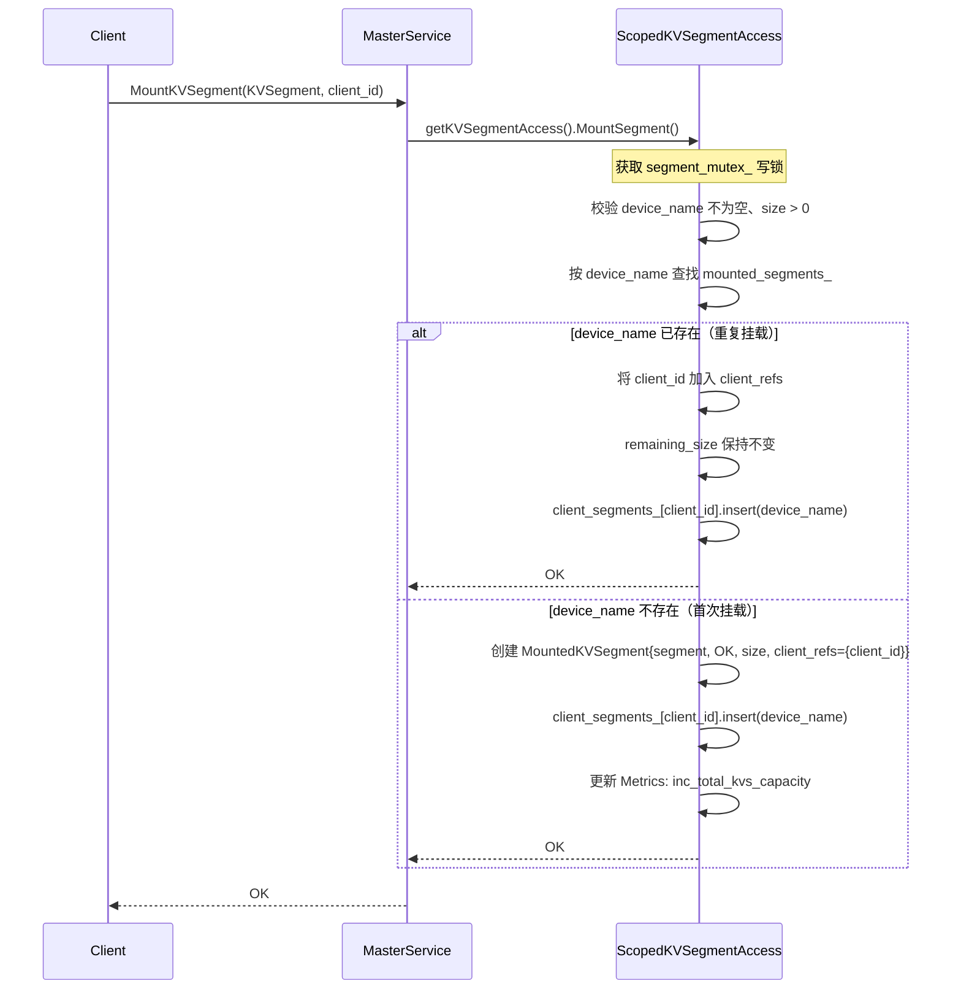
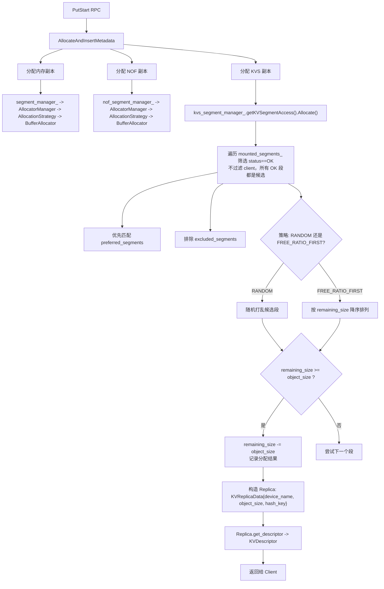
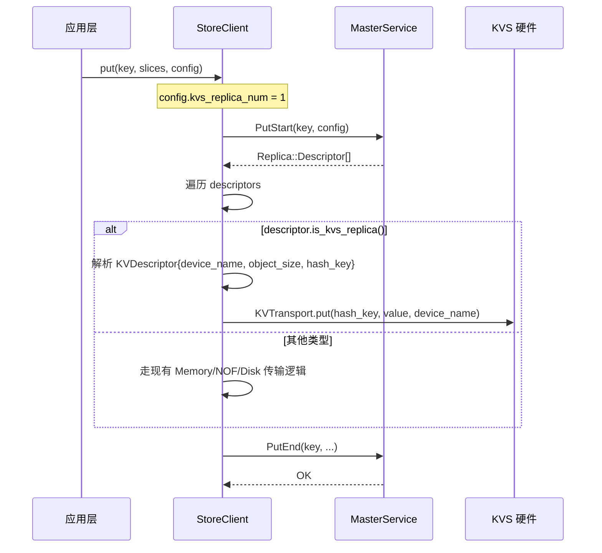
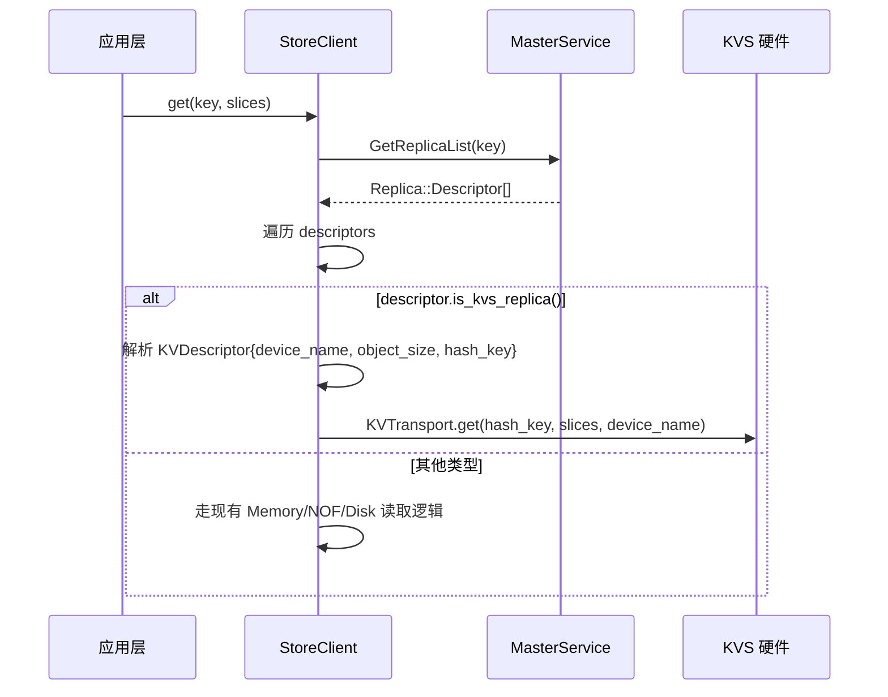
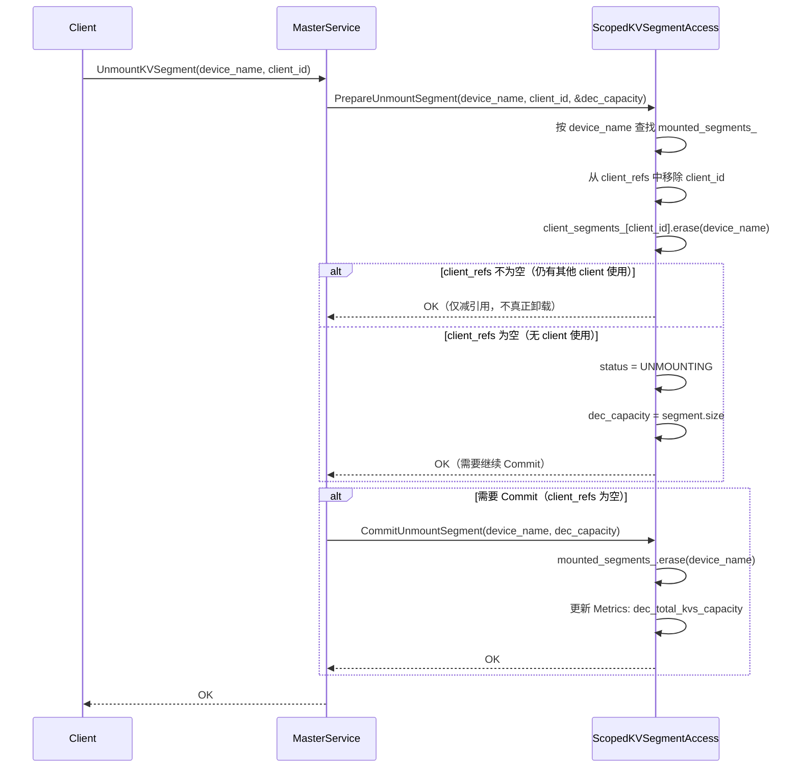
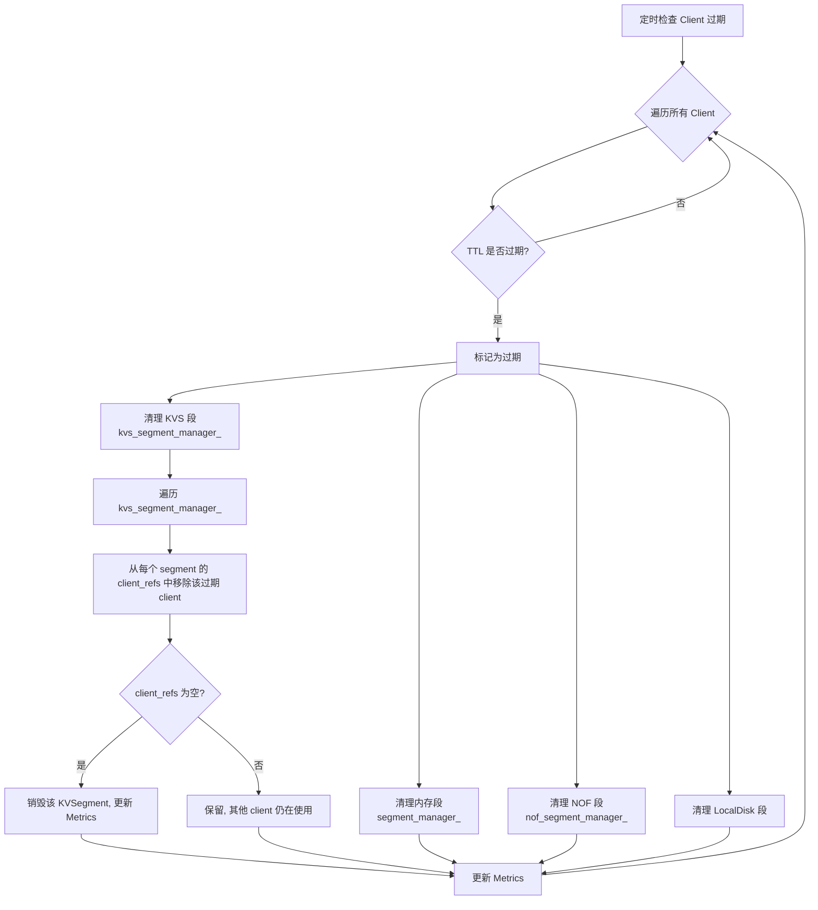
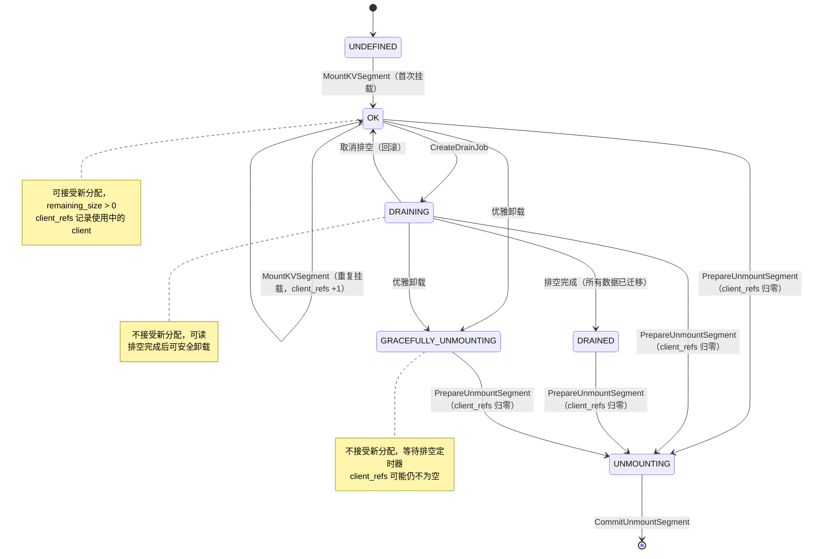

# KVSegment 设计方案

## 一、整体架构概览

KVSegment 是为 KVTransferEngine 设计的新型 Segment，特点是硬件自行管理地址空间，只需传入 key/value 即可完成存取，无需基于内存地址的空间管理。

KVSegment 有独立的 `KVSegmentManager`。segment分配策略沿用现有的 `AllocationStrategyType` 配置（RANDOM / FREE\_RATIO\_FIRST）。

### 1.1 与现有 Segment 的架构关系



### 1.2 新增/修改文件清单

| 文件                                | 操作 | 说明                                                                      |
| ----------------------------------- | ---- | ------------------------------------------------------------------------- |
| `include/types.h`                 | 修改 | 新增`KVSegment`、`ReplicaType::KVS`                                   |
| `include/segment.h`               | 修改 | 新增`MountedKVSegment`、`KVSegmentManager`、`ScopedKVSegmentAccess` |
| `src/segment.cpp`                 | 修改 | 实现 KVSegment 管理逻辑                                                   |
| `include/replica.h`               | 修改 | 新增`KVReplicaData`、`KVDescriptor`                                   |
| `include/rpc_types.h`             | 修改 | 新增 KVSegment 相关 RPC 消息                                              |
| `include/master_service.h`        | 修改 | 新增`kvs_segment_manager_`、RPC 处理方法                                |
| `src/master_service.cpp`          | 修改 | 实现 KVS RPC、PutStart 分配分支、客户端过期清理                           |
| `include/client_service.h`        | 修改 | 新增客户端挂载方法                                                        |
| `src/client_service.cpp`          | 修改 | 实现客户端 KVS 段挂载                                                     |
| `include/master_metric_manager.h` | 修改 | 新增 KVS 容量指标                                                         |

**不修改：** `allocator.h`、`allocator.cpp`、`allocation_strategy.h`、`allocation_strategy.cpp`

### 1.3 整体类图



ScopedKVSegmentAccess中方法入参的client_id都需要保留，用于client_refs元素增删改查。

## 二、数据结构定义

### 2.1 KVSegment（types.h）

| 字段            | 类型            | 说明                                                                    |
| --------------- | --------------- | ----------------------------------------------------------------------- |
| `id`          | `UUID`        | 辅助标识，每次挂载时随机生成，仅用于日志/追踪，不参与去重和索引         |
| `name`        | `std::string` | 逻辑段名，用于 preferred allocation 路由                                |
| `device_name` | `std::string` | KVS 硬件设备名称（如`/dev/kvu0`），**全局唯一标识，作为主索引** |
| `size`        | `size_t`      | KVS 设备总容量（字节）                                                  |

对比普通 `Segment`：**不需要** `base`（无地址概念）、`protocol`（使用专用协议）。

**`id` 字段说明**：Client 端在挂载时调用 `generate_uuid()` 生成随机 v4 UUID。由于每次挂载生成不同的 UUID，`id` 不适合做去重或索引。KVSegment 的去重和索引统一以 `device_name` 为准。

### 2.2 枚举扩展（types.h）

`ReplicaType` 新增 `KVS = 4`，用于在分配和传输路径中区分 KVS 副本。

`BufferAllocatorType` 不需要新增值——KVSegmentManager 不创建任何 BufferAllocator。

### 2.3 MountedKVSegment（segment.h）

| 字段               | 类型               | 说明                                                  |
| ------------------ | ------------------ | ----------------------------------------------------- |
| `segment`        | `KVSegment`      | 段元数据                                              |
| `status`         | `SegmentStatus`  | 复用现有状态机                                        |
| `remaining_size` | `size_t`         | 剩余容量，直接跟踪，替代 BufferAllocator              |
| `client_refs`    | `std::set<UUID>` | **新增**：当前正在使用该 segment 的 client 集合 |

**`client_refs` 的核心作用**：

- 挂载时：若 `device_name` 已存在，仅将 `client_id` 加入 `client_refs`，`remaining_size` 不变
- 卸载时：从 `client_refs` 移除 `client_id`，仅当集合为空时才真正销毁 segment
- 过期清理时：从 `client_refs` 移除过期 client，归零才销毁

### 2.4 KVSegmentManager（segment.h）

内部数据结构：

| 成员                  | 类型                              | 说明                                                                     |
| --------------------- | --------------------------------- | ------------------------------------------------------------------------ |
| `segment_mutex_`    | `shared_mutex`                  | 读写锁                                                                   |
| `mounted_segments_` | `map<string, MountedKVSegment>` | **`device_name` → 已挂载段**（key 从 `UUID` 改为 `string`） |
| `client_segments_`  | `map<UUID, set<string>>`        | `client_id` → 其引用过的 device_name 集合（**天然去重**）          |

**相比原设计移除的成员**：

- ~~`client_by_name_`（`map<string, UUID>`）~~ — 1:1 映射不成立，一个 segment 可被多个 client 共享
- ~~`segment_id_by_name_`（`map<string, UUID>`）~~ — 同上，且 `id` 随机生成不具确定性

**没有** `AllocatorManager`、`memory_allocator_`。分配策略通过 `Allocate()` 方法的 `strategy` 参数控制，逻辑内聚在 `ScopedKVSegmentAccess` 中直接操作 `remaining_size`。

### 2.5 Replica 扩展（replica.h）

| 结构体            | 字段                                           | 说明                                                                    |
| ----------------- | ---------------------------------------------- | ----------------------------------------------------------------------- |
| `KVReplicaData` | `device_name`, `object_size`, `hash_key` | 运行时数据，Master 侧持有；`get_descriptor()` 拷贝到 `KVDescriptor` |
| `KVDescriptor`  | `device_name`, `object_size`, `hash_key` | 序列化描述符，通过 RPC 发给 Client                                      |

`Replica` 类需新增：`KVReplicaData` variant 分支、`KVDescriptor` variant 分支、对应构造函数、`is_kvs_replica()` 判断方法、`get_descriptor()` 中的 KVS 分支。

### 2.6 key 到 hash_key 的映射

Master 在 `AllocateAndInsertMetadata` 时为 KVS 副本计算 `hash_key = hash(原始 key)`，先存入 `KVReplicaData`，再通过 `get_descriptor()` 拷贝到 `KVDescriptor`，随 `Replica::Descriptor` 一起持久化到 `ObjectMetadata` 中。

- **Put 路径**：Client 从 `PutStart` 返回的 `KVDescriptor` 中获取 `hash_key`，将其传入 KV 硬件驱动替代原始 key。
- **Get 路径**：Client 用原始 key 调用 `GetReplicaList` 查询元数据，从返回的 `KVDescriptor` 中取出 `hash_key`，再用 `hash_key` 从 KV 硬件读取数据。

**映射关系由现有的 key→ObjectMetadata 机制自然完成，无需额外存储映射表。** 每次 Get 时用原始 key 查元数据即可获得对应的 `hash_key`。

`hash_key` 采用确定性哈希（如 SHA-256 截断），相同 key 始终产生相同 hash，因此不需要维护随机映射。

### 2.7 ReplicateConfig 扩展

新增 `kvs_replica_num` 字段（默认 0），控制 KVS 副本数量。

---

## 三、MasterService 初始化



---

## 四、Segment 挂载流程



与普通 Segment 挂载的核心差异：

| 步骤                  | 普通 Segment                                                 | KVSegment                                                         |
| --------------------- | ------------------------------------------------------------ | ----------------------------------------------------------------- |
| 地址校验              | `base != 0`、对齐校验                                      | 无（无地址概念）                                                  |
| 创建分配器            | 创建`CachelibBufferAllocator` 或 `OffsetBufferAllocator` | 不创建，直接记录`remaining_size`                                |
| 加入 AllocatorManager | `addAllocator()`                                           | 无此步骤                                                          |
| 去重检查              | 按`segment.id`                                             | **按 `device_name`**（`segment.id` 随机生成，不做去重） |
| 重复挂载              | 返回`SEGMENT_ALREADY_EXISTS`                               | **增加引用计数，返回 OK**                                   |

---

## 五、PutStart 分配流程

### 5.1 整体流程



### 5.2 分配策略

`ScopedKVSegmentAccess::Allocate()` 接收 `AllocationStrategyType` 参数，与现有 `AllocationStrategy` 类使用相同的枚举值。策略逻辑直接在 Manager 中实现，不经过 `BufferAllocatorBase`。

**关键差异**：分配时**不区分** segment 由哪个 client 挂载，所有状态为 `OK` 的 segment 都是候选。这是因为 KVSegment 对应物理 SSD 设备，所有 client 共享同一设备。

**分两轮分配**，每轮内部根据策略类型选择：

**第一轮——Preferred Segments：**
按 `preferred_segments` 列表顺序尝试，容量足够即分配。

**第二轮——从剩余段中分配：**
收集所有 OK 状态、不在排除列表中的段，过滤出容量足够的候选：

- **RANDOM：** 将候选段随机打乱，依次分配
- **FREE\_RATIO\_FIRST：** 按 `remaining_size` 降序排列，优先选择空闲最多的段

每次分配成功后，直接在对应的 `MountedKVSegment.remaining_size` 上扣减（在 `segment_mutex_` 写锁保护下）。

---

## 六、Client 端 Put 流程



---

## 七、Client 端 Get 流程



Get 流程说明：

1. Client 用**原始 key** 向 Master 查询元数据（`GetReplicaList`）
2. Master 通过 key 索引 `ObjectMetadata`，返回所有副本描述符
3. 对于 KVS 副本，`KVDescriptor` 中携带了 `hash_key`
4. Client 用 `hash_key` 从 KV 硬件读取数据

**key→hash_key 的映射无需额外存储**：Master 在 PutStart 时已将 `hash_key` 存入 `KVDescriptor`，并随 `ObjectMetadata` 一起持久化（快照 + OpLog）。Get 时通过原始 key 查元数据即可获得。

## 八、Unmount 流程



与普通 Segment 的差异：

| 步骤           | 普通 Segment                                      | KVSegment                                   |
| -------------- | ------------------------------------------------- | ------------------------------------------- |
| 查找 key       | `segment_id`（UUID）                            | `device_name`（string）                   |
| Prepare 参数   | `(segment_id, &dec_capacity)`                   | `(device_name, client_id, &dec_capacity)` |
| 引用语义       | 直接卸载                                          | 引用计数 -1，归零才卸载                     |
| Commit 时机    | 总是执行                                          | 仅当`client_refs` 为空时执行              |
| 移除 allocator | `removeAllocator()` + `buf_allocator.reset()` | 无此步骤                                    |

---

## 九、Client 过期清理流程



KVS 段清理的关键差异：**不是直接销毁过期 client 的所有段，而是从 `client_refs` 中移除该 client。只有 `client_refs` 归零的段才真正销毁。**

---

## 十、生命周期状态机



**状态机关键说明**：

- `PrepareUnmountSegment` 仅在 `client_refs` 归零后才推进状态到 `UNMOUNTING`
- `client_refs > 0` 时，`PrepareUnmountSegment` 仅移除调用者的 client_id，不改变状态
- 完全复用现有 `SegmentStatus` 枚举，无需新增状态

### DRAINING / DRAINED 状态说明

**DRAINING** 用于**安全下线**场景（设备维护、负载均衡、优雅关闭）：

| 行为 | 说明 |
|------|------|
| 新分配 | **拒绝** — `Allocate()` 中跳过非 `OK` 状态的 segment |
| 已有对象 | **可读** — 已分配的对象不受影响 |
| 触发方式 | Master 收到 `CreateDrainJob` RPC 后调用 `SetSegmentStatusByName(segment_name, DRAINING)` |
| 回滚 | 排空取消时回退到 `OK` |

**DRAINED** 表示排空完成，所有数据已迁移到其他 segment，等待最终卸载：

| 行为 | 说明 |
|------|------|
| 触发时机 | DrainJob 确认该 segment 上所有活跃对象已迁移完毕 |
| 后续操作 | 等待 `client_refs` 归零后由 `PrepareUnmountSegment` 进入 `UNMOUNTING` |

### 与普通 Segment 的差异

| 维度 | 普通 Segment | KVSegment |
|------|-------------|-----------|
| **分配控制** | `SetSegmentStatusByName` 中通过 `HasAllocator` 的 add/remove 控制 | `Allocate()` 中检查 `status == OK` 时跳过非 OK 段 |
| **排空完成判定** | 通过 `BufferAllocator::size() == 0` 判断是否还有活跃对象 | 需依赖 KVS 硬件驱动或心跳确认设备上无活跃对象（Master 不追踪单对象分配） |

---

## 十一、RPC 消息定义

| RPC                  | Request                                | Response               |
| -------------------- | -------------------------------------- | ---------------------- |
| `MountKVSegment`   | `KVSegment segment`                  | `int32_t error_code` |
| `UnmountKVSegment` | `string device_name, UUID client_id` | `int32_t error_code` |

**UnmountKVSegment 参数从 `UUID segment_id` 改为 `string device_name + UUID client_id`**，对应引用计数语义。

---

## 十二、Metrics 扩展

| 指标                                               | 触发时机                             |
| -------------------------------------------------- | ------------------------------------ |
| `inc_total_kvs_capacity(segment_name, capacity)` | 首次挂载成功后                       |
| `dec_total_kvs_capacity(segment_name, capacity)` | CommitUnmount 后（client_refs 归零） |

---

## 十三、关键设计决策

| 决策                                                                  | 理由                                                                                                                    |
| --------------------------------------------------------------------- | ----------------------------------------------------------------------------------------------------------------------- |
| **不引入 BufferAllocator**                                      | KVS 硬件自行管理空间，master 只需跟踪容量，无需 slab/offset 分配器                                                      |
| **复用 AllocationStrategyType 配置**                            | 策略语义一致（RANDOM / FREE\_RATIO\_FIRST），但逻辑直接操作 `remaining_size`，不经过 `BufferAllocatorBase`          |
| **容量记录在 remaining_size**                                   | 省去中间抽象层，操作直接                                                                                                |
| **Allocate() 内聚在 KVSegmentManager**                          | 分配逻辑简单，无需通过`AllocatorManager` 中转                                                                         |
| **KVReplicaData 直接持有 device_name + object_size + hash_key** | Master 分配时计算 hash_key 存入，`get_descriptor()` 拷贝到 KVDescriptor。不需要 AllocatedBuffer 包装                  |
| **独立 KVSegmentManager**                                       | 与 SegmentManager/NoFSegmentManager 平级，架构一致                                                                      |
| **新增独立 RPC**                                                | 接口清晰，不与现有 RPC 耦合                                                                                             |
| **不修改 allocator.h / allocation_strategy.h**                  | KVS 不经过这些组件，改动范围最小                                                                                        |
| **hash_key 存入 KVDescriptor**                                  | 确定性哈希，映射关系由现有 key→ObjectMetadata 机制自然完成，无需额外映射表。Get 时用原始 key 查元数据即可获得 hash_key |
| **mounted_segments_ 以 device_name 为 key**                     | `device_name` 是物理设备的唯一标识，`segment.id` 随机生成不具确定性，不适合做索引                                   |
| **引入 client_refs 引用计数**                                   | 一个物理 SSD 设备可被多个 client 共享，使用引用计数管理生命周期                                                         |
| **分配不过滤 client**                                           | 所有 client 共享同一组物理设备，任何 OK 状态的段都可分配                                                                |
| **Unmount 参数改为 device_name + client_id**                    | 对应引用计数语义：卸载 = 减引用，而非直接销毁                                                                           |

---

## 十四、ScopedKVSegmentAccess 接口定义

### 14.1 方法总览

| 方法                      | 与`ScopedSegmentAccess` 的差异                                                                                                      |
| ------------------------- | ------------------------------------------------------------------------------------------------------------------------------------- |
| `MountSegment`          | 参数类型不同（`KVSegment` vs `Segment`）；去重 key 不同（`device_name` vs `segment.id`）；支持引用计数语义（重复挂载返回 OK） |
| `ReMountSegment`        | 同上，内部调用`MountSegment`                                                                                                        |
| `PrepareUnmountSegment` | 参数不同（`device_name + client_id` vs `segment_id`）；引用计数语义；无 allocator 清理                                            |
| `CommitUnmountSegment`  | 参数不同（`device_name` vs `segment_id + client_id`）；无 `client_by_name_`/`segment_id_by_name_` 清理                        |
| `Allocate`              | **新增**，`ScopedSegmentAccess` 无此方法（普通 Segment 通过 `AllocatorManager` 分配）                                       |
| `Deallocate`            | **新增**，归还容量到 `remaining_size`                                                                                         |
| `GetClientSegments`     | 返回类型不同（`vector<KVSegment>` vs `vector<Segment>`）                                                                          |
| `GetAllSegments`        | 功能合并：返回所有`device_name`（不区分状态），不再区分 `GetAllSegments`/`GetAllSegmentNames`                                   |
| `QuerySegments`         | 实现不同：通过`remaining_size` 计算，而非 `allocator_manager_`                                                                    |
| `GetRefCount`           | **新增**，查询 `client_refs` 大小                                                                                             |

### 14.2 方法详细说明

---

#### `MountSegment`

```cpp
ErrorCode MountSegment(const KVSegment& segment, const UUID& client_id);
```

**功能**：挂载一个 KVSegment。以 `device_name` 为唯一键查找是否已存在：

- 已存在 → 将 `client_id` 加入 `client_refs`，`remaining_size` 不变，返回 OK
- 不存在 → 创建 `MountedKVSegment`，`client_refs = {client_id}`，`remaining_size = segment.size`，更新容量指标

**与 `ScopedSegmentAccess::MountSegment` 差异**：

- 参数类型 `KVSegment` 而非 `Segment`，无 `base`/`protocol`/`te_endpoint` 字段
- 去重 key 为 `device_name`（string），而非 `segment.id`（UUID）
- 不创建 `BufferAllocator`，不操作 `AllocatorManager`
- 重复挂载不报错，而是增加引用计数

---

#### `ReMountSegment`

```cpp
ErrorCode ReMountSegment(const std::vector<KVSegment>& segments, const UUID& client_id);
```

**功能**：批量重新挂载 KVSegment，遍历 `segments` 逐个调用 `MountSegment`，忽略 `SEGMENT_ALREADY_EXISTS` 等非致命错误。

**与 `ScopedSegmentAccess::ReMountSegment` 差异**：参数类型不同，内部调用的是 `ScopedKVSegmentAccess::MountSegment`。

---

#### `PrepareUnmountSegment`

```cpp
ErrorCode PrepareUnmountSegment(const std::string& device_name, const UUID& client_id, size_t& metrics_dec_capacity);
```

**功能**：准备卸载一个 KVSegment。从 `client_refs` 中移除 `client_id`，同时清理 `client_segments_[client_id]` 中的记录：
- `client_refs` 仍不为空 → 仅减引用，返回 OK（`metrics_dec_capacity = 0`）
- `client_refs` 为空 → 设置 `status = UNMOUNTING`，`metrics_dec_capacity = segment.size`，返回 OK

**与 `ScopedSegmentAccess::PrepareUnmountSegment` 差异**：

- 查找 key 为 `device_name`（string），而非 `segment_id`（UUID）
- 多一个 `client_id` 参数，用于引用计数减一
- 不需要 `removeAllocator()` 和 `buf_allocator.reset()`
- 不一定推进状态到 `UNMOUNTING`，取决于 `client_refs` 是否归零

---

#### `CommitUnmountSegment`

```cpp
ErrorCode CommitUnmountSegment(const std::string& device_name, const size_t& metrics_dec_capacity);
```

**功能**：提交卸载，完成清理。从 `mounted_segments_` 中删除该 entry，扣减容量指标。**注意：`client_segments_` 已在 `PrepareUnmountSegment` 中清理完毕，此处不再需要遍历。**

**与 `ScopedSegmentAccess::CommitUnmountSegment` 差异**：
- 查找 key 为 `device_name`（string），而非 `segment_id`（UUID）
- 不需要 `client_id` 参数（此时 `client_refs` 已空）
- 不需要清理 `client_by_name_`、`segment_id_by_name_`（已移除）
- 不需要遍历 `client_segments_`（已在 `PrepareUnmountSegment` 中清理）

---

#### `Allocate`

```cpp
struct AllocResult {
    std::string device_name;
    size_t allocated_size;
};

std::vector<AllocResult> Allocate(size_t size, size_t count,
    const std::vector<std::string>& preferred_segments,
    const std::vector<std::string>& excluded_segments,
    AllocationStrategyType strategy);
```

**功能**：在 KVS 段上分配空间。遍历所有 `status == OK` 的 segment，按策略选择，扣减 `remaining_size`。分配不限 client，所有 OK 段都是候选。

**与 `ScopedSegmentAccess` 差异**：**新增方法**，原 `ScopedSegmentAccess` 无此方法。普通 Segment 的分配通过 `AllocatorManager` → `AllocationStrategy` → `BufferAllocator` 链路完成，不暴露在 `ScopedSegmentAccess` 中。

---

#### `Deallocate`

```cpp
void Deallocate(const std::string& device_name, size_t size);
```

**功能**：归还空间，增加对应 segment 的 `remaining_size`。

**与 `ScopedSegmentAccess` 差异**：**新增方法**。普通 Segment 通过 `BufferAllocator::Free()` 归还空间，KVS 无 `BufferAllocator`，直接在 `remaining_size` 上加回。

---

#### `GetClientSegments`

```cpp
ErrorCode GetClientSegments(const UUID& client_id, std::vector<KVSegment>& segments) const;
```

**功能**：查询指定 client 引用了哪些 KVSegment，通过 `client_segments_` 找到 `device_name` 的 `set`，再在 `mounted_segments_` 中查找对应信息。

**与 `ScopedSegmentAccess::GetClientSegments` 差异**：

- 返回类型为 `vector<KVSegment>` 而非 `vector<Segment>`
- 内部通过 `device_name`（string）查找，而非 `segment_id`（UUID）

---

#### `GetAllSegments`

```cpp
ErrorCode GetAllSegments(std::vector<std::string>& all_segments) const;
```

**功能**：返回所有已挂载 KVSegment 的 `device_name` 列表（不区分状态）。**合并了原 `ScopedSegmentAccess` 中 `GetAllSegments`（过滤 OK）和 `GetAllSegmentNames`（不过滤）两个方法的功能，统一为返回全部。**

**与 `ScopedSegmentAccess` 差异**：

- 原版有两个重载：`GetAllSegments(vector<string>&)`（过滤 status==OK）和 `GetAllSegments(vector<pair<Segment, UUID>>&)`（不过滤，带 client_id）
- 原版还有 `GetAllSegmentNames(vector<string>&)`（不过滤）
- KVS 版简化为一个：返回所有 `device_name`，由调用方按需过滤

---

#### `QuerySegments`

```cpp
ErrorCode QuerySegments(const std::string& segment_name, size_t& used, size_t& capacity) const;
```

**功能**：通过 `segment_name` 查询 KVSegment 的已用空间和总容量。`capacity = segment.size`，`used = capacity - remaining_size`。

**与 `ScopedSegmentAccess::QuerySegments` 差异**：

- 原版通过 `allocator_manager_` 获取所有 `<BufferAllocatorBase>`，累加 `size()` 和 `capacity()`
- KVS 版直接通过 `segment.size` 和 `remaining_size` 计算，无需经过 allocator 层

---

#### `GetRefCount`

```cpp
size_t GetRefCount(const std::string& device_name) const;
```

**功能**：查询指定 KVSegment 当前的引用计数（`client_refs` 大小）。

**与 `ScopedSegmentAccess` 差异**：**新增方法**。原 `ScopedSegmentAccess` 中 segment 与 client 是 1:1 绑定，无需引用计数概念。
