# KVSegment 设计方案

> **本文档范围**：Master 服务侧的数据/副本管理，以及 Client 端的数据传输链路。
> **KVTransport 实现设计**将作为独立章节另行补充。

---

## 一、概述

KVSegment 是为 KV 硬件设计的新型 Segment。KV 硬件自行管理地址空间，仅需传入 key/value 即可完成存取，无需基于内存地址的空间管理。

### 1.1 架构定位

KVSegment 在 MasterService 中由独立的 `KVSegmentManager` 管理，与 `SegmentManager`（内存段）、`NoFSegmentManager`（NVMe-oF 段）平级。

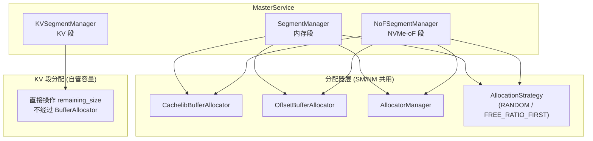

核心差异：KVSegmentManager **不创建 BufferAllocator**，不经过 `AllocatorManager`，直接用 `remaining_size` 跟踪容量。

### 1.2 数据传输路径

KV 数据的读写链路分为两个阶段：

1. **元数据阶段**：Client 通过 RPC 向 MasterService 获取副本描述符（`KVDescriptor`），其中包含 `device_name` 和 `hash_key`。
2. **传输阶段**：Client 将描述符提交给 `TransferSubmitter`，后者通过 `TransferEngine` 调用 **KVTransport.submitTransferTask** 执行实际硬件读写。

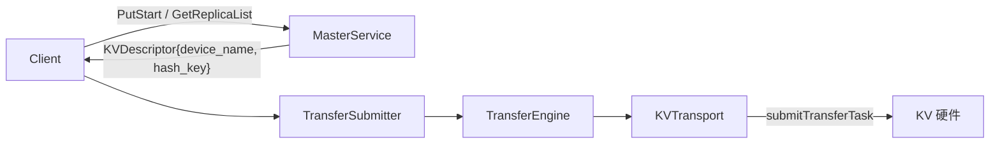

KVTransport 与现有 Transport 架构一致（参考 NVMeoFTransport），通过 `metadata_->getSegmentDescByID` 获取段描述符，从中读取所需信息执行硬件操作。

### 1.3 整体类图

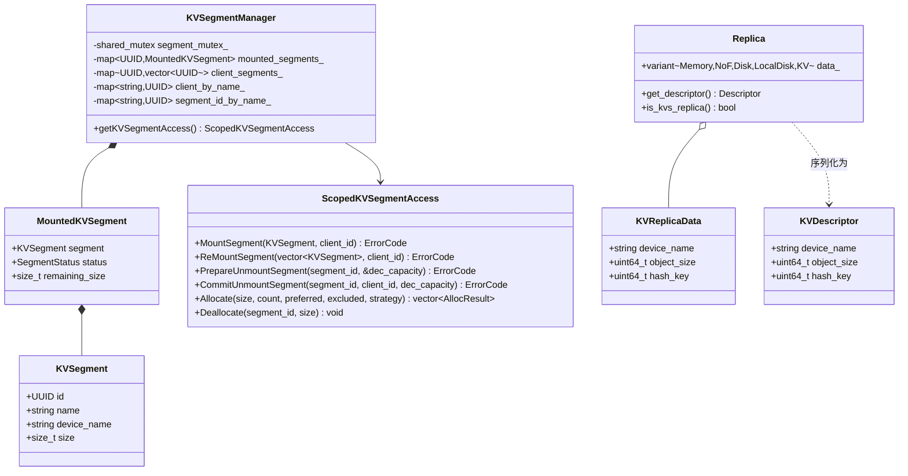

---

## 二、数据结构

### 2.1 KVSegment（types.h）

| 字段            | 类型            | 说明                                     |
| --------------- | --------------- | ---------------------------------------- |
| `id`          | `UUID`        | 全局唯一标识                             |
| `name`        | `std::string` | 逻辑段名，用于 preferred allocation 路由 |
| `device_name` | `std::string` | KV 硬件设备名称（如`/dev/kvu0`）       |
| `size`        | `size_t`      | 设备总容量（字节）                       |

与普通 `Segment` 的区别：无 `base`（无地址概念）、无 `protocol`（使用专用协议）。

### 2.2 MountedKVSegment（segment.h）

| 字段               | 类型              | 说明                           |
| ------------------ | ----------------- | ------------------------------ |
| `segment`        | `KVSegment`     | 段元数据                       |
| `status`         | `SegmentStatus` | 复用现有状态机                 |
| `remaining_size` | `size_t`        | 剩余容量，替代 BufferAllocator |

### 2.3 KVSegmentManager / ScopedKVSegmentAccess（segment.h）

**KVSegmentManager** 内部数据结构：

| 成员                    | 类型                            | 说明                              |
| ----------------------- | ------------------------------- | --------------------------------- |
| `segment_mutex_`      | `shared_mutex`                | 读写锁                            |
| `mounted_segments_`   | `map<UUID, MountedKVSegment>` | segment_id → 已挂载段            |
| `client_segments_`    | `map<UUID, vector<UUID>>`     | client_id → 其拥有的 segment_ids |
| `client_by_name_`     | `map<string, UUID>`           | segment.name → client_id         |
| `segment_id_by_name_` | `map<string, UUID>`           | segment.name → segment_id        |

无 `AllocatorManager`、`memory_allocator_`。分配策略通过 `Allocate()` 方法的 `strategy` 参数控制，逻辑内聚在 `ScopedKVSegmentAccess` 中，直接操作 `remaining_size`。

**ScopedKVSegmentAccess** 接口：

| 方法                      | 用途                 |
| ------------------------- | -------------------- |
| `MountSegment`          | 挂载 KV 段           |
| `ReMountSegment`        | Client 重启后重挂载  |
| `PrepareUnmountSegment` | 两阶段卸载（阶段一） |
| `CommitUnmountSegment`  | 两阶段卸载（阶段二） |
| `Allocate`              | 为 KVS 副本分配空间  |
| `Deallocate`            | 归还已分配空间       |

### 2.4 Replica 扩展（replica.h）

`ReplicaType` 新增 `KVS = 4`。

| 结构体            | 字段            | 类型         | 说明                               |
| ----------------- | --------------- | ------------ | ---------------------------------- |
| `KVReplicaData` | `device_name` | `string`   | 运行时数据，Master 侧持有          |
|                   | `object_size` | `uint64_t` |                                    |
|                   | `hash_key`    | `uint64_t` |                                    |
| `KVDescriptor`  | `device_name` | `string`   | 序列化描述符，通过 RPC 发给 Client |
|                   | `object_size` | `uint64_t` |                                    |
|                   | `hash_key`    | `uint64_t` |                                    |

`Replica` 类需新增：`KVReplicaData` variant 分支、`KVDescriptor` variant 分支、对应构造函数、`is_kvs_replica()`、`get_descriptor()` KVS 分支。

### 2.5 hash_key 映射机制

Master 在 `AllocateAndInsertMetadata` 时为 KVS 副本计算 `hash_key = hash(原始 key)`（xxhash64，确定性），存入 `KVReplicaData`，通过 `get_descriptor()` 拷贝到 `KVDescriptor`，随 `ObjectMetadata` 一起持久化。

**传递链路**：

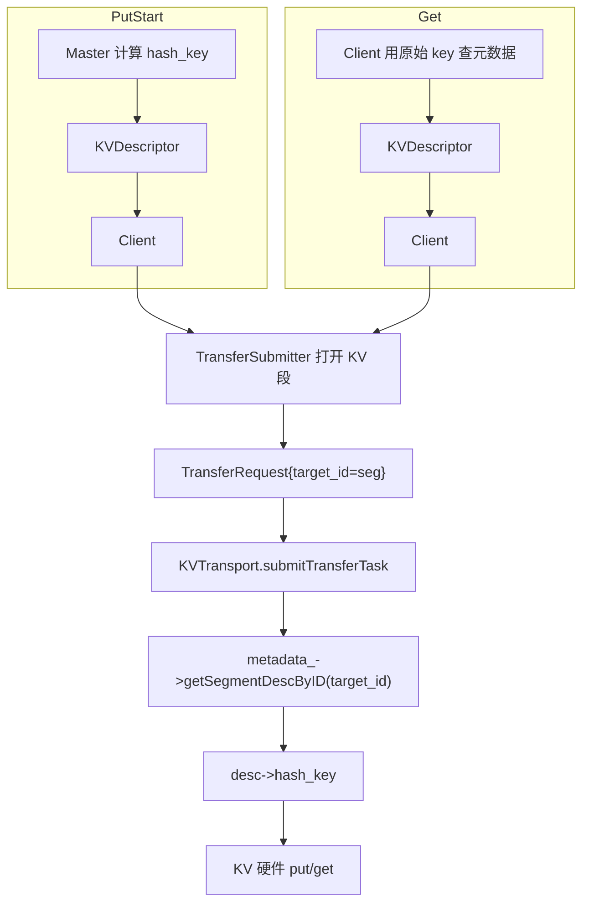

`hash_key` 无需显式传入 `TransferRequest`——段描述符已包含，类似 NVMeoF 从 `desc->nvmeof_buffers` 获取路径。映射关系由现有 key→ObjectMetadata 机制自然完成，无需额外存储映射表。

### 2.6 ReplicateConfig 扩展

新增 `kvs_replica_num` 字段（默认 0），控制 KVS 副本数量。

---

## 三、MasterService 端流程

### 3.1 初始化

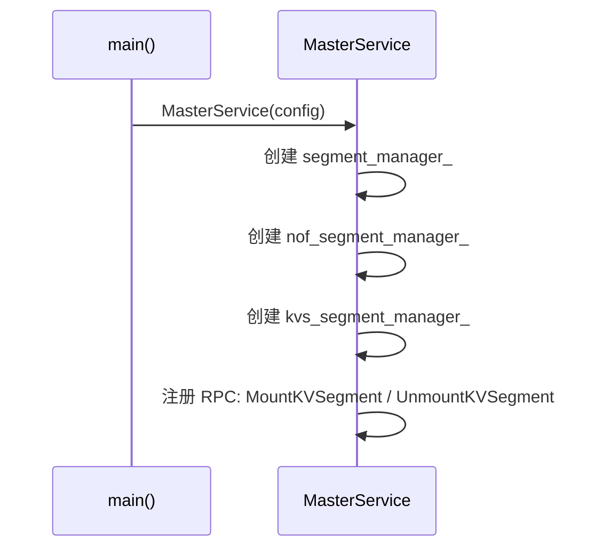

### 3.2 Segment 挂载

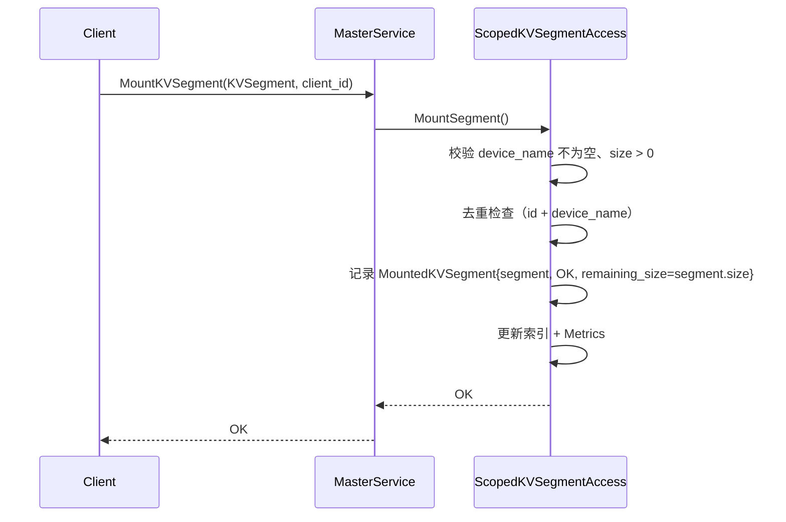

与普通 Segment 挂载的核心差异：无地址校验、不创建 BufferAllocator、不加入 AllocatorManager。

### 3.3 Segment 卸载

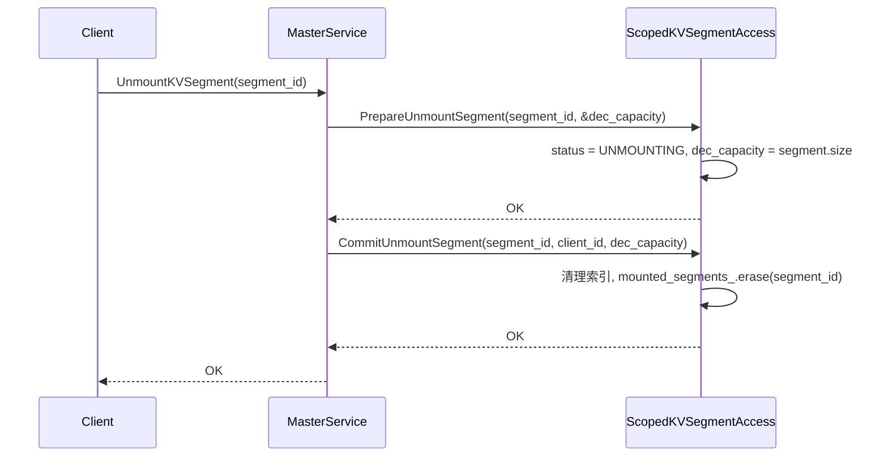

无需 `removeAllocator()` 和 `buf_allocator.reset()`，直接修改状态即可。

### 3.4 PutStart 分配

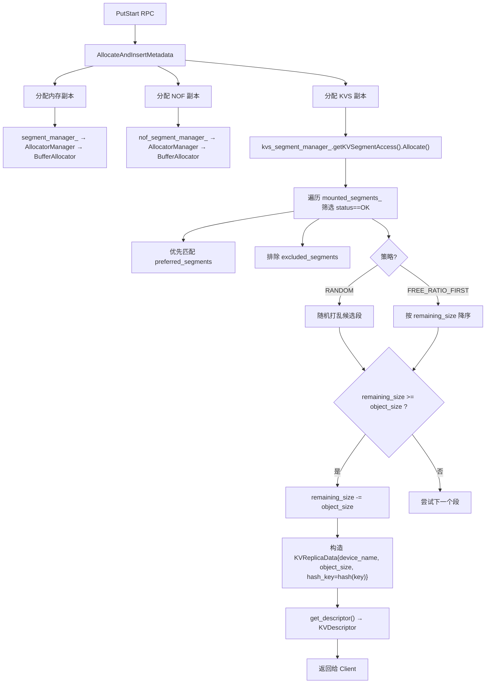

**分配策略**：复用 `AllocationStrategyType` 枚举（RANDOM / FREE_RATIO_FIRST），分两轮：

1. **Preferred Segments**：按列表顺序尝试，容量足够即分配
2. **剩余段**：收集 OK 状态、不在排除列表的候选段，按策略排序后分配

每次分配直接在 `remaining_size` 上扣减（`segment_mutex_` 写锁保护下）。

### 3.5 Client 过期清理

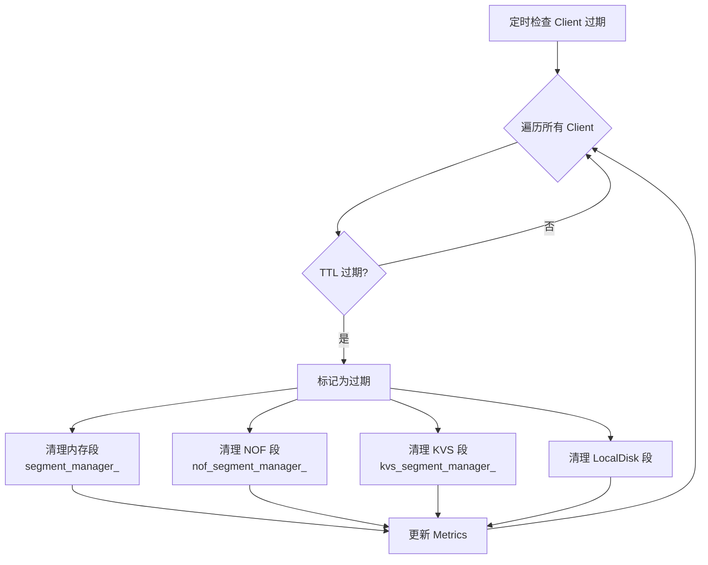

### 3.6 生命周期状态机

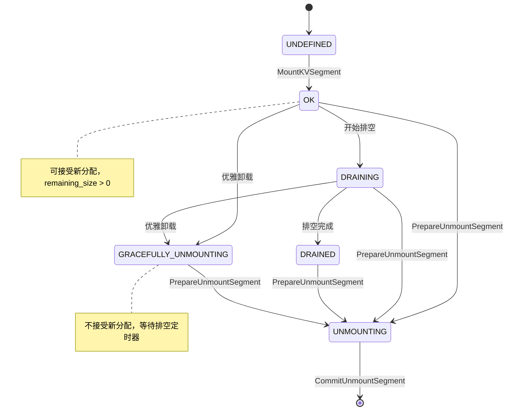

完全复用现有 `SegmentStatus` 枚举，无需新增状态。

---

## 四、Client 端数据路径

### 4.1 Put 流程

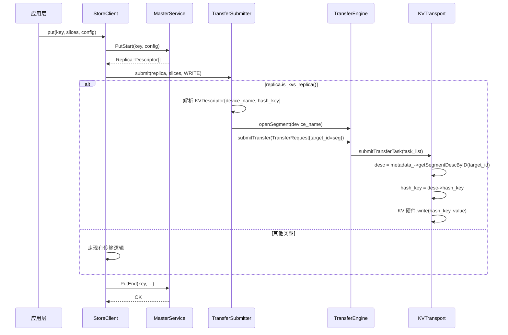

### 4.2 Get 流程

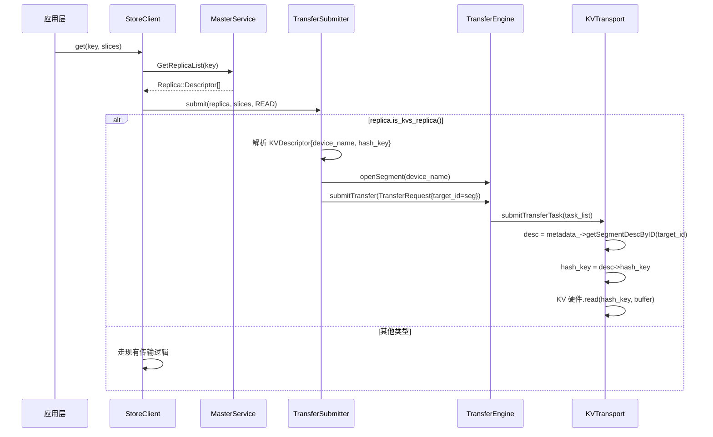

Get 时 Client 用原始 key 查询 `ObjectMetadata`，从 `KVDescriptor` 获取 `hash_key`。映射关系由 Master 在 PutStart 时建立并持久化，无需额外存储映射表。

---

## 五、RPC 与 Metrics

### 5.1 RPC 定义

| RPC                  | Request               | Response               |
| -------------------- | --------------------- | ---------------------- |
| `MountKVSegment`   | `KVSegment segment` | `int32_t error_code` |
| `UnmountKVSegment` | `UUID segment_id`   | `int32_t error_code` |

### 5.2 Metrics

| 指标                                               | 触发时机         |
| -------------------------------------------------- | ---------------- |
| `inc_total_kvs_capacity(segment_name, capacity)` | Mount 成功后     |
| `dec_total_kvs_capacity(segment_name, capacity)` | CommitUnmount 后 |

---

## 六、关键设计决策

| 决策                                     | 理由                                                                                                                            |
| ---------------------------------------- | ------------------------------------------------------------------------------------------------------------------------------- |
| **独立 KVSegmentManager**          | KV 不经过 BufferAllocator，分配模型与内存/NoF 段根本不同，独立 Manager 避免污染现有热路径                                       |
| **不引入 BufferAllocator**         | KV 硬件自行管理空间，Master 仅需跟踪`remaining_size`                                                                          |
| **分配策略内聚**                   | 复用`AllocationStrategyType` 枚举，但逻辑直接在 `ScopedKVSegmentAccess` 中实现，不经过 `AllocatorManager`                 |
| **hash_key = uint64_t**            | 确定性哈希（xxhash64），存入`KVReplicaData`/`KVDescriptor`，映射关系由 key→ObjectMetadata 自然完成                         |
| **hash_key 通过 SegmentDesc 传递** | KVTransport 从`desc->hash_key` 获取，无需修改 `TransferRequest.target_offset`。参考 NVMeoF 的 `desc->nvmeof_buffers` 模式 |
| **新增独立 RPC**                   | `MountKVSegment`/`UnmountKVSegment` 与现有 RPC 解耦，参数类型和校验逻辑不同                                                 |

---

## 七、待补充：KVTransport 设计

KVTransport 作为 Transport 子类，实现 `submitTransferTask`，内部通过 `metadata_->getSegmentDescByID` 获取段描述符，从中读取 `hash_key` 和 `device_name`，执行 KV 硬件的读写操作。

（详见后续 KVTransport 设计文档）
