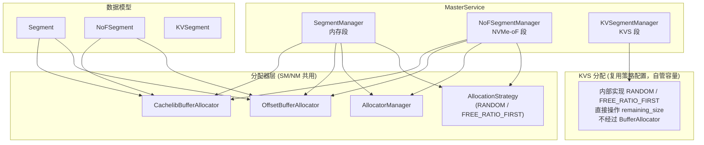
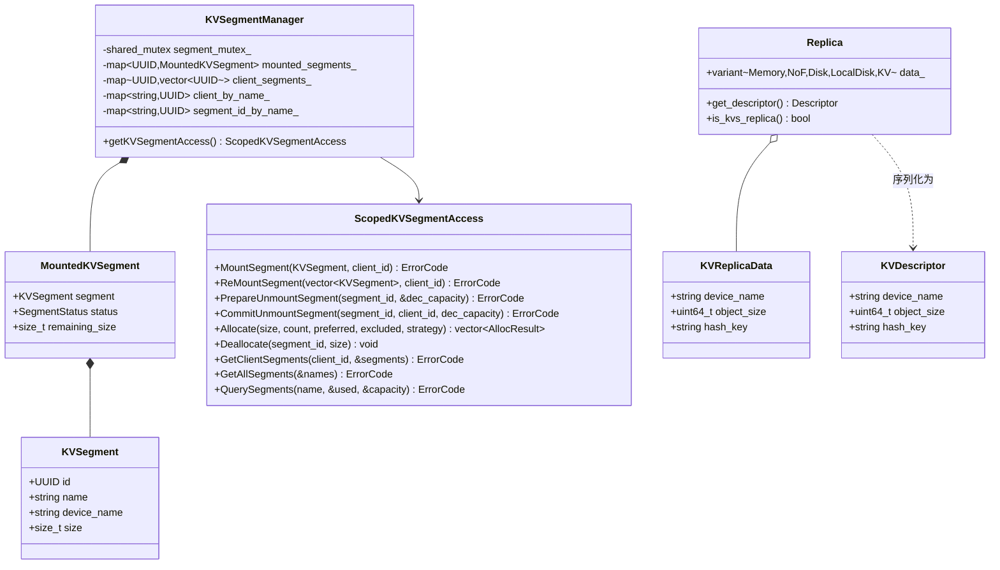
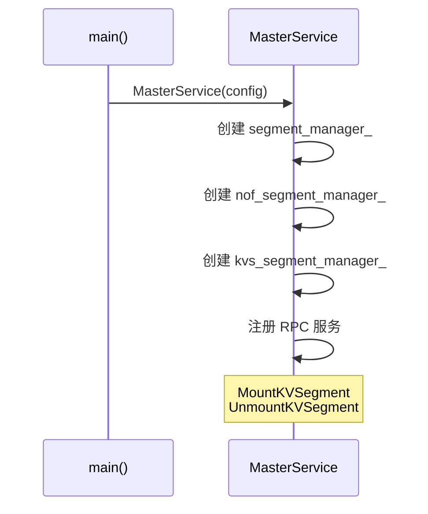
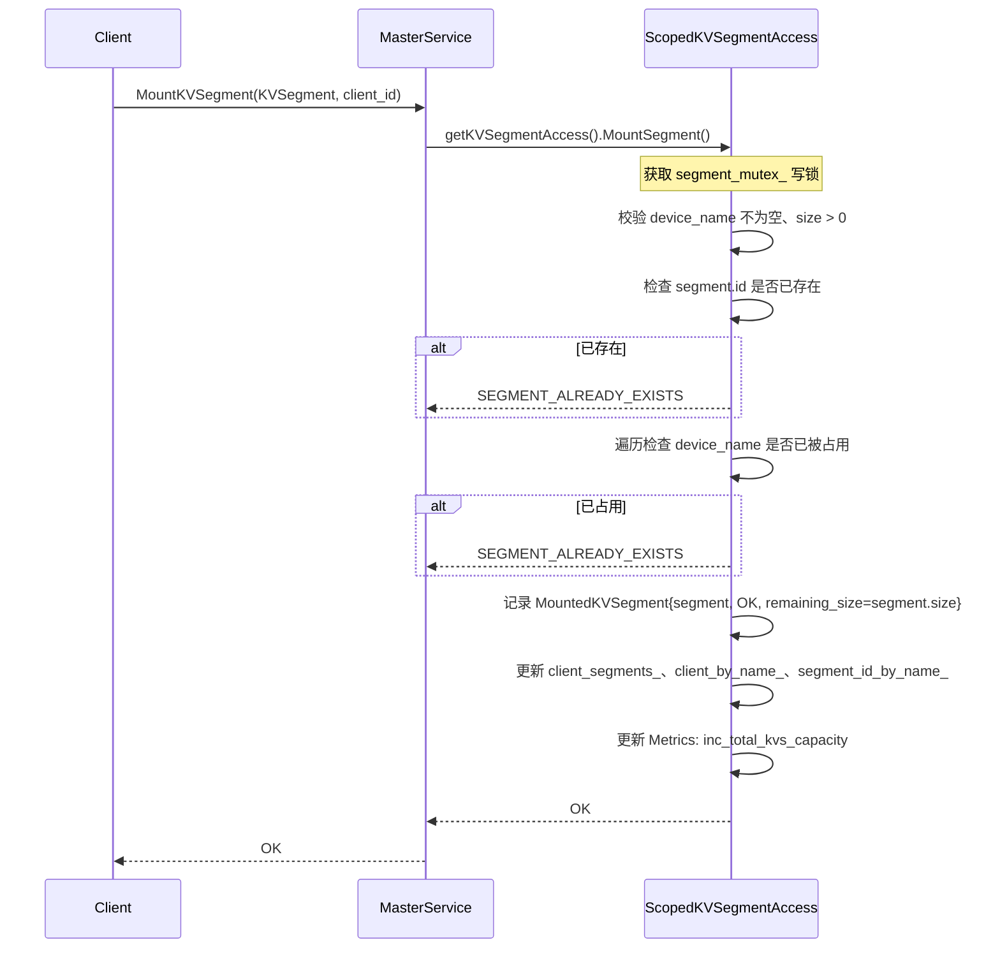
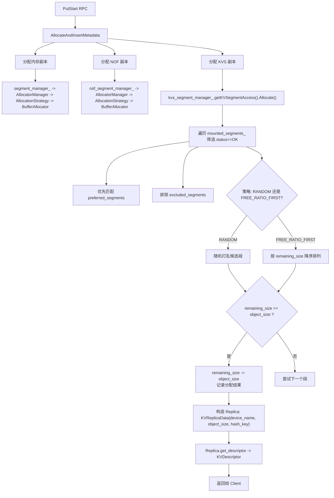
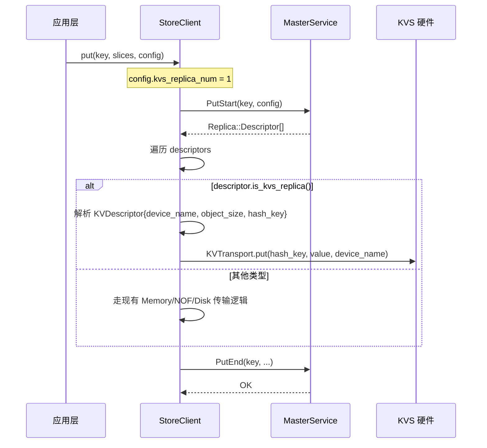
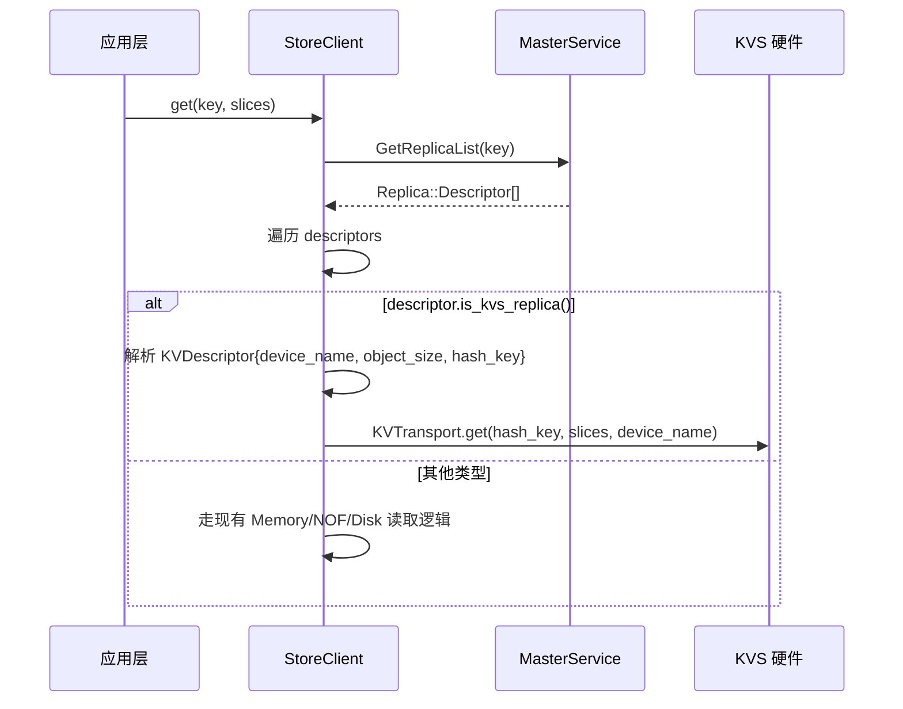
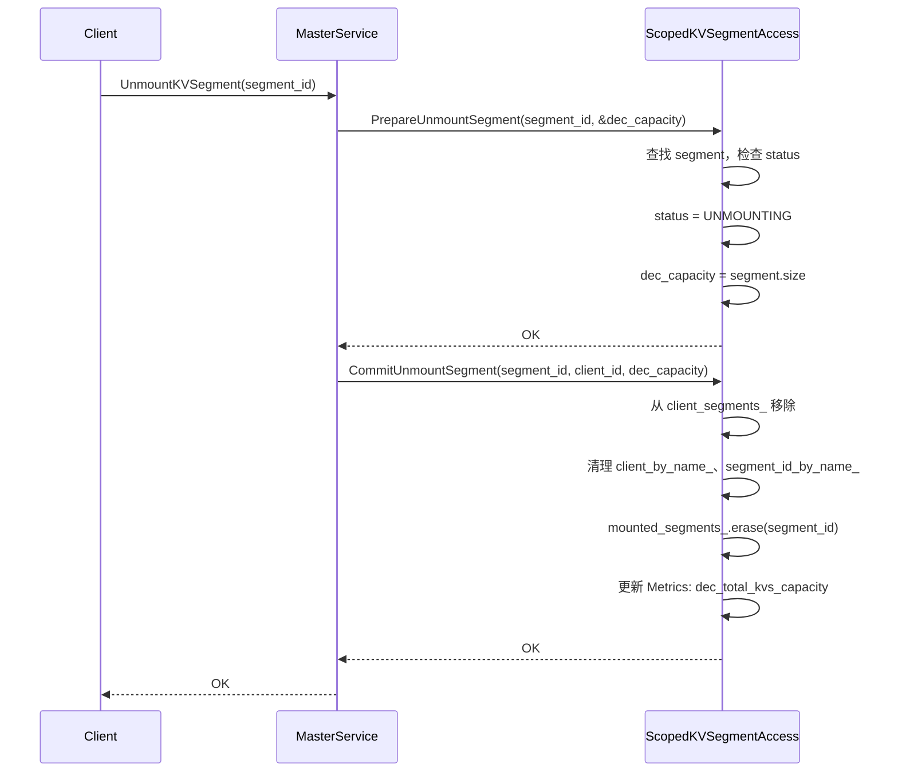
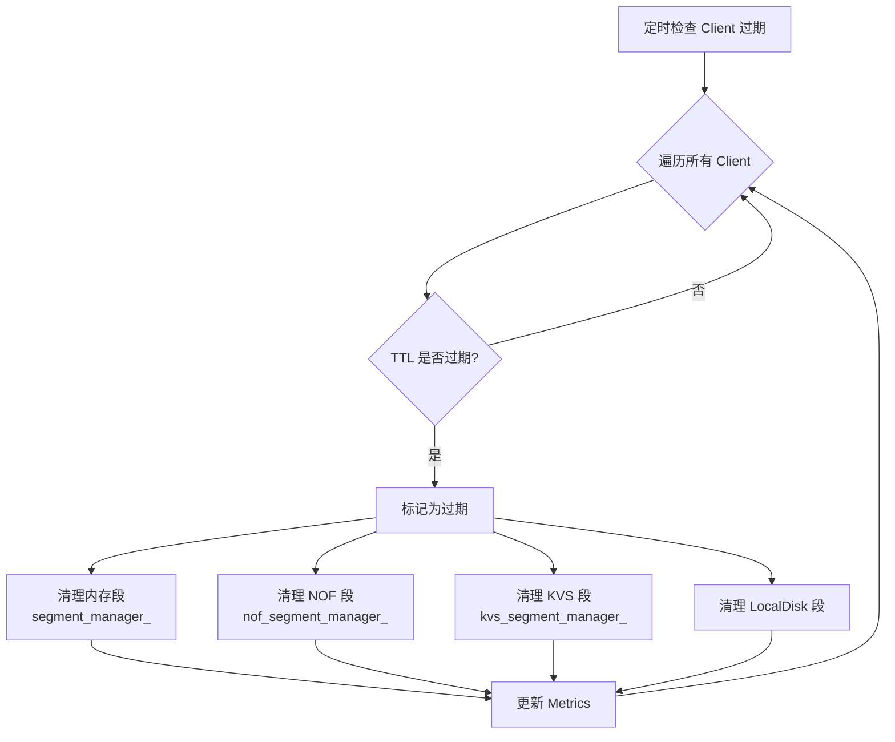
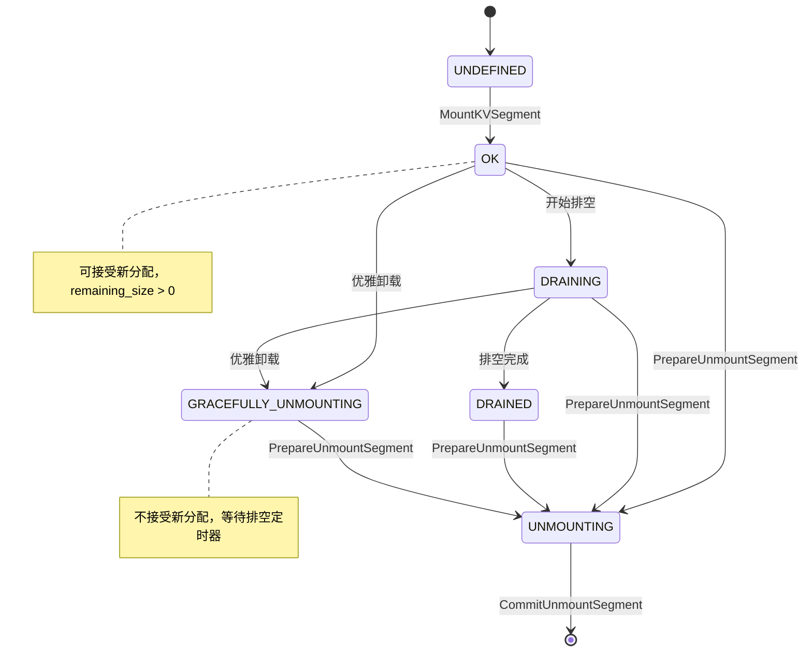

# KVSegment 设计方案

## 一、整体架构概览

KVSegment 是为 KVTransferEngine 设计的新型 Segment，特点是硬件自行管理地址空间，只需传入 key/value 即可完成存取，无需基于内存地址的空间管理。

KVSegment 有独立的 `KVSegmentManager`。segment分配策略沿用现有的 `AllocationStrategyType` 配置（RANDOM / FREE\_RATIO\_FIRST）。

### 1.1 与现有 Segment 的架构关系

### 1.2 新增/修改文件清单

| 文件                                | 操作 | 说明                                                                       |
| ----------------------------------- | ---- | -------------------------------------------------------------------------- |
| `include/types.h`                 | 修改 | 新增 `KVSegment`、`ReplicaType::KVS`                                   |
| `include/segment.h`               | 修改 | 新增 `MountedKVSegment`、`KVSegmentManager`、`ScopedKVSegmentAccess` |
| `src/segment.cpp`                 | 修改 | 实现 KVSegment 管理逻辑                                                    |
| `include/replica.h`               | 修改 | 新增 `KVReplicaData`、`KVDescriptor`                                   |
| `include/rpc_types.h`             | 修改 | 新增 KVSegment 相关 RPC 消息                                               |
| `include/master_service.h`        | 修改 | 新增 `kvs_segment_manager_`、RPC 处理方法                                |
| `src/master_service.cpp`          | 修改 | 实现 KVS RPC、PutStart 分配分支、客户端过期清理                            |
| `include/client_service.h`        | 修改 | 新增客户端挂载方法                                                         |
| `src/client_service.cpp`          | 修改 | 实现客户端 KVS 段挂载                                                      |
| `include/master_metric_manager.h` | 修改 | 新增 KVS 容量指标                                                          |

**不修改：** `allocator.h`、`allocator.cpp`、`allocation_strategy.h`、`allocation_strategy.cpp`

### 1.3 整体类图

---

## 二、数据结构定义

### 2.1 KVSegment（types.h）

| 字段            | 类型            | 说明                                     |
| --------------- | --------------- | ---------------------------------------- |
| `id`          | `UUID`        | 全局唯一标识                             |
| `name`        | `std::string` | 逻辑段名，用于 preferred allocation 路由 |
| `device_name` | `std::string` | KVS 硬件设备名称（如 `/dev/kvu0`）     |
| `size`        | `size_t`      | KVS 设备总容量（字节）                   |

对比普通 `Segment`：**不需要** `base`（无地址概念）、`protocol`（使用专用协议）。

### 2.2 枚举扩展（types.h）

`ReplicaType` 新增 `KVS = 4`，用于在分配和传输路径中区分 KVS 副本。

`BufferAllocatorType` 不需要新增值——KVSegmentManager 不创建任何 BufferAllocator。

### 2.3 MountedKVSegment（segment.h）

| 字段               | 类型              | 说明                                     |
| ------------------ | ----------------- | ---------------------------------------- |
| `segment`        | `KVSegment`     | 段元数据                                 |
| `status`         | `SegmentStatus` | 复用现有状态机                           |
| `remaining_size` | `size_t`        | 剩余容量，直接跟踪，替代 BufferAllocator |

### 2.4 KVSegmentManager（segment.h）

内部数据结构：

| 成员                    | 类型                            | 说明                                |
| ----------------------- | ------------------------------- | ----------------------------------- |
| `segment_mutex_`      | `shared_mutex`                | 读写锁                              |
| `mounted_segments_`   | `map<UUID, MountedKVSegment>` | segment\_id → 已挂载段             |
| `client_segments_`    | `map<UUID, vector<UUID>>`     | client\_id → 其拥有的 segment\_ids |
| `client_by_name_`     | `map<string, UUID>`           | segment.name → client\_id          |
| `segment_id_by_name_` | `map<string, UUID>`           | segment.name → segment\_id         |

**没有** `AllocatorManager`、`memory_allocator_`。分配策略通过 `Allocate()` 方法的 `strategy` 参数控制，逻辑内聚在 `ScopedKVSegmentAccess` 中直接操作 `remaining_size`。

### 2.5 Replica 扩展（replica.h）

| 结构体            | 字段                                           | 说明                               |
| ----------------- | ---------------------------------------------- | ---------------------------------- |
| `KVReplicaData` | `device_name`, `object_size`, `hash_key` | 运行时数据，Master 侧持有；`get_descriptor()` 拷贝到 `KVDescriptor` |
| `KVDescriptor`  | `device_name`, `object_size`, `hash_key` | 序列化描述符，通过 RPC 发给 Client |

`Replica` 类需新增：`KVReplicaData` variant 分支、`KVDescriptor` variant 分支、对应构造函数、`is_kvs_replica()` 判断方法、`get_descriptor()` 中的 KVS 分支。

### 2.6 key 到 hash_key 的映射

Master 在 `AllocateAndInsertMetadata` 时为 KVS 副本计算 `hash_key = hash(原始 key)`，先存入 `KVReplicaData`，再通过 `get_descriptor()` 拷贝到 `KVDescriptor`，随 `Replica::Descriptor` 一起持久化到 `ObjectMetadata` 中。

- **Put 路径**：Client 从 `PutStart` 返回的 `KVDescriptor` 中获取 `hash_key`，将其传入 KV 硬件驱动替代原始 key。
- **Get 路径**：Client 用原始 key 调用 `GetReplicaList` 查询元数据，从返回的 `KVDescriptor` 中取出 `hash_key`，再用 `hash_key` 从 KV 硬件读取数据。

**映射关系由现有的 key→ObjectMetadata 机制自然完成，无需额外存储映射表。** 每次 Get 时用原始 key 查元数据即可获得对应的 `hash_key`。

`hash_key` 采用确定性哈希（如 SHA-256 截断），相同 key 始终产生相同 hash，因此不需要维护随机映射。

### 2.7 ReplicateConfig 扩展

新增 `kvs_replica_num` 字段（默认 0），控制 KVS 副本数量。

---

## 三、MasterService 初始化

---

## 四、Segment 挂载流程

与普通 Segment 挂载的核心差异：

| 步骤                  | 普通 Segment                                                  | KVSegment                           |
| --------------------- | ------------------------------------------------------------- | ----------------------------------- |
| 地址校验              | `base != 0`、对齐校验                                       | 无（无地址概念）                    |
| 创建分配器            | 创建 `CachelibBufferAllocator` 或 `OffsetBufferAllocator` | 不创建，直接记录 `remaining_size` |
| 加入 AllocatorManager | `addAllocator()`                                            | 无此步骤                            |
| 去重检查              | 按 `segment.id`                                             | 按 `segment.id` + `device_name` |

---

## 五、PutStart 分配流程

### 5.1 整体流程

### 5.2 分配策略

`ScopedKVSegmentAccess::Allocate()` 接收 `AllocationStrategyType` 参数，与现有 `AllocationStrategy` 类使用相同的枚举值。策略逻辑直接在 Manager 中实现，不经过 `BufferAllocatorBase`。

**分两轮分配**，每轮内部根据策略类型选择：

**第一轮——Preferred Segments：**
按 `preferred_segments` 列表顺序尝试，容量足够即分配。

**第二轮——从剩余段中分配：**
收集所有 OK 状态、未被使用、不在排除列表中的段，过滤出容量足够的候选：

- **RANDOM：** 将候选段随机打乱，依次分配
- **FREE\_RATIO\_FIRST：** 按 `remaining_size` 降序排列，优先选择空闲最多的段

每次分配成功后，直接在对应的 `MountedKVSegment.remaining_size` 上扣减（在 `segment_mutex_` 写锁保护下）。

---

## 六、Client 端 Put 流程

---

## 七、Client 端 Get 流程

Get 流程说明：

1. Client 用**原始 key** 向 Master 查询元数据（`GetReplicaList`）
2. Master 通过 key 索引 `ObjectMetadata`，返回所有副本描述符
3. 对于 KVS 副本，`KVDescriptor` 中携带了 `hash_key`
4. Client 用 `hash_key` 从 KV 硬件读取数据

**key→hash_key 的映射无需额外存储**：Master 在 PutStart 时已将 `hash_key` 存入 `KVDescriptor`，并随 `ObjectMetadata` 一起持久化（快照 + OpLog）。Get 时通过原始 key 查元数据即可获得。

## 八、Unmount 流程

与普通 Segment 的差异：PrepareUnmountSegment 中不需要 `removeAllocator()` 和 `buf_allocator.reset()`，直接修改状态即可。

---

## 九、Client 过期清理流程

---

## 十、生命周期状态机

完全复用现有 `SegmentStatus` 枚举，无需新增状态。

---

## 十一、RPC 消息定义

| RPC                  | Request               | Response               |
| -------------------- | --------------------- | ---------------------- |
| `MountKVSegment`   | `KVSegment segment` | `int32_t error_code` |
| `UnmountKVSegment` | `UUID segment_id`   | `int32_t error_code` |

---

## 十二、Metrics 扩展

| 指标                                               | 触发时机         |
| -------------------------------------------------- | ---------------- |
| `inc_total_kvs_capacity(segment_name, capacity)` | Mount 成功后     |
| `dec_total_kvs_capacity(segment_name, capacity)` | CommitUnmount 后 |

---

## 十三、关键设计决策

| 决策                                                         | 理由                                                                                                                    |
| ------------------------------------------------------------ | ----------------------------------------------------------------------------------------------------------------------- |
| **不引入 BufferAllocator**                             | KVS 硬件自行管理空间，master 只需跟踪容量，无需 slab/offset 分配器                                                      |
| **复用 AllocationStrategyType 配置**                   | 策略语义一致（RANDOM / FREE\_RATIO\_FIRST），但逻辑直接操作 `remaining_size`，不经过 `BufferAllocatorBase`          |
| **容量记录在 remaining\_size**                         | 省去中间抽象层，操作直接                                                                                                |
| **Allocate() 内聚在 KVSegmentManager**                 | 分配逻辑简单，无需通过 `AllocatorManager` 中转                                                                        |
| **KVReplicaData 直接持有 device\_name + object\_size + hash_key** | Master 分配时计算 hash_key 存入，`get_descriptor()` 拷贝到 KVDescriptor。不需要 AllocatedBuffer 包装 |
| **独立 KVSegmentManager**                              | 与 SegmentManager/NoFSegmentManager 平级，架构一致                                                                      |
| **新增独立 RPC**                                       | 接口清晰，不与现有 RPC 耦合                                                                                             |
| **不修改 allocator.h / allocation\_strategy.h**        | KVS 不经过这些组件，改动范围最小                                                                                        |
| **hash_key 存入 KVDescriptor**                         | 确定性哈希，映射关系由现有 key→ObjectMetadata 机制自然完成，无需额外映射表。Get 时用原始 key 查元数据即可获得 hash_key |
